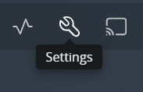
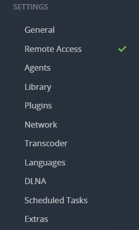
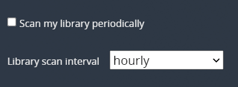
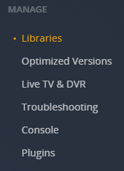
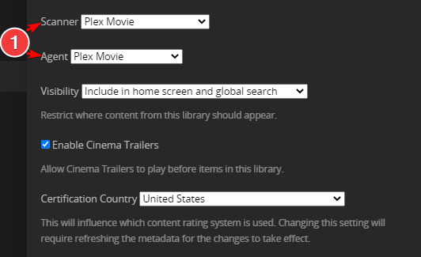
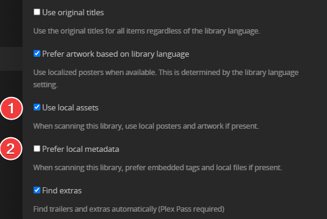
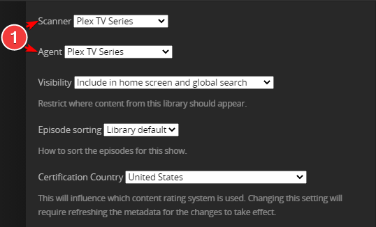
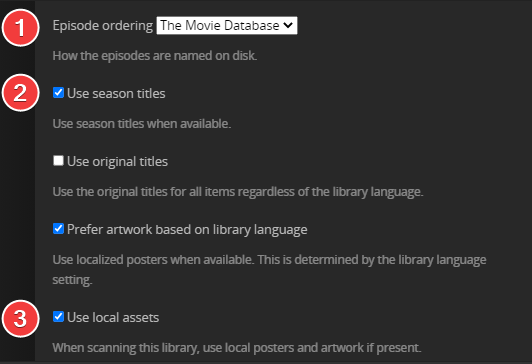
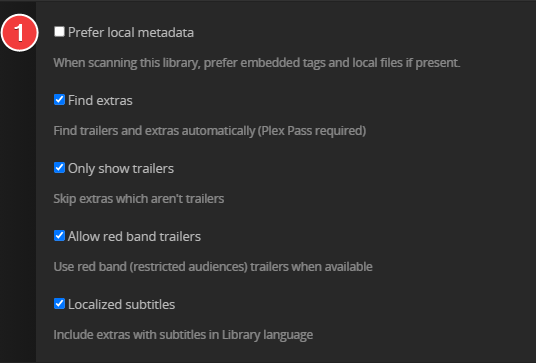

# Paramètres suggérés pour le serveur multimédia Plex 

Alors, quels sont les meilleurs paramètres pour le serveur multimédia Plex ? 

C'est une question à laquelle on ne peut pas vraiment répondre car cela dépend du cas d'utilisation et de vos préférences personnelles. 

!!! danger "" 
    Ici, je vais fournir quelques suggestions et essayer d'expliquer pourquoi je recommande ces paramètres. Ajustez-le à votre guise et gardez à l'esprit qu'il ne s'agit que d'une suggestion. Je ne suis pas un Plex Pro de toute façon :bangbang: 

!!! avertissement 
    Certains paramètres ne sont visibles que pour les détenteurs de Plex Pass. 

Toutes les modifications doivent être effectuées sur votre serveur multimédia Plex. 

 

!!! info "Pourquoi n'avez-vous pas couvert l'option .... ?" 
     Je ne couvrirai que les paramètres qui, à mon avis, pourraient être intéressants ou qui correspondent à des préférences personnelles. Si vous souhaitez que je couvre d'autres paramètres, veuillez me contacter sur {:target="_blank" rel="noopener noreferrer"} 

## Paramètres 

 

### Accès à distance 

 

1. Assurez-vous d'avoir activé les paramètres avancés (ce sera nécessaire pour tous les paramètres) 
1. Activer/Désactiver l'accès à distance (si vous le désactivez, ignorez le reste de ces paramètres) 
1. IP LAN/conteneur 
1. IP publique ** Si vous devez fournir une capture d'écran, masquez toujours cette IP : bangbang :** 
1. Spécifiez manuellement le port public si vous exécutez Docker ou si vous souhaitez un port fixe. 
1. Entrez le port Plex que vous souhaitez utiliser. (par défaut : « 32400 ») 
1. Cliquez sur « Appliquer » et lorsque tout est correctement configuré, votre serveur multimédia Plex doit être entièrement accessible en dehors de votre réseau, afin que vous puissiez vous connecter à votre serveur Plex de l'extérieur. Vous devrez peut-être également configurer la redirection de port sur votre routeur. Des instructions détaillées sont disponibles [ICI](https://support.plex.tv/articles/200931138-troubleshooting-remote-access/){:target="_blank" rel="noopener noreferrer"}. 
1. Entrez ici votre vitesse de téléchargement Internet et Plex peut garantir qu'il fonctionne dans cette limite. 
1. Définissez le débit binaire maximum d'un flux distant de ce serveur. 

------ 

### Agents 

Ceci peut être ignoré si vous utilisez les nouveaux agents Plex, 

les nouveaux paramètres d'agent sont désormais gérés « par bibliothèque ». 

------ 

### Bibliothèque 

#### Analyser ma bibliothèque automatiquement 

Lorsqu'un changement est détecté dans l'emplacement source du contenu d'une bibliothèque, la bibliothèque appropriée sera analysée. Cette fonction s'appuie sur le système d'exploitation de l'ordinateur qui fournit le déclencheur « quelque chose a changé ». Certains systèmes d'exploitation ne fournissent pas ce déclencheur et le contenu monté via un réseau ne fonctionnera généralement pas non plus. Si votre bibliothèque n'analyse pas automatiquement, vous devrez peut-être définir une analyse périodique ou la faire manuellement. 

!!! succès "" 
    **Suggéré : `Activé`** 

??? tip "TIP - Autoscan - [Cliquez pour afficher/masquer]" 

    Si pour une raison quelconque, ex. vos systèmes d'exploitation ne fournissent pas ce déclencheur ou votre stockage est monté sur un réseau (SMB/NFS/Cloud Storage) ou votre bibliothèque n'analyse tout simplement pas automatiquement, ou est tout simplement peu pratique, vous voudrez peut-être envisager d'utiliser l'analyse automatique. IBRACORP (une chaîne Youtube avec laquelle je collabore) propose une vidéo l'expliquant plus en détail. 

    <iframe width="560" height="315" src="https://www.youtube.com/embed/JYBVAzJBw2w" title="Lecteur vidéo YouTube" frameborder="0" allow="accéléromètre ; lecture automatique ; presse-papiers- écrire ; médias cryptés ; gyroscope ; image dans l'image "allowfullscreen></iframe> 

    N'oubliez pas de consulter ses autres vidéos Unraid [ICI](https://www.youtube.com/c/IBRACORP/ vidéos){:target="_blank" rel="noopener noreferrer"} 

#### Exécuter une analyse partielle lorsque des modifications sont détectées 

 

Lorsque des modifications apportées aux dossiers de bibliothèque sont détectées, analysez uniquement le dossier qui a changé plutôt que d'analyser l'intégralité de l'emplacement du contenu. Cela fonctionne avec le paramètre normal Mettre à jour automatiquement ma bibliothèque (et nécessite que ce paramètre soit activé). 

!!! success "" 
    **Suggéré : `Activé`** 

#### Inclure les bibliothèques musicales dans les mises à jour automatiques 

 

Je ne fais pas de musique, donc ce choix dépend de vous, et je n'en parlerai pas. 

#### Analyser ma bibliothèque périodiquement 

 

L'activation de cette option entraînera l'exécution d'analyses par votre serveur multimédia Plex vos bibliothèques en utilisant l'intervalle désigné. 

!!! success "" 
    **Suggéré : `Désactivé`** 

    *Avez-vous besoin d'une analyse supplémentaire pour que votre bibliothèque reconnaisse les nouveaux médias ?* 

#### Videz automatiquement la corbeille après chaque analyse 

 

Le propriétaire du serveur sera autorisé à supprimer des fichiers multimédias du disque. 

!!! succès "" 
    **Suggéré : `Désactivé`** 

    *À mon avis, Plex ne devrait pas toucher vos fichiers multimédias. Utilisez Sonarr/Radarr pour gérer votre médiathèque. (Pour plus de sécurité, j'ai configuré Plex avec un accès en lecture seule à la bibliothèque multimédia)* 

#### Exécutez les tâches du scanner avec une priorité inférieure 

 

Sur les systèmes à faible consommation (par exemple, les périphériques NAS basés sur ARM), il peut être avantageux d'exécuter des tâches de scanner avec une priorité inférieure aux autres tâches. Cela peut aider à garantir qu’ils n’interfèrent pas avec la diffusion régulière. 

!!! success "" 
    **Suggéré : `Activé`** 

    *Veille à ce qu'il utilise moins de ressources et s'assure qu'elles n'interfèrent pas avec la diffusion régulière.* 

#### Générer des vignettes d'aperçu vidéo 

![!Paramètres - Bibliothèque - Générer des vignettes d'aperçu vidéo] (images/settings-library-generate-video-preview-thumbnails.png) 

Cette option crée une série de vignettes d'aperçu à partir d'un élément multimédia lors de son analyse. Ces images sont utilisées par certaines applications Plex lorsque vous avancez et avancez dans une application avec le curseur de chronologie. Ils seront également affichés dans Now Playing lorsque quelqu'un diffuse du streaming depuis vous afin que vous puissiez voir où il se trouve dans la vidéo. 

!!! succès "" 
    **Suggéré : `Jamais`** 

    *En plus de cela, il utilise beaucoup d'espace disque et des E/S élevées. Personne dans ma famille n'utilise FastForward/Rewind mais ils utilisent le saut en avant/en arrière.* 

!! ! danger "ATTENTION" 
    La création de ces images peut 

    - <u>Prendre un temps considérable</u> 
    - <u>Utiliser beaucoup de ressources CPU</u> 
    - <u>Augmenter l'espace de stockage utilisé</u> 

    Le les images sont stockées dans l'emplacement de votre base de données Plex (/config), donc <u>faites attention à ne pas remplir le lecteur :bangbang:</u> 

#### Générez des marqueurs vidéo d'introduction 

 

Vous pouvez choisir d'analyser les épisodes télévisés pour essayer de détecter le moment où « l'intro » se produit pendant la lecture. Une fois détectées, les applications proposeront alors un bouton « Passer l'introduction », vous permettant de sauter rapidement par-dessus l'intro. 

!!! succès ""
    **Suggéré : `en tant que tâche planifiée`** 

    *ou* 

    **Suggéré : `en tant que tâche planifiée et lorsque le média est ajouté`** 

#### Générer des vignettes de chapitre 

![!Paramètres - Bibliothèque - Générer des vignettes de chapitre] (images/settings-library-generate-chapter-thumbnails.png) 

Les vignettes de chapitre fournissent des images dans la vue de chapitre sur les applications prises en charge. Leur génération peut prendre un peu de temps et consommer très peu d’espace disque supplémentaire. 

!!! success "" 
    **Suggéré : `en tant que tâche planifiée`** 

    *ou* 

    **Suggéré : `en tant que tâche planifiée et lorsque le média est ajouté`** 

------ 

### Réseau 

#### Activer Prise en charge IPv6 

 

Activer la prise en charge IPv6. 

!!! success "" 
    **Suggéré : `Désactivé`** 

    *Si vous n'êtes pas sûr que votre réseau fonctionne à 100 % avec ip6 <u>ne l'activez pas</u>.* 

#### Connexions sécurisées 

 

Choisissez comment votre serveur multimédia Plex gère les connexions sécurisées. 

!!! success "" 
    **Suggéré : `Préféré`** 

    *Acceptez et préférez les connexions sécurisées lorsqu'elles sont disponibles pour une application Plex, mais autorisez les connexions HTTP régulières si l'application ne prend pas en charge les connexions sécurisées ou si une connexion ne peut pas être établie * 

#### Interface réseau préférée 

 

Pour les utilisateurs disposant de plusieurs cartes réseau ou de systèmes tels que NAS ou Docker où il y a toujours une autre interface réseau que les applications clientes Plex peuvent essayer d'utiliser pour se connecter au serveur multimédia Plex. Avec cette option, vous pouvez vous assurer que vos clients Plex locaux n'essaieront que cette interface. 

!!! avertissement 
    Si vous avez activé l'accès à distance et que Plex mappe automatiquement le port (au lieu de spécifier un port manuellement), alors Plex Media Server n'a aucun contrôle sur l'interface réseau utilisée pour un port automatiquement mappé. Ainsi, il est possible que les connexions d'accès à distance passent par une interface autre que celle spécifiée ici. 

!!! success "" 
    **Suggéré : `Ce qui convient à votre configuration`** 

#### Configuration TLS stricte 

Si ce paramètre est activé, il empêche Plex Media Server d'utiliser ou d'accepter les protocoles TLSv1.0 et v1.1 obsolètes, ainsi que les chiffrements faibles existants. Peut empêcher les clients plus âgés de se connecter. La grande majorité des utilisateurs n’auront aucune raison d’activer cette option (et n’en tireront aucun avantage). 

!!! success "" 
    **Suggéré : `Désactivé`** 

#### Activer la découverte du réseau local (GDM) 

.png) 

Activer la découverte « G'Day Mate ». Ceci est utilisé pour permettre aux applications et aux serveurs Plex de se trouver automatiquement sur un réseau local. 

!!! success "" 
    **Suggéré : `Activé`** 

#### Flux distants autorisés par utilisateur 

 

Vous pouvez définir le nombre maximum de flux simultanés que chaque utilisateur distant est autorisé à avoir. 

!!! success "" 
    **Suggéré : `Ce qui convient à votre configuration`** 

#### Réseaux LAN 

 

Il vous permet de spécifier quelle adresse IP les adresses ou réseaux seront considérés comme « locaux » pour vous. 

!!! success "" 
    **Suggéré : `Votre IP/masques de réseau locaux`** 

    *Si vos appareils locaux sont considérés comme des appareils distants, cela pourrait résoudre votre problème. (N'incluez pas d'espaces ni de tabulations.)* 

#### Traitez l'IP WAN comme une bande passante LAN 

 

Permet aux requêtes entrantes provenant de l'adresse IP WAN de ce réseau d'être traitées comme des requêtes LAN en termes de bande passante. Cela se produit souvent lorsque la protection de rebinding DNS est en place et que les clients sur le réseau local ne peuvent pas contacter directement le serveur mais doivent plutôt passer par l'adresse IP du WAN. 

!!! success "" 
    **Suggéré : `Enabled`** 

#### Activer le relais 

 

Le relais permet les connexions au serveur via un relais proxy lorsque le serveur n'est pas accessible autrement. Les connexions relais sont limitées en bande passante. 

!!! success "" 
    **Suggéré : `Désactivé`** 

    *J'ai vu plusieurs rapports dans lesquels des personnes qui avaient cette option activée avaient des problèmes de lecture car elle semble être limitée à 2 Mbps.* 

#### URL d'accès au serveur personnalisées 

Une liste d'URL séparées par des virgules (HTTP ou HTTPS), qui seront publiées sur plex.tv pour la découverte du serveur. Cela peut être très utile dans quelques cas : si vous utilisez un proxy inverse devant le serveur multimédia, ou si votre configuration réseau est par ailleurs unique. Par exemple, si vous disposez de votre propre domaine personnalisé avec sous-domaine. 

!!! success "" 
    **Suggéré : `En fonction de votre configuration`** 

    *Exemple : `https://plex.mycustomdomain.com:32400`* 

#### Webhooks 

 

Cette fonctionnalité peut être activée pour permettre à votre serveur d'envoyer des événements à des services externes. Par exemple [Notifiarr](/Notifiarr/Quick-Start/){:target="_blank" rel="noopener noreferrer"} 

------ 

### Transcodeurs 

#### Qualité du transcodeur 

 

Cela influencera la qualité utilisée lors du transcodage du média. 

!!! success "" 
    **Suggéré : `Automatique`** 

    *La plupart des utilisateurs devraient le laisser défini sur Automatique. Le streaming accéléré par le matériel n'est pas affecté par ce paramètre.* 

#### Répertoire temporaire du transcodeur 

 

Répertoire à utiliser lors du transcodage fichiers temporaires pour le streaming. 

!!! succès "" 
    **Suggéré : `En fonction de votre configuration, si possible, votre RAM (disque)`** 

    *Accélére le transcodage et moins d'E/S, les données de transcodage sont temporaires et n'ont pas besoin d'être écrites sur un disque. * 

    *Si vous exécutez Docker, définissez-le sur `/transcode` et mappez-le sur `/tmp/plex`* * 

    Par défaut, Linux n'alloue qu'un maximum de 50 % de la RAM totale du système à tous les répertoires RAM (c'est-à-dire /tmp, /dev /shm, etc.)* 

    !!! danger "AVERTISSEMENT" 
        :bangbang: **VOUS NE DEVEZ PAS SPÉCIFIER UN EMPLACEMENT QUI RÉSIDE SUR UN PARTAGE/DISQUE RÉSEAU.** :bangbang: 

#### Activer le mappage de tonalité HDR 

 

Cette fonctionnalité permet à Plex Media Server de maintenir une haute fidélité visuelle du contenu, en appliquant un mappage de tons pour le convertir en SDR lors du transcodage du contenu HDR. 

!!! succès "" 
    **Suggéré : `En fonction de votre configuration`** 

    *La plupart des contenus HDR seront en résolution 4K. Si votre plate-forme doit utiliser un transcodage logiciel pour effectuer le mappage de tons, elle risque alors d'avoir du mal à convertir le contenu 4K en temps réel, à moins que vous n'utilisiez un système très puissant.* 

!!! note
    La prise en charge du mappage de tons de Plex devrait généralement être capable de produire un bon mappage de couleurs et d'éviter les couleurs « délavées » qui se produisent lors de la conversion de contenu HDR sans mappage de tons. 

#### Utilisez l'accélération matérielle lorsqu'elle est disponible 

 

Pour utiliser le streaming avec accélération matérielle dans Plex Media Serveur. 

!!! success "" 
    **Suggéré : `Activé`** 

#### Utiliser l'encodage vidéo accéléré par le matériel 

 

Pour utiliser le codage accéléré par le matériel dans Plex Media Server. 

!!! success "" 
    **Suggéré : `Activé`** 

------ 

## Gérer 

 

### Bibliothèques 

Ici vous trouverez vos bibliothèques que vous' que vous avez ajouté à votre serveur multimédia Plex. 

??? exemple "Exemples - [Cliquez pour afficher/masquer]" 

    - Films `(/data/media/movies)` 
    - Films-4K/Films-UHD `(/data/media/movies4k)`/`(/data/media/ films-uhd)` 
    - Films-enfants `(/data/media/movies-kids)` 
    - Films-Anime `(/data/media/movies-anime)` 
    - TV `(/data/media/tv)` 
    - TV-4k/TV-UHD `(/data/media/tv-4k)`/`(/data/media/tv-uhd)` 
    - TV-Kids `(/data/media/tv-kids)` 
    - TV -Anime `(/data/media/tv-anime)` 
    - Anime `(/data/media/anime)` 
    - etc 

!!! info "Je ne couvrirai que les paramètres des bibliothèques pour les films et les émissions de télévision" 

#### Films 

 

1. La nouvelle version du Agent/scanner de films Plex 

    !!! succès "" 
        **Suggéré : `Plex Movie`** 

        *En plus d'être beaucoup plus rapide pour analyser et obtenir des métadonnées, l'un des avantages du nouvel agent est que tous les paramètres de l'agent sont définis au niveau de la bibliothèque, de sorte que les différentes bibliothèques utilisant le le même agent peut avoir des paramètres d'agent différents.* 

 

1. Lors de la numérisation de cette bibliothèque, utilisez des affiches et des illustrations locales le cas échéant. (Les fichiers de sous-titres locaux seront utilisés, que cela soit activé ou non) 

    !!! success "" 
        **Suggéré : `Activé`** 

        *J'ai activé cette option parce que je pensais que c'était nécessaire pour les sous-titres locaux (.srt), mais après recherche, il semble que ce ne soit pas nécessaire. 
        Si vous le souhaitez, vous pouvez le désactiver, le choix vous appartient.*

1. Lors de l'analyse de cette bibliothèque, préférez les balises intégrées et les fichiers locaux s'ils sont présents. 

    !!! succès "" 
        **Suggéré : `Désactivé`** 

        *Si cette option est activée, vous pourriez vous retrouver avec un nom de film étrange dont vous ne voulez pas, cela se produit en particulier à partir des versions de `RARBG`* 

 

1. Créez automatiquement des collections lorsqu'il y a plus que le nombre sélectionné d'éléments pour une collection disponible. 

    !!! success "" 
        **Suggéré : `2`** 

        *Afficher les collections uniquement lorsque vous avez plus d'un élément dans votre bibliothèque* 

 

1. Cette option crée une série de vignettes d'aperçu à partir d'un élément multimédia lors de son analyse. Ces images sont utilisées par certaines applications Plex lorsque vous avancez et avancez dans une application avec le curseur de chronologie. Ils seront également affichés dans Now Playing lorsque quelqu'un diffuse du streaming depuis vous afin que vous puissiez voir où il se trouve dans la vidéo. 

    !!! danger "ATTENTION" 
        La création de ces images peut <u>prendre un temps considérable</u>, des <u>ressources CPU</u> et <u>augmenter l'espace de stockage utilisé</u>. Les images sont stockées dans votre base de données Plex donc <u>faites attention à ne pas remplir le lecteur :bangbang:</u> 

    !!! success "" 
        **Suggéré : `Désactivé`** 

        *En plus de cela, il utilise beaucoup d'espace disque et des E/S élevées. Personne dans ma famille n'utilise FastForward/Rewind mais ils utilisent le saut en avant/en arrière.* 

1. Cela supprime les vignettes d'aperçu générées avant de désactiver cette option. 
1. Si vous souhaitez afficher votre collection dans votre bibliothèque 

    !!! succès "" 
        **Suggéré : `Désactivé`** 

        *Lorsque désactivé, vos films s'afficheront normalement lorsque vous utilisez la vue bibliothèque, cela ne signifie pas que cela désactivera la vue collection.* 

#### TV 

 

1. La nouvelle version de l'agent/scanner Plex Movie 

    !!! succès "" 
        **Suggéré : `Plex TV Series`** 

        *En plus d'être beaucoup plus rapide pour analyser et obtenir des métadonnées, l'un des avantages du nouvel agent est que tous les paramètres de l'agent sont définis au niveau de la bibliothèque, de sorte que les différentes bibliothèques utilisant le même agent peut avoir des paramètres d'agent différents.* 

 

1. Comment les épisodes sont nommés sur le disque. Si votre nom suit The MovieDB ou TheTVDB, choisissez-le ici. 
1. Utilisez les titres de saison lorsqu'ils sont disponibles. 
1. Lors de la numérisation de cette bibliothèque, utilisez des affiches et des illustrations locales le cas échéant.

    !!! success "" 
        **Suggéré : `Activé`** 

        *J'ai activé cette option parce que je pensais que c'était nécessaire pour les sous-titres locaux (.srt), mais après recherche, il semble que ce ne soit pas nécessaire. 
        Si vous le souhaitez, vous pouvez le désactiver, à vous de choisir.* 

 

1. Lors de l'analyse de cette bibliothèque, préférez les balises intégrées et les fichiers locaux si présent. 

    !!! succès "" 
        **Suggéré : `Désactivé`** 

        *Si cette option est activée, vous pourriez vous retrouver avec un nom de film étrange dont vous ne voulez pas, cela se produit en particulier avec les versions de `RARBG`* 

 

1. Cette option crée une série de vignettes d'aperçu à partir d'un élément multimédia lors de son analyse. Ces images sont utilisées par certaines applications Plex lorsque vous avancez et avancez dans une application avec le curseur de chronologie. Ils seront également affichés dans Now Playing lorsque quelqu'un diffuse du streaming depuis vous afin que vous puissiez voir où il se trouve dans la vidéo. 

    !!! danger "ATTENTION" 
        La création de ces images peut <u>prendre un temps considérable</u>, des <u>ressources CPU</u> et <u>augmenter l'espace de stockage utilisé</u>. Les images sont stockées dans votre base de données Plex donc <u>faites attention à ne pas remplir le lecteur :bangbang:</u> 

    !!! success "" 
        **Suggéré : `Désactivé`** 

        *En plus de cela, il utilise beaucoup d'espace disque et des E/S élevées. Personne dans ma famille n'utilise FastForward/Rewind mais ils utilisent le saut en avant/en arrière.* 

1. Cela supprime les vignettes d'aperçu générées avant de désactiver cette option. 
1. Si vous souhaitez afficher votre collection dans votre bibliothèque 

    !!! success "" 
        **Suggéré : `Désactivé`** 

        *Lorsque cette option est désactivée, votre émission de télévision s'affichera normalement lorsque vous utilisez la vue bibliothèque. Cela ne signifie pas qu'elle désactivera la vue collection.* 

1. Générez une détection d'introduction pour les éléments de cette bibliothèque lorsqu'elle est activée dans les paramètres du serveur. 

    !!! succès "" 
        **Suggéré : `Activé`** 

        *Avez-vous déjà regardé une émission de télévision et elle commence à jouer la même introduction de générique d'une minute et demie que vous avez déjà regardée plusieurs fois ? Eh bien, vous pouvez demander à votre Plex Media Server d'analyser les émissions de télévision pour essayer de détecter ces introductions, puis de les parcourir d'un simple clic !* 

------ 

Pour les informations de ce guide, j'ai utilisé le sources suivantes 

– Informations que j'ai recueillies sur plusieurs serveurs Discord 
– [Articles d'assistance Plex](https://support.plex.tv/articles/){ : 
target="_blank" rel="noopener noreferrer"} - Informations supplémentaires recueillies auprès d'un employé de Plex 
- Propre expérience 

{! include-markdown "../../../includes/support.md" !}
<!-- --8<-- "includes/support.md" -->