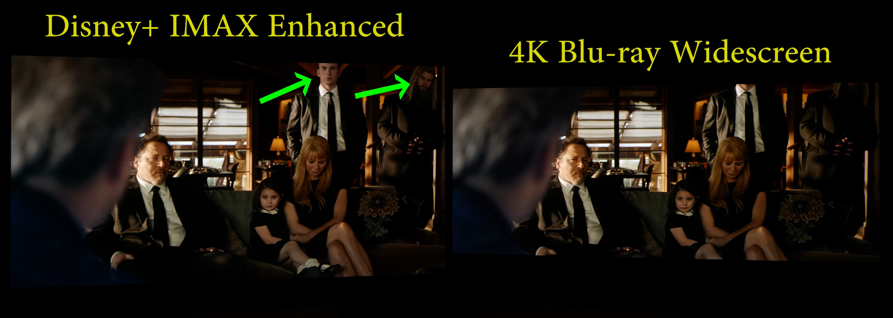

# Collection de formats personnalisés Vous 

trouverez ci-dessous une collection de ce que nous considérons comme les formats personnalisés les plus nécessaires et les plus couramment utilisés. 
Ces CF ont été collectés à partir de discussions sur Discord ou créés avec l'aide d'autres personnes. 

Un merci spécial à tous ceux qui ont aidé à la création et aux tests de ces formats personnalisés, à mon équipe des guides TRaSH, à l'équipe Radarr et à la communauté. 

Avec Radarr V3, les formats personnalisés sont beaucoup plus avancés/puissants qu'avec la V2, bien que cela signifie également qu'un format personnalisé peut nécessiter plus de connaissances pour être configuré ou créé. 

Après avoir fait une demande auprès de Team Radarr, nous avons désormais la possibilité d'importer/exporter les formats personnalisés au format JSON. Cela offre à chacun un moyen simple de partager et d’utiliser des formats personnalisés. 

Nous avons réalisé 3 guides liés à cela. 

- [Comment importer des formats personnalisés](/Radarr/Radarr-import-custom-formats){:target="_blank" rel="noopener noreferrer"} - Explique comment importer les formats personnalisés. 
- [Comment mettre à niveau les formats personnalisés](/Radarr/Radarr-how-to-update-custom-formats){:target="_blank" rel="noopener noreferrer"} - Explique comment mettre à niveau vos formats personnalisés existants. 
- [Comment configurer des profils de qualité](/Radarr/radar-setup-quality-profiles){:target="_blank" rel="noopener noreferrer"} - Explique comment tirer le meilleur parti des formats personnalisés et présente quelques détails. de ma configuration. Vous pouvez utiliser ces exemples pour avoir une idée de la façon de configurer vos préférences. 

!!! astuce 

    Il est également recommandé de modifier les paramètres Propers et Repacks dans les « Paramètres » de Radarr. 

    `Media Management` => `File Management` sur `Ne pas préférer` et utilisez le format personnalisé [Repack/Proper](#repackproper). 

     

    De cette façon, vous vous assurez que la notation et les préférences du format personnalisé seront pleinement utilisées. 

--8<-- "includes/support.md" 
------

## INDEX

------

| Audio Advanced #1                     | Audio Advanced #2         | Audio Channels               | HDR Formats                       |
| ------------------------------------- | ------------------------- | ---------------------------- | --------------------------------- |
| [TrueHD ATMOS](#truehd-atmos)         | [FLAC](#flac)             | [1.0 Mono](#10-mono)         | [DV HDR10+](#dv-hdr10plus)        |
| [DTS X](#dts-x)                       | [PCM](#pcm)               | [2.0 Stereo](#20-stereo)     | [DV HDR10](#dv-hdr10)             |
| [ATMOS (undefined)](#atmos-undefined) | [DTS-HD HRA](#dts-hd-hra) | [3.0 Sound](#30-sound)       | [DV](#dv)                         |
| [DD+ ATMOS](#ddplus-atmos)            | [AAC](#aac)               | [4.0 Sound](#40-sound)       | [DV HLG](#dv-hlg)                 |
| [TrueHD](#truehd)                     | [DD](#dd)                 | [5.1 Surround](#51-surround) | [DV SDR](#dv-sdr)                 |
| [DTS-HD MA](#dts-hd-ma)               | [MP3](#mp3)               | [6.1 Surround](#61-surround) | [HDR10+](#hdr10plus)              |
| [DD+](#ddplus)                        | [Opus](#opus)             | [7.1 Surround](#71-surround) | [HDR10](#hdr10)                   |
| [DTS-ES](#dts-es)                     |                           | [9.1 Surround](#91-surround) | [HDR](#hdr)                       |
| [DTS](#dts)                           |                           |                              | [HDR (undefined)](#hdr-undefined) |
|                                       |                           |                              | [PQ](#pq)                         |
|                                       |                           |                              | [HLG](#hlg)                       |

------

| Movie Versions                                | Unwanted                                | HQ Release Groups                         | Streaming Services         |
| --------------------------------------------- | --------------------------------------- | ----------------------------------------- | -------------------------- |
| [4K Remaster](#4k-remaster)                   | [3D](#3d)                               | [Remux Tier 01](#remux-tier-01)           | [Amazon](#amzn)            |
| [Criterion Collection](#criterion-collection) | [BR-DISK](#br-disk)                     | [Remux Tier 02](#remux-tier-02)           | [Apple TV+](#atvp)         |
| [Hybrid](#hybrid)                             | [Extras](#extras)                       | [Remux Tier 03](#remux-tier-03)           | [BBC iPlayer (iP)](#ip)    |
| [IMAX Enhanced](#imax-enhanced)               | [LQ](#lq)                               | [UHD Bluray Tier 01](#uhd-bluray-tier-01) | [Bravia Core](#bcore)      |
| [IMAX](#imax)                                 | [LQ (Release Title)](#lq-release-title) | [UHD Bluray Tier 02](#uhd-bluray-tier-02) | [Crave](#crav)             |
| [Masters of Cinema](#masters-of-cinema)       | [Upscaled](#upscaled)                   | [UHD Bluray Tier 03](#uhd-bluray-tier-03) | [Criterion Channel](#crit) |
| [Open Matte](#open-matte)                     | [x265 (HD)](#x265-hd)                   | [HD Bluray Tier 01](#hd-bluray-tier-01)   | [Disney+](#dsnp)           |
| [Remaster](#remaster)                         |                                         | [HD Bluray Tier 02](#hd-bluray-tier-02)   | [FOD](#fod)                |
| [Special Edition](#special-edition)           |                                         | [HD Bluray Tier 03](#hd-bluray-tier-03)   | [HBO](#hbo)                |
| [Theatrical Cut](#theatrical-cut)             |                                         | [WEB Tier 01](#web-tier-01)               | [HBO Max](#hmax)           |
| [Vinegar Syndrome](#vinegar-syndrome)         |                                         | [WEB Tier 02](#web-tier-02)               | [Hulu](#hulu)              |
|                                               |                                         | [WEB Tier 03](#web-tier-03)               | [Max](#max)                |
|                                               |                                         |                                           | [Movies Anywhere](#ma)     |
|                                               |                                         |                                           | [Netflix](#nf)             |
|                                               |                                         |                                           | [OViD](#ovid)              |
|                                               |                                         |                                           | [Pathe Thuis](#pathe)      |
|                                               |                                         |                                           | [Peacock TV](#pcok)        |
|                                               |                                         |                                           | [Paramount+](#pmtp)        |
|                                               |                                         |                                           | [Stan](#stan)              |
|                                               |                                         |                                           | [TVer](#tver)              |
|                                               |                                         |                                           | [U-NEXT](#u-next)          |

------

| Misc                           | Optional                               | French Audio Version          | French Source Groups                            |
| ------------------------------ | -------------------------------------- | ----------------------------- | ----------------------------------------------- |
| [Dutch Groups](#dutch-groups)  | [AV1](#av1)                            | [Multi-French](#multi-french) | [FR Remux Tier 01](#fr-remux-tier-01)           |
| [FreeLeech](#freeleech)        | [Bad Dual Groups](#bad-dual-groups)    | [Multi-Audio](#multi-audio)   | [FR Remux Tier 02](#fr-remux-tier-02)           |
| [MPEG2](#mpeg2)                | [DV (Disk)](#dv-disk)                  | [French Audio](#french-audio) | [FR UHD Bluray Tier 01](#fr-uhd-bluray-tier-01) |
| [Multi](#multi)                | [DV (WEBDL)](#dv-webdl)                | [VFF](#vff)                   | [FR UHD Bluray Tier 02](#fr-uhd-bluray-tier-02) |
| [Repack/Proper](#repackproper) | [DV HDR10+ Boost](#dv-hdr10plus-boost) | [VOF](#vof)                   | [FR HD Bluray Tier 01](#fr-hd-bluray-tier-01)   |
| [Repack2](#repack2)            | [EVO (no WEBDL)](#evo-no-webdl)        | [VFI](#vfi)                   | [FR HD Bluray Tier 02](#fr-hd-bluray-tier-02)   |
| [x264](#x264)                  | [HDR10+ Boost](#hdr10plus-boost)       | [VF2](#vf2)                   | [FR WEB Tier 01](#fr-web-tier-01)               |
| [x265](#x265)                  | [HFR](#hfr)                            | [VFQ](#vfq)                   | [FR WEB Tier 02](#fr-web-tier-02)               |
|                                | [Internal](#internal)                  | [VOQ](#voq)                   | [FR Scene Groups](#fr-scene-groups)             |
|                                | [Line/Mic Dubbed](#linemic-dubbed)     | [VQ](#vq)                     | [FR LQ](#fr-lq)                                 |
|                                | [No-RlsGroup](#no-rlsgroup)            | [VFB](#vfb)                   |                                                 |
|                                | [Obfuscated](#obfuscated)              | [VOSTFR](#vostfr)             |                                                 |
|                                | [Retags](#retags)                      | [FanSUB](#fansub)             |                                                 |
|                                | [Scene](#scene)                        | [FastSUB](#fastsub)           |                                                 |
|                                | [SDR (no WEBDL)](#sdr-no-webdl)        |                               |                                                 |
|                                | [SDR](#sdr)                            |                               |                                                 |
|                                | [VP9](#vp9)                            |                               |                                                 |
|                                | [x265 (no HDR/DV)](#x265-no-hdrdv)     |                               |                                                 |

------

| Anime                                                                       | Anime                                                                 | Anime       | Anime Optional                        |
| --------------------------------------------------------------------------- | --------------------------------------------------------------------- | ----------- | ------------------------------------- |
| [Anime BD Tier 01 (Top SeaDex Muxers)](#anime-bd-tier-01-top-seadex-muxers) | [Anime Web Tier 01 (Muxers)](#anime-web-tier-01-muxers)               | [v0](#v0)   | [Uncensored](#uncensored)             |
| [Anime BD Tier 02 (SeaDex Muxers)](#anime-bd-tier-02-seadex-muxers)         | [Anime Web Tier 02 (Top FanSubs)](#anime-web-tier-02-top-fansubs)     | [v1](#v1)   | [10bit](#10bit)                       |
| [Anime BD Tier 03 (SeaDex Muxers)](#anime-bd-tier-03-seadex-muxers)         | [Anime Web Tier 03 (Official Subs)](#anime-web-tier-03-official-subs) | [v2](#v2)   | [Anime Dual Audio](#anime-dual-audio) |
| [Anime BD Tier 04 (SeaDex Muxers)](#anime-bd-tier-04-seadex-muxers)         | [Anime Web Tier 04 (Official Subs)](#anime-web-tier-04-official-subs) | [v3](#v3)   | [Dubs Only](#dubs-only)               |
| [Anime BD Tier 05 (Remuxes)](#anime-bd-tier-05-remuxes)                     | [Anime Web Tier 05 (FanSubs)](#anime-web-tier-05-fansubs)             | [v4](#v4)   |                                       |
| [Anime BD Tier 06 (FanSubs)](#anime-bd-tier-06-fansubs)                     | [Anime Web Tier 06 (FanSubs)](#anime-web-tier-06-fansubs)             | [VRV](#vrv) |                                       |
| [Anime BD Tier 07 (P2P/Scene)](#anime-bd-tier-07-p2pscene)                  | [Anime Raws](#anime-raws)                                             |             |                                       |
| [Anime BD Tier 08 (Mini Encodes)](#anime-bd-tier-08-mini-encodes)           | [Anime LQ Groups](#anime-lq-groups)                                   |             |                                       |

## Audio Avancé 

------ 

### TrueHD ATMOS 

??? question "TrueHD ATMOS - [Cliquez pour afficher/masquer]" 

    [De Wikipédia, l'encyclopédie gratuite](https://en.wikipedia.org/wiki/Dolby_Atmos){:target="_blank" rel="noopener noreferrer"} 

    Dolby Atmos est une technologie de son surround développée par Dolby Laboratories. Il étend les systèmes de son surround existants en ajoutant des canaux de hauteur, permettant aux sons d'être interprétés comme des objets tridimensionnels. 

??? exemple "JSON - [Cliquez pour afficher/masquer]" 

    ```json 
    [[% filter indent(width=4) %]][[% include 'json/radar/cf/truehd-atmos.


### DTSX 

??? question "DTS:X - [Cliquez pour afficher/masquer]" [ 

    DTS:X est un codec audio basé sur des objets](https://www.whathifi.com/advice/dtsx-what-it-how-can-you -get-it), qui vise à créer un son multidimensionnel qui « bouge autour de vous comme il le ferait dans la vraie vie ». 
    Vous pensez peut-être que cela ressemble beaucoup à Dolby Atmos, et vous avez raison. Mais là où DTS:X diffère, c'est dans la configuration des enceintes requise. Alors que Dolby Atmos vous oblige à ajouter des canaux aériens supplémentaires à votre configuration 5.1 ou 7.1, DTS:X fonctionne avec les configurations d'enceintes surround standard, tout comme celle que vous possédez peut-être déjà à la maison. Il peut prendre en charge jusqu'à 32 emplacements d'enceintes et jusqu'à un système à 11,2 canaux. 
    DTS:X, comme les autres formats DTS de qualité supérieure (par exemple DTS-HD MA), est sans perte. 

??? exemple "JSON - [Cliquez pour afficher/masquer]" 

    ```json 
    [[% filter indent(width=4) %]][[% include 'json/radar/cf/dts-x.json' %]][ [% endfilter %]] 
    ``` 

<sub><sup>[TOP](#index)</sup> 

------ 

### ATMOS (non défini) 

??? question "ATMOS (non défini) - [Cliquez pour afficher/masquer]" 

    Gère les cas où seul Atmos est spécifié dans le titre mais pas DD+ ou TrueHD (où il n'est pas spécifié s'il est avec perte ou sans perte) 

    !!! note 
        Donnez-lui le même score que Lossy Atmos, puis lors de l'importation, il sera modifié en avec ou sans perte en fonction des informations sur les médias. 

??? exemple "JSON - [Cliquez pour afficher/masquer]" 

    ```json 
    [[% filter indent(width=4) %]][[% include 'json/radar/cf/atmos-undefined.json' %]][ [% endfilter %]] 
    ``` 

<sub><sup>[TOP](#index)</sup> 

------ 

### DDPlus ATMOS 

??? question "DD+ ATMOS - [Cliquez pour afficher/masquer]" 

    Atmos via UHD Blu-ray sera sans perte, ou avec perte via les services de streaming donc dans ce cas ce sera avec perte + Atmos 

??? exemple "JSON - [Cliquez pour afficher/masquer]" 

    ```json 
    [[% filter indent(width=4) %]][[% include 'json/radar/cf/ddplus-atmos.json' %]][ [% endfilter %]] 
    ``` 

<sub><sup>[TOP](#index)</sup> 

------ 

### TrueHD 

??? question "TrueHD - [Cliquez pour afficher/masquer]" 

    [De Wikipédia, l'encyclopédie gratuite](https://en.wikipedia.org/wiki/Dolby_TrueHD){:target="_blank" rel="noopener noreferrer"} 

    Dolby TrueHD est un codec audio multicanal sans perte développé par Dolby Laboratories pour la vidéo domestique, utilisé principalement dans les disques Blu-ray et le matériel compatible. 

??? exemple "JSON - [Cliquez pour afficher/masquer]" 

    ```json 
    [[% filter indent(width=4) %]][[% include 'json/radar/cf/truehd.


??? question "DTS-HD MA - [Cliquez pour afficher/masquer]" 

    [De Wikipédia, l'encyclopédie gratuite](https://en.wikipedia.org/wiki/DTS-HD_Master_Audio){:target="_blank" rel=" noopener noreferrer"} 

    DTS-HD Master Audio est un codec audio multicanal sans perte développé par DTS comme une extension du codec avec perte DTS Coherent Acoustics (DTS CA ; généralement lui-même appelé simplement DTS). Plutôt que d'être un mécanisme de codage entièrement nouveau, DTS-HD MA encode d'abord un maître audio en DTS avec perte, puis stocke un flux simultané de données supplémentaires représentant tout ce que l'encodeur DTS a rejeté. Cela donne au DTS-HD MA un « noyau » avec perte capable d'être lu par des appareils qui ne peuvent pas décoder l'audio sans perte plus complexe. L'application principale du DTS-HD MA est le stockage et la lecture audio pour les supports Blu-ray Disc. 

??? exemple "JSON - [Cliquez pour afficher/masquer]" 

    ```json 
    [[% filter indent(width=4) %]][[% include 'json/radar/cf/dts-hd-ma.json' %] ][[% endfilter %]] 
    ``` 

<sub><sup>[TOP](#index)</sup> 

------ 

### FLAC 

??? question "FLAC - [Cliquez pour afficher/masquer]" 

    FLAC signifie Free Lossless Audio Codec, un format audio similaire au MP3, mais sans perte, ce qui signifie que l'audio est compressé en FLAC sans aucune perte de qualité. Ceci est similaire au fonctionnement de Zip, sauf qu'avec FLAC, vous obtiendrez une bien meilleure compression car il est conçu spécifiquement pour l'audio 

??? exemple "JSON - [Cliquez pour afficher/masquer]" 

    ```json 
    [[% filter indent(width=4) %]][[% include 'json/radar/cf/flac.json' %]][[% endfilter %]] 
    ``` 

<sub><sup>[TOP](#index)</sup> 

------ 

### PCM 

??? question "PCM - [Cliquez pour afficher/masquer]" 

    PCM est la méthode d'encodage généralement utilisée pour l'audio numérique non compressé 

??? exemple "JSON - [Cliquez pour afficher/masquer]" 

    ```json 
    [[% filter indent(width=4) %]][[% include 'json/radar/cf/pcm.json' %]][[% endfilter %]] 
    ``` 

<sub><sup>[TOP](#index)</sup> 

------ 

### DTS-HD HRA 

??? question "DTS-HD HRA - [Cliquez pour afficher/masquer]" 

    [Livre blanc technique](https://www.opusproductions.com/pdfs/DTS_HD_WhitePaper.pdf){:target="_blank" rel="noopener noreferrer"} 

    | Codecs | Pages | Paragraphe | 
    | ---------- | ------ | --------- | 
    | DTS-HD MA | Page 6 | 5.1.1 | 
    | DTS-HD HRA | Page 7 | 5.1.2 | 

    DTS-HD HRA est la version avec perte de DTS-HD MA. 

    | Codecs | DTS-HRA | DTS-MA | 
    | ---------- | ---------------- | ----------------- | 
    | Avec/sans perte | Avec perte | Sans perte |
    | Débit de données | 1,5 - 6,0 Mbit/s | VBR-24,5 Mbit/s | 
    | Chaînes | Jusqu'à 7,1 ch | Jusqu'à 7,1 ch | 
    | Fréquence d'échantillonnage. | 96 kHz | 192 kHz | 
    | Résolution | - | Jusqu'à 24 bits | 

??? exemple "JSON - [Cliquez pour afficher/masquer]" 

    ```json 
    [[% filter indent(width=4) %]][[% include 'json/radar/cf/dts-hd-hra.json' %] ][[% endfilter %]] 
    ``` 

<sub><sup>[TOP](#index)</sup> 

------ 

### DDPlus 

<sub>Dolby Digital Plus = DD+ = DDPlus</ sous> 

??? question "DD+ - [Cliquez pour afficher/masquer]" 

    [De Wikipédia, l'encyclopédie gratuite](https://en.wikipedia.org/wiki/Dolby_Digital_Plus){:target="_blank" rel="noopener noreferrer"} 

    Dolby Digital Plus, également connu sous le nom d'Enhanced AC-3 (et communément abrégé en DD+ ou E-AC-3, ou EC-3) est un système de compression audio numérique développé par Dolby Labs pour le transport et le stockage de l'audio numérique multicanal. C'est le successeur du Dolby Digital (AC-3). 

??? exemple "JSON - [Cliquez pour afficher/masquer]" 

    ```json 
    [[% filter indent(width=4) %]][[% include 'json/radar/cf/ddplus.json' %]][[% endfilter %]] 
    ``` 

<sub><sup>[TOP](#index)</sup> 

------ 

### DTS-ES 

??? question "DTS-ES - [Cliquez pour afficher/masquer]" 

    DTS-ES (DTS Extended Surround) comprend deux variantes, DTS-ES Discrete 6.1 et DTS-ES Matrix 5.1, selon la manière dont le son a été initialement masterisé et stocké. 

??? exemple "JSON - [Cliquez pour afficher/masquer]" 

    ```json 
    [[% filter indent(width=4) %]][[% include 'json/radar/cf/dts-es.json' %]][ [% endfilter %]] 
    ``` 

<sub><sup>[TOP](#index)</sup> 

------ 

### DTS 

<sub>DTS = DTS de base</sub> 

??? question "DTS - [Cliquez pour afficher/masquer]" 
    Espace réservé pour la description 

??? exemple "JSON - [Cliquez pour afficher/masquer]" 

    ```json 
    [[% filter indent(width=4) %]][[% include 'json/radar/cf/dts.json' %]][[% endfilter %]] 
    ``` 

<sub><sup>[TOP](#index)</sup> 

------ 

### AAC 

??? question "AAC - [Cliquez pour afficher/masquer]" 

    Advanced Audio Coding 

    [De Wikipédia, l'encyclopédie gratuite](https://en.wikipedia.org/wiki/Advanced_Audio_Coding){:target="_blank" rel="noopener noreferrer "} 
    Advanced Audio Coding (AAC) est une norme de codage audio pour la compression audio numérique avec perte. Conçu pour être le successeur du format MP3, AAC permet généralement d'obtenir une qualité sonore supérieure à celle du MP3 au même débit binaire. 

??? exemple "JSON - [Cliquez pour afficher/masquer]" 

    ```json
    [[% filter indent(width=4) %]][[% include 'json/radar/cf/aac.json' %]][[% endfilter %]] 
    ``` 

<sub><sup>[TOP] (#index)</sup> 

------ 

### DD 

<sub>(Basique) Dolby Digital = DD</sub> 

??? question "DD - [Cliquez pour afficher/masquer]" 

    [De Wikipédia, l'encyclopédie gratuite](https://en.wikipedia.org/wiki/Dolby_Digital){:target="_blank" rel="noopener noreferrer"} 

    Dolby Numérique, également connu sous le nom de Dolby AC-3, la compression audio est avec perte. 

??? exemple "JSON - [Cliquez pour afficher/masquer]" 

    ```json 
    [[% filter indent(width=4) %]][[% include 'json/radar/cf/dd.json' %]][[% endfilter %]] 
    ``` 

<sub><sup>[TOP](#index)</sup> 

------ 

### MP3 

??? question "MP3 - [Cliquez pour afficher/masquer]" 
    Espace réservé pour la description 

??? exemple "JSON - [Cliquez pour afficher/masquer]" 

    ```json 
    [[% filter indent(width=4) %]][[% include 'json/radar/cf/mp3.json' %]][[% endfilter %]] 
    ``` 

<sub><sup>[TOP](#index)</sup> 

------ 

### Opus 

??? question "Opus - [Cliquez pour afficher/masquer]" 

    [De Wikipédia, l'encyclopédie gratuite](https://en.wikipedia.org/wiki/Opus_(audio_format)){:target="_blank" rel="noopener noreferrer "} 

    Opus est un format de codage audio avec perte développé par la Fondation Xiph.Org et standardisé par l'Internet Engineering Task Force, conçu pour coder efficacement la parole et l'audio général dans un format unique, tout en restant suffisamment faible pour une communication interactive en temps réel. et suffisamment peu complexe pour les processeurs embarqués bas de gamme. Opus remplace à la fois Vorbis et Speex pour de nouvelles applications, et plusieurs tests d'écoute aveugle l'ont classé comme étant de meilleure qualité que tout autre format audio standard à n'importe quel débit binaire donné jusqu'à ce que la transparence soit atteinte, y compris MP3. , AAC et HE-AAC 

??? exemple "JSON - [Cliquez pour afficher/masquer]" 

    ```json 
    [[% filter indent(width=4) %]][[% include 'json/radar/cf/opus.json' %]][[% endfilter %]] 
    ``` 

<sub><sup>[TOP](#index)</sup> 

------ 

## Canaux audio 

------ 

### 1.0 Mono 

??? exemple "JSON - [Cliquez pour afficher/masquer]" 

    ```json 
    [[% filter indent(width=4) %]][[% include 'json/radar/cf/10-mono.json' %]][ [% endfilter %]] 
    ``` 

<sub><sup>[TOP](#index)</sup> 

------ 

### 2. 

0 Stéréo ??? exemple "JSON - [Cliquez pour afficher/masquer]" 

    ```json 
    [[% filter indent(width=4) %]][[% include 'json/radar/cf/20-stereo.json' %]][ [% endfilter %]] 
    ``` 

<sub><sup>[TOP](#index)</sup> 

------ 

### Son 3.0

??? exemple "JSON - [Cliquez pour afficher/masquer]" 

    ```json 
    [[% filter indent(width=4) %]][[% include 'json/radar/cf/30-sound.json' %]][ [% endfilter %]] 
    ``` 

<sub><sup>[TOP](#index)</sup> 

------ 

### 4.0 Son 

??? exemple "JSON - [Cliquez pour afficher/masquer]" 

    ```json 
    [[% filter indent(width=4) %]][[% include 'json/radar/cf/40-sound.json' %]][ [% endfilter %]] 
    ``` 

<sub><sup>[TOP](#index)</sup> 

------ 

### Surround 5.1 

??? exemple "JSON - [Cliquez pour afficher/masquer]" 

    ```json 
    [[% filter indent(width=4) %]][[% include 'json/radar/cf/51-surround.json' %]][ [% endfilter %]] 
    ``` 

<sub><sup>[TOP](#index)</sup> 

------ 

### Surround 6.1 

??? exemple "JSON - [Cliquez pour afficher/masquer]" 

    ```json 
    [[% filter indent(width=4) %]][[% include 'json/radar/cf/61-surround.json' %]][ [% endfilter %]] 
    ``` 

<sub><sup>[TOP](#index)</sup> 

------ 

### Surround 7.1 

??? exemple "JSON - [Cliquez pour afficher/masquer]" 

    ```json 
    [[% filter indent(width=4) %]][[% include 'json/radar/cf/71-surround.json' %]][ [% endfilter %]] 
    ``` 

<sub><sup>[TOP](#index)</sup> 

------ 

### 9.1 Surround 

??? exemple "JSON - [Cliquez pour afficher/masquer]" 

    ```json 
    [[% filter indent(width=4) %]][[% include 'json/radar/cf/91-surround.json' %]][ [% endfilter %]] 
    ``` 

<sub><sup>[TOP](#index)</sup> 

------ 

## Formats HDR 

------ 

### DV HDR10Plus 

<sub> DV = DoVi = Dolby Vision</sub><br> 
<sub>HDR10+ = HDR10P = HDR10Plus</sub> 

??? question "DV HDR10+ - [Cliquez pour afficher/masquer]" 

    {! include-markdown "../../includes/cf-descriptions/dv-hdr10plus.md" !} 

??? exemple "JSON - [Cliquez pour afficher/masquer]" 

    ```json 
    [[% filter indent(width=4) %]][[% include 'json/radar/cf/dv-hdr10plus.json' %]][ [% endfilter %]] 
    ``` 

<sub><sup>[TOP](#index)</sup> 

------ 

### DV HDR10 

<sub>DV = DoVi = Dolby Vision</sub> 

??? question "DV HDR10 - [Cliquez pour afficher/masquer]" 

    {! include-markdown "../../includes/cf-descriptions/dv-hdr10.md" ! 

} ??? exemple "JSON - [Cliquez pour afficher/masquer]" 

    ```json 
    [[% filter indent(width=4) %]][[% include 'json/radar/cf/dv-hdr10.json' %]][ [% endfilter %]] 
    ``` 

<sub><sup>[TOP](#index)</sup> 

------ 

### DV 

<sub>DV = DoVi = Dolby Vision</sub>

??? question "DV - [Cliquez pour afficher/masquer]" 

    --8<-- "includes/cf-descriptions/dv.md" 

<! -- la raison pour laquelle nous n'avons pas utilisé ici `include-markdown` est que tous les en-têtes lors de l'utilisation de `include-markdown` rechercheront dans `/includes` et non dans le fichier markdown actuel, dans ce cas le pointeur vers ` #dv-webdl` dans `includes/dv.md` --> 

??? exemple "JSON - [Cliquez pour afficher/masquer]" 

    ```json 
    [[% filter indent(width=4) %]][[% include 'json/radar/cf/dv.json' %]][[% endfilter %]] 
    ``` 

<sub><sup>[TOP](#index)</sup> 

------ 

### DV HLG 

<sub>DV = DoVi = Dolby Vision</sub> 

?? ? question "DV HLG - [Cliquez pour afficher/masquer]" 

    {! include-markdown "../../includes/cf-descriptions/dv-hlg.md" !} 

??? exemple "JSON - [Cliquez pour afficher/masquer]" 

    ```json 
    [[% filter indent(width=4) %]][[% include 'json/radar/cf/dv-hlg.json' %]][ [% endfilter %]] 
    ``` 

<sub><sup>[TOP](#index)</sup> 

------ 

### DV SDR 

<sub>DV = DoVi = Dolby Vision</sub> 

??? question "DV SDR - [Cliquez pour afficher/masquer]" 

    {! include-markdown "../../includes/cf-descriptions/dv-sdr.md" !} 

??? exemple "JSON - [Cliquez pour afficher/masquer]" 

    ```json 
    [[% filter indent(width=4) %]][[% include 'json/radar/cf/dv-sdr.json' %]][ [% endfilter %]] 
    ``` 

<sub><sup>[TOP](#index)</sup> 

------ 

### HDR10Plus 

<sub>HDR10+ = HDR10P = HDR10Plus</sub> 

?? ? question "HDR10+ - [Cliquez pour afficher/masquer]" 

    {! include-markdown "../../includes/cf-descriptions/hdr10plus.md" !} 

??? exemple "JSON - [Cliquez pour afficher/masquer]" 

    ```json 
    [[% filter indent(width=4) %]][[% include 'json/radar/cf/hdr10plus.json' %]][[% endfilter %]] 
    ``` 

<sub><sup>[TOP](#index)</sup> 

------ 

### HDR10 

<sub>HDR10</sub> 

??? question "HDR10 - [Cliquez pour afficher/masquer]" 

    {! include-markdown "../../includes/cf-descriptions/hdr10.md" !} 

??? exemple "JSON - [Cliquez pour afficher/masquer]" 

    ```json 
    [[% filter indent(width=4) %]][[% include 'json/radar/cf/hdr10.json' %]][[% endfilter %]] 
    ``` 

<sub><sup>[TOP](#index)</sup> 

------ 

### HDR 

<sub>HDR</sub> 

??? question "HDR - [Cliquez pour afficher/masquer]" 

    {! 

include-markdown "../../includes/cf-descriptions/hdr.md" !} ??? exemple "JSON - [Cliquez pour afficher/masquer]" 

    ```json 
    [[% filter indent(width=4) %]][[% include 'json/radar/cf/hdr.json' %]][[% filtre de fin %]] 
    ```

<sub><sup>[TOP](#index)</sup> 

------ 

### HDR (non défini) 

??? question "HDR (non défini) - [Cliquez pour afficher/masquer]" 

    {! include-markdown "../../includes/cf-descriptions/hdr-undefined.md" !} 

??? exemple "JSON - [Cliquez pour afficher/masquer]" 

    ```json 
    [[% filter indent(width=4) %]][[% include 'json/radar/cf/hdr-undefined.json' %]][ [% endfilter %]] 
    ``` 

<sub><sup>[TOP](#index)</sup> 

------ 

### PQ 

<sub>PQ = PQ10</sub> 

??? question "PQ - [Cliquez pour afficher/masquer]" 

    {! include-markdown "../../includes/cf-descriptions/pq.md" !} 

??? exemple "JSON - [Cliquez pour afficher/masquer]" 

    ```json 
    [[% filter indent(width=4) %]][[% include 'json/radar/cf/pq.json' %]][[% endfilter %]] 
    ``` 

<sub><sup>[TOP](#index)</sup> 

------ 

### HLG 

<sub>HLG = HLG10</sub> 

??? question "HLG - [Cliquez pour afficher/masquer]" 

    {! include-markdown "../../includes/cf-descriptions/hlg.md" !} 

??? exemple "JSON - [Cliquez pour afficher/masquer]" 

    ```json 
    [[% filter indent(width=4) %]][[% include 'json/radar/cf/hlg.json' %]][[% endfilter %]] 
    ``` 

<sub><sup>[TOP](#index)</sup> 

------ 

## Versions du film 

------ 

### Hybride 

??? question "Hybride - [Cliquez pour afficher/masquer]" 

    Une version hybride signifie toute combinaison de sources (vidéo + audio) et non un encodage direct d'une seule source. En général, vous pouvez être sûr que tout hybride créé constitue la version de la meilleure qualité d’un titre particulier. 

??? exemple "JSON - [Cliquez pour afficher/masquer]" 

    ```json 
    [[% filter indent(width=4) %]][[% include 'json/radar/cf/hybrid.json' %]][[% endfilter %]] 
    ``` 

<sub><sup>[TOP](#index)</sup> 

------ 

### Remasteriser 

??? question "Remaster - [Cliquez pour afficher/masquer]" 

    [De Wikipédia, l'encyclopédie gratuite](https://en.wikipedia.org/wiki/Remaster){:target="_blank" rel="noopener noreferrer"} 

    Pour le terme logiciel, voir Remasterisation de logiciels. 
    Le remaster (également remasterisation numérique et remasterisé numériquement) fait référence à la modification de la qualité du son ou de l'image, ou des deux, d'enregistrements précédemment créés, qu'ils soient audiophoniques, cinématographiques ou vidéographiques. 

??? exemple "JSON - [Cliquez pour afficher/masquer]" 

    ```json 
     [[% filter indent(width=4) %]][[% include 'json/radar/cf/remaster.json' %]][[% endfilter %]] 
    ``` 

<sub><sup>[TOP](#index)</sup> 

------ 

### Remasterisation 4K 

??? question "4K Remaster - [Cliquez pour afficher/masquer]"

    Un film remasterisé ou masterisé en 4K devrait généralement vous offrir la meilleure image et le meilleur son actuellement pour le film. Les deux ne sont que des noms pour décrire le meilleur possible actuellement pour le film. 

    Pour être clair, les films numériques finaux sur les Blu-ray masterisés en 4K n'ont toujours que la même résolution réelle de 1920 x 1080 pixels que les Blu-ray normaux. Mais l’argument est que, parce que ces fichiers Full HD sont dérivés de masters à plus haute résolution, leurs images seront plus précises, avec de meilleures couleurs, moins de bruit et une netteté et des détails améliorés. Notamment parce que le processus de mastering à plus haute résolution fournira plus de détails à partir de l’impression originale sur lesquels les masters Blu-ray pourront s’appuyer lors de leur (espérons-le…) processus de compression image par image. 

    Un autre élément important des disques masterisés en 4K est qu'ils sont tous masterisés avec la spécification de couleur « xvYCC ». Cela offre une gamme de couleurs élargie, plus proche de celle contenue dans le matériel source original. 

??? exemple "JSON - [Cliquez pour afficher/masquer]" 

    ```json 
    [[% filter indent(width=4) %]][[% include 'json/radar/cf/4k-remaster.json' %]][ [% endfilter %]] 
    ``` 

<sub><sup>[TOP](#index)</sup> 

------ 

### Collection de critères 

??? question "Criterion Collection - [Cliquez pour afficher/masquer]" 

    The Criterion Collection, Inc. (ou simplement Criterion) est une société américaine de distribution de vidéos à domicile qui se concentre sur l'octroi de licences pour "des films classiques et contemporains importants" et sur leur vente aux amateurs de cinéma. Criterion a contribué à standardiser les caractéristiques de la vidéo domestique telles que la restauration de films, l'utilisation du format boîte aux lettres pour les films grand écran et l'ajout de fonctionnalités bonus et de pistes de commentaires. 

??? exemple "JSON - [Cliquez pour afficher/masquer]" 

    ```json 
    [[% filter indent(width=4) %]][[% include 'json/radar/cf/criterion-collection.json' %]][ [% endfilter %]] 
    ``` 

<sub><sup>[TOP](#index)</sup> 

------ 

### Maîtres du cinéma 

??? question "Masters of Cinema - [Cliquez pour afficher/masquer]" 

    Masters of Cinema est une gamme de sorties DVD et Blu-ray publiées par Eureka Entertainment. En raison de l'emballage uniformément marqué et numéroté et de l'inclusion standard de livrets et d'analyses par des historiens du cinéma récurrents, la ligne est souvent perçue comme l'équivalent britannique de The Criterion Collection. 

??? exemple "JSON - [Cliquez pour afficher/masquer}" 

    ```json 
    [[% filter indent(width=4) %]][[% include 'json/radar/cf/masters-of-cinema. 
    json' %]][[% endfilter %]] ``` 

<sub><sup>[TOP](#index)</sup> 

------ 

### Syndrome du vinaigre 

??? question "Syndrome du vinaigre - [Cliquez pour afficher/masquer]"

    Vinegar Syndrome est une société américaine fondée en 2012 pour préserver et distribuer d'anciens films classés X. Au fil du temps, ils ont élargi leur catalogue pour inclure d’autres types de films cultes et d’exploitation, spécialisés dans les genres d’horreur et d’action. 

??? exemple "JSON - [Cliquez pour afficher/masquer}" 

    ```json 
    [[% filter indent(width=4) %]][[% include 'json/radar/cf/vinegar-syndrome.json' %]][ [% endfilter %]] 
    ``` 

<sub><sup>[TOP](#index)</sup> 

------ 

### Coupe théâtrale 

??? question "Theatrical Cut - [Cliquez pour afficher/masquer]" 

    Le Theatrical Cut est la version du film qui a été projetée dans les cinémas. 

??? exemple "JSON - [Cliquez pour afficher/masquer]" 

    ```json 
    [[% filter indent(width=4) %]][[% include 'json/radar/cf/theatrical-cut.json' %]][ [% endfilter %]] 
    ``` 

<sub><sup>[TOP](#index)</sup> 

------ 

### Édition spéciale 

??? question "Édition spéciale - [Cliquez pour afficher/masquer]" 

    Format personnalisé pour plusieurs éditions spéciales 

    - Le Director's Cut est la version éditée par le réalisateur, généralement pour des communiqués de presse supplémentaires à domicile. 
    - Un montage étendu est généralement toute version du film qui est plus longue que le montage cinéma (bien que dans de très rares cas, elle soit plus courte). 

??? exemple "JSON - [Cliquez pour afficher/masquer]" 

    ```json 
    [[% filter indent(width=4) %]][[% include 'json/radar/cf/special-edition.json' %]][ [% endfilter %]] 
    ``` 

<sub><sup>[TOP](#index)</sup> 

------ 

### IMAX 

??? question "IMAX - [Cliquez pour afficher/masquer]" 
    Espace réservé pour la description 

??? exemple "JSON - [Cliquez pour afficher/masquer]" 

    ```json 
    [[% filter indent(width=4) %]][[% include 'json/radar/cf/imax.json' %]][[% endfilter %]] 
    ``` 

<sub><sup>[TOP](#index)</sup> 

------ 

### IMAX amélioré 

??? question "IMAX Enhanced - [Cliquez pour afficher/masquer]" 
    IMAX Enhanced : obtenez plus d'image au lieu de barres noires. 

    Le rapport d'aspect étendu exclusif IMAX Enhanced est de 1:90:1, ce qui offre jusqu'à 26 % d'image en plus pour certaines séquences, ce qui signifie plus de l'action est visible à l'écran. 

     

     

     

     

     ??? exemple "JSON - [Cliquez pour afficher/masquer]" 

    ```json
    [[% filter indent(width=4) %]][[% include 'json/radar/cf/imax-enhanced.json' %]][[% endfilter %]] `` 
    ` 

<sub><sup>[ TOP](#index)</sup> 

------ 

### Cache ouvert 

??? question "Open Matte - [Cliquez pour afficher/masquer]" 

    Le cache ouvert est une technique de tournage qui consiste à mater le haut et le bas de l'image du film dans le projecteur de film (appelé cache doux) pour la sortie en salles sur grand écran, puis à numériser. le film sans cache (au ratio Academy) pour une sortie vidéo domestique en plein écran. 

??? exemple "JSON - [Cliquez pour afficher/masquer}" 

    ```json 
    [[% filter indent(width=4) %]][[% include 'json/radar/cf/open-matte.json' %]][ [% endfilter %]] 
    ``` 

<sub><sup>[TOP](#index)</sup> 

------ 

## Indésirable 

------ 

### BR-DISK 

??? question "BR-DISK - [Cliquez pour afficher/masquer]" 

    Il s'agit d'un format personnalisé pour aider Radarr à reconnaître et ignorer BR-DISK (structure des dossiers ISO et Blu-ray) en plus de la qualité BR-DISK standard. 

    Vous devrez ajouter les éléments suivants à votre nouveau format personnalisé lors de sa création dans votre profil de qualité (`Setting` => `Profiles`), puis définir le score sur `-10000`. 

    !!! note 

        En fonction de votre schéma de renommage, il peut arriver que Radarr corresponde aux fichiers renommés après leur téléchargement et leur importation en tant que « BR-DISK ». 
        Il s'agit d'un ennui esthétique jusqu'à ce que nous trouvions une autre façon de résoudre ce problème, 
        étant donné que ce format personnalisé est utilisé pour ne pas télécharger BR-DISK, il remplit son rôle comme prévu. 
        Plusieurs raisons expliquent ce phénomène : 

        - La faute à la dénomination souvent mal utilisée des encodes x265. 
        - Radarr v3/v4 utilise des formats personnalisés dynamiques. 

??? exemple "JSON - [Cliquez pour afficher/masquer]" 

    ```json 
    [[% filter indent(width=4) %]][[% include 'json/radar/cf/br-disk.json' %]][ [% endfilter %]] 
    ``` 

<sub><sup>[TOP](#index)</sup> 

------ 

### LQ 

<sub>Communiqués de mauvaise qualité = LQ</sub> 

?? ? question "LQ - [Cliquez pour afficher/masquer]" 

    - Une collection de groupes connus de mauvaise qualité (souvent bannis des meilleurs trackers en raison de leur manque de qualité), de groupes de release interdits ou malhonnêtes, ou de rips/encodages de scène et rapides- pour publier des groupes P2P qui, bien qu'adéquats, ne sont généralement pas considérés comme de haute qualité. 
    - Release Groups qui brisent l'automatisation des applications Starr car leur mauvaise dénomination pourrait potentiellement provoquer des boucles de téléchargement, même si leur qualité globale est parfaite. 

??? exemple "JSON - [Cliquez pour afficher/masquer]" 

    ```json 
    [[% filter indent(width=4) %]][[% include 'json/radar/cf/lq.json' %]][[% filtre de fin %]]
    ``` 

<sub><sup>[TOP](#index)</sup> 

------ 

### LQ (titre de la version) 

<sub>Communications de faible qualité = LQ</sub> 

??? question "LQ (titre de la version) - [Cliquez pour afficher/masquer]" 

    Une collection de termes vus dans les titres des versions de basse qualité qui ne sont pas capturés à l'aide d'un nom de groupe de versions. 

??? exemple "JSON - [Cliquez pour afficher/masquer]" 

    ```json 
    [[% filter indent(width=4) %]][[% include 'json/radar/cf/lq-release-title.json' %] ][[% endfilter %]] 
    ``` 

<sub><sup>[TOP](#index)</sup> 

------ 

### 3D 

??? question "3D - [Cliquez pour afficher/masquer]" 

    Si vous préférez ou non la 3D. 

    Vous pouvez utiliser un format personnalisé ou utiliser des restrictions (`Paramètres` => `Indexeurs` => `Restrictions`) selon votre préférence. 

??? exemple "JSON - [Cliquez pour afficher/masquer]" 

    ```json 
    [[% filter indent(width=4) %]][[% include 'json/radar/cf/3d.json' %]][[% endfilter %]] 
    ``` 

<sub><sup>[TOP](#index)</sup> 

------ 

### x265 (HD) 

<sub>720/1080p non x265 = x265 (720/ 1080p) = x265 (HD)</sub> 

??? question "x265 (HD) - [Cliquez pour afficher/masquer]" 

    Cela bloque toutes les versions 720/1080p (HD) codées en x265. 

    Dans votre profil de qualité, utilisez le score suivant pour ce format personnalisé : `{{ radarr['cf']['x265-hd']['trash_scores']['default'] }}` 

    !!! échec "" 
        --8<-- "includes/docker/x265.md" 

            !!! Danger "Ne l'utilisez pas avec [{{ radarr['cf']['x265-no-hdrdv']['name'] }}](/Radarr/Radarr-collection-of-custom-formats/# x265-no-hdrdv), n'en inclure qu'un :avertissement:" 

??? exemple "JSON - [Cliquez pour afficher/masquer]" 

    ```json 
    [[% filter indent(width=4) %]][[% include 'json/radar/cf/x265-hd.json' %]][ [% endfilter %]] 
    ``` 

<sub><sup>[TOP](#index)</sup> 

------ 

### Mise à l'échelle 

??? question « Mise à l'échelle - [Cliquez pour afficher/masquer] » 

    Ce format personnalisé est utilisé pour empêcher Radarr de récupérer les versions mises à l'échelle. 

??? exemple "JSON - [Cliquez pour afficher/masquer]" 

    ```json 
    [[% filter indent(width=4) %]][[% include 'json/radar/cf/upscaled. 
    json' %]][[% endfilter %]] ``` 

<sub><sup>[TOP](#index)</sup> 

------ 

### Extras 

??? question "Extras - [Cliquez pour afficher/masquer]" 

    Ce format personnalisé est utilisé pour empêcher Radarr de récupérer des versions contenant uniquement des extras/bonus. 

??? exemple "JSON - [Cliquez pour afficher/masquer]" 

    ```json 
    [[% filter indent(width=4) %]][[% include 'json/radar/cf/extras.json' %]][[% filtre de fin %]]
    ``` 

<sub><sup>[TOP](#index)</sup> 

------ 

## Facultatif 

------ 

### Mauvais groupes doubles 

??? question "Mauvais groupes doubles - [Cliquez pour afficher/masquer]" 
    Ces groupes prennent la version originale et ajoutent leur propre langue (ex. le portugais) comme piste audio principale (AAC 2.0). Le résultat après avoir renommé et FFprobe est que le média Le fichier sera reconnu comme audio AAC portugais. Il est courant d'ajouter le meilleur son comme première piste. 
    De plus, ils traduisent/renomment souvent même le nom de la version en portugais. 

??? exemple "JSON - [Cliquez pour afficher/masquer]" 

    ```json 
    [[% filter indent(width=4) %]][[% include 'json/radar/cf/bad-dual-groups.json' %] ][[% endfilter %]] 
    ``` 

<sub><sup>[TOP](#index)</sup> 

------ 

### DV (WEBDL) 

<sub>DV = DoVi = Dolby Vision </sub> 

??? question "DV (WEBDL) - [Cliquez pour afficher/masquer]" 
    Il s'agit d'un format personnalisé spécial qui bloque les WEBDL **avec** Dolby Vision mais **sans** solution de secours HDR10. 

    Vous devrez ajouter les éléments suivants en tant que nouveau format personnalisé et, une fois créé, ajuster la note dans votre profil de qualité (`Setting` => `Profiles`) à `-10000`. 

    Ce format personnalisé fonctionne avec le format personnalisé [DV](#dv) normal que vous utiliseriez pour préférer Dolby Vision. 

    La plupart des WEBDL des services de streaming ne disposent pas de solution de repli vers HDR10. Ce qui peut résulter pendant la lecture, ce sont des problèmes de couleurs étranges (généralement une teinte verte) lorsque vous essayez de le lire sur une configuration non compatible Dolby Vision. 

    Les remux et Bluray ont un recours au HDR10. 

??? exemple "JSON - [Cliquez pour afficher/masquer]" 

    ```json 
    [[% filter indent(width=4) %]][[% include 'json/radar/cf/dv-webdl.json' %]][ [% endfilter %]] 
    ``` 

<sub><sup>[TOP](#index)</sup> 

------ 

### EVO (pas de WEBDL) 

??? question "EVO (pas de WEBDL) - [Cliquez pour afficher/masquer]" 

    Ce groupe est souvent interdit pour les versions Blu-ray de mauvaise qualité, mais leurs WEB-DL sont corrects. 

    Vous devrez ajouter les éléments suivants en tant que nouveau format personnalisé et, une fois créé, ajuster la note dans votre profil de qualité (`Setting` => `Profiles`) à `-10000`. 

??? exemple "JSON - [Cliquez pour afficher/masquer]" 

    ```json 
    [[% filter indent(width=4) %]][[% include 'json/radar/cf/evo-no-webdl.json' %] ][[% endfilter %]] 
    ``` 

<sub><sup>[TOP](#index)</sup> 

------ 

### HDR10Plus Boost 

??? question "HDR10+ Boost - [Cliquez pour afficher/masquer]" 

    Facultatif.

??? exemple "JSON - [Cliquez pour afficher/masquer]" 

    ```json 
    [[% filter indent(width=4) %]][[% include 'json/radar/cf/hdr10plus-boost.json' %]][ [% endfilter %]] 
    ``` 

<sub><sup>[TOP](#index)</sup> 

------ 

### DV HDR10Plus Boost 

??? question "DV HDR10+ Boost - [Cliquez pour afficher/masquer]" 

    Facultatif : utilisez celle-ci si vous souhaitez passer du DV HDR10 au DV HDR10+ pour prendre en charge le meilleur des deux mondes. 

??? exemple "JSON - [Cliquez pour afficher/masquer]" 

    ```json 
    [[% filter indent(width=4) %]][[% include 'json/radar/cf/dv-hdr10plus-boost.json' %] ][[% endfilter %]] 
    ``` 

<sub><sup>[TOP](#index)</sup> 

------ 

### No-RlsGroup 

??? question "No-RlsGroup - [Cliquez pour afficher/masquer]" 

    Certains indexeurs suppriment le groupe de versions, ce qui pourrait permettre aux groupes LQ d'obtenir un score plus élevé. 
    Par exemple, beaucoup de versions d'EVO finissent par être dépourvues du nom du groupe, elles apparaissent donc comme des "mises à niveau" et finissent par obtenir un score décent si d'autres choses correspondent 

    !!! avertissement 

        Si vous n'utilisez pas de noms de fichiers corrects (comme ne pas ajouter de groupes de versions), n'ajoutez pas ce format personnalisé, sauf si vous souhaitez les mettre à niveau. 

??? exemple "JSON - [Cliquez pour afficher/masquer]" 

    ```json 
    [[% filter indent(width=4) %]][[% include 'json/radar/cf/no-rlsgroup.json' %]][ [% endfilter %]] 
    ``` 

<sub><sup>[TOP](#index)</sup> 

------ 

### Obscurci 

??? question "Obfuscated - [Cliquez pour afficher/masquer]" 

    Facultatif (utilisez-les uniquement si vous n'aimez pas les versions renommées) 

??? exemple "JSON - [Cliquez pour afficher/masquer]" 

    ```json 
    [[% filter indent(width=4) %]][[% include 'json/radar/cf/obfuscated.json' %]][[% endfilter %]] 
    ``` 

<sub><sup>[TOP](#index)</sup> 

------ 

### Retags 

??? question "Retags - [Cliquez pour afficher/masquer]" 

    Facultatif (utilisez-les uniquement si vous n'aimez pas les versions retaggées) 

??? exemple "JSON - [Cliquez pour afficher/masquer]" 

    ```json 
    [[% filter indent(width=4) %]][[% include 'json/radar/cf/retags.json' %]][[% endfilter %]] 
    ``` 

<sub><sup>[TOP](#index)</sup> 

------ 

### Scène 

??? question "Scène - [Cliquez pour afficher/masquer]" 

    Ce format personnalisé tentera de reconnaître ce qu'on appelle les "libérations de scène". Selon vos préférences, vous pouvez lui attribuer une note négative '-10000', une note positive, ou évitez simplement de l'ajouter complètement. 

??? exemple "JSON - [Cliquez pour afficher/masquer]" 

    ```json 
    [[% filter indent(width=4) %]][[% include 'json/radar/cf/scene.json' %]][[% filtre de fin %]]
    ``` 

<sub><sup>[TOP](#index)</sup> 

------ 

### x265 (pas de HDR/DV) 

??? question "x265 (pas de HDR/DV) - [Cliquez pour afficher/masquer]" 

    Cela bloque la plupart des versions 720/1080p (HD) codées en x265. 

    **Mais cela autorisera les versions 720/1080p x265 si elles ont du HDR et/ou du DV** 

    *Étant donné que certaines versions NF ne seront pas publiées en 4K, mais vous souhaitez avoir des versions DV/HDR.* 

    Dans votre profil de qualité utilisez le score suivant pour ce format personnalisé : `{{ radarr['cf']['x265-no-hdrdv']['trash_scores']['default'] }}` 

    !!! Danger "Ne l'utilisez pas avec [{{ radarr['cf']['x265-hd']['name'] }}](/Radarr/Radarr-collection-of-custom-formats/#x265- hd), n'en inclure qu'un :avertissement:" 

??? exemple "JSON - [Cliquez pour afficher/masquer]" 

    ```json 
    [[% filter indent(width=4) %]][[% include 'json/radar/cf/x265-no-hdrdv.json' %] ][[% endfilter %]] 
    ``` 

<sub><sup>[TOP](#index)</sup> 

------ 

### AV1 

??? question "AV1 - [Cliquez pour afficher/masquer]" 

    - Il s'agit d'un nouveau codec et vous avez besoin d'appareils modernes qui le prennent en charge. 
    - Nous avons également eu des rapports faisant état de problèmes de lecture/transcodage. 
    - Aucun groupe principal ne l'utilise (encore). 
    - Il est préférable d'ignorer ce nouveau codec pour éviter des problèmes de compatibilité. 

??? exemple "JSON - [Cliquez pour afficher/masquer]" 

    ```json 
    [[% filter indent(width=4) %]][[% include 'json/radar/cf/av1.json' %]][[% endfilter %]] 
    ``` 

<sub><sup>[TOP](#index)</sup> 

------ 

### VP9 

??? question "VP9 - [Cliquez pour afficher/masquer]" 

    - Il s'agit d'un nouveau codec et vous avez besoin d'appareils modernes qui le prennent en charge. 
    - Nous avons également eu des rapports faisant état de problèmes de lecture/transcodage. 
    - Aucun groupe principal ne l'utilise (encore). 
    - Il est préférable d'ignorer ce nouveau codec pour éviter des problèmes de compatibilité. 

??? exemple "JSON - [Cliquez pour afficher/masquer]" 

    ```json 
    [[% filter indent(width=4) %]][[% include 'json/radar/cf/vp9.json' %]][[% endfilter %]] 
    ``` 

<sub><sup>[TOP](#index)</sup> 

------ 

### Interne 

??? question "Interne - [Cliquez pour afficher/masquer]" 

    - Pour ceux qui préfèrent les versions de scène, vous souhaiterez peut-être améliorer les composants internes car ils ont généralement des paramètres plus élevés qui peuvent ne pas être conformes aux règles. 
    - Dans de rares cas, le P2P utilise également INTERNE. 

??? exemple "JSON - [Cliquez pour afficher/masquer]" 

    ```json 
    [[% filter indent(width=4) %]][[% include 'json/radar/cf/internal.json' %]][[% endfilter %]] 
    ``` 

<sub><sup>[TOP](#index)</sup> 

------ 

### SDR

??? question "SDR - [Cliquez pour afficher/masquer]" 

    - Cela empêchera la récupération des versions UHD/4k sans formats HDR. 

??? exemple "JSON - [Cliquez pour afficher/masquer]" 

    ```json 
    [[% filter indent(width=4) %]][[% include 'json/radar/cf/sdr.json' %]][[% endfilter %]] 
    ``` 

<sub><sup>[TOP](#index)</sup> 

------ 

### SDR (pas de WEBDL) 

??? question "SDR (pas de WEBDL) - [Cliquez pour afficher/masquer]" 

    - Cela empêchera de récupérer les versions encodées UHD/4k Remux et Bluray sans formats HDR - c'est-à-dire que les versions WEB SDR seront toujours autorisées. Les versions WEB 4K SDR peuvent être plus belles que la version 1080p, grâce à des débits binaires améliorés. 

??? exemple "JSON - [Cliquez pour afficher/masquer]" 

    ```json 
    [[% filter indent(width=4) %]][[% include 'json/radar/cf/sdr-no-webdl.json' %] ][[% endfilter %]] 
    ``` 

<sub><sup>[TOP](#index)</sup> 

------ 

### DV (Disque) 

??? question "DV (Disque) - [Cliquez pour afficher/masquer]" 

    - Cela augmentera le score des versions Dolby Vision en utilisant la couche Dolby Vision originale de pleine qualité de la version disque pour remplacer l'ancienne version WEBDL HYBRID. 

??? exemple "JSON - [Cliquez pour afficher/masquer]" 

    ```json 
    [[% filter indent(width=4) %]][[% include 'json/radar/cf/dv-disk.json' %]][ [% endfilter %]] 
    ``` 

<sub><sup>[TOP](#index)</sup> 

------ 

### Ligne/Mic doublé 

??? question "Line/Mic Dubbed - [Cliquez pour afficher/masquer]" 

    - Cela semble être souvent utilisé avec les versions allemandes, et cela bloquera l'audio de faible qualité. 
    - Line Dubbed = Son extrait au cinéma par câble. 
    - Mic Dubbed = Son extrait au cinéma par un microphone. 

??? exemple "JSON - [Cliquez pour afficher/masquer]" 

    ```json 
    [[% filter indent(width=4) %]][[% include 'json/radar/cf/line-mic-dubbed.json' %] ][[% endfilter %]] 
    ``` 

<sub><sup>[TOP](#index)</sup> 

------ 

### HFR 

??? question "HFR - [Cliquez pour afficher/masquer]" 

    - Cela augmentera le score des versions HFR. HFR signifie High Frame Rate et fait référence à un format vidéo qui utilise un nombre d'images par seconde plus élevé que la vidéo traditionnelle, ce qui donne un mouvement plus fluide et plus détaillé. 

??? exemple "JSON - [Cliquez pour afficher/masquer]" 

    ```json 
    [[% filter indent(width=4) %]][[% include 'json/radar/cf/hfr. 
    json' %]][[% endfilter %]] ``` 

<sub><sup>[TOP](#index)</sup> 

------ 

## Divers 

------ 

### Remballer/correctement 

??? exemple "JSON - [Cliquez pour afficher/masquer]" 

    ```json
    [[% filter indent(width=4) %]][[% include 'json/radar/cf/repack-proper.json' %]][[% endfilter %]] `` 
    ` 

<sub><sup>[ TOP](#index)</sup> 

------ 

### Repack2 

??? exemple "JSON - [Cliquez pour afficher/masquer]" 

    ```json 
    [[% filter indent(width=4) %]][[% include 'json/radar/cf/repack2.json' %]][[% endfilter %]] 
    ``` 

<sub><sup>[TOP](#index)</sup> 

------ 

### x264 

??? question "x264 - [Cliquez pour afficher/masquer]" 

    x264 est une *bibliothèque de logiciels gratuits* et une *application* pour encoder des flux vidéo au format [H.264/MPEG-4 AVC](https://en.wikipedia.org /wiki/H.264){:target="_blank" rel="noopener noreferrer"} format de compression et est publié selon les termes de la [GNU GPL](https://www.gnu.org/licenses/old -licenses/gpl-2.0.html){:target="_blank" rel="noopener noreferrer"}. 

    Si vous souhaitez une compatibilité maximale et bénéficier d’une bien meilleure prise en charge de la lecture directe, utilisez x264 pour 720p/1080p. 

??? exemple "JSON - [Cliquez pour afficher/masquer]" 

    ```json 
    [[% filter indent(width=4) %]][[% include 'json/radar/cf/x264.json' %]][[% endfilter %]] 
    ``` 

<sub><sup>[TOP](#index)</sup> 

------ 

### x265 

??? question "x265 - [Cliquez pour afficher/masquer]" 

    x265 est une *bibliothèque de logiciels gratuits* et une *application* permettant d'encoder des flux vidéo au format [H.265/MPEG-H HEVC](http://en.wikipedia.org /wiki/H.265){:target="_blank" rel="noopener noreferrer"} format de compression et est publié selon les termes de la [GNU GPL](http://www.gnu.org/licenses/old -licenses/gpl-2.0.html){:target="_blank" rel="noopener noreferrer"}. 
    Cela s'applique à toutes les versions x265/HEVC qui ne sont pas Remux. 

    !!! échec "" 
        N'oubliez pas de lire ce qui suit [Microsized & Wrong Source](#microsized-wrong-source) 

??? exemple "JSON - [Cliquez pour afficher/masquer]" 

    ```json 
    [[% filter indent(width=4) %]][[% include 'json/radar/cf/x265.json' %]][[% endfilter %]] 
    ``` 

<sub><sup>[TOP](#index)</sup> 

------ 

### FreeLeech 

??? question "FreeLeech - [Cliquez pour afficher/masquer]" 

    Parfois, les sites torrent définissent un torrent comme étant freeleech. Cela signifie que le téléchargement de ce torrent ne comptera pas dans votre quota ou ratio de téléchargement. C’est vraiment utile si vous n’avez pas encore le meilleur ratio. 

    !!! avertissement 
        Gardez à l'esprit que tous les trackers ne prennent pas en charge cette option. 

??? exemple "JSON - [Cliquez pour afficher/masquer]" 

    ```json 
    [[% filter indent(width=4) %]][[% include 'json/radar/cf/freeleech.json' %]][[% endfilter %]] 
    ``` 

<sub><sup>[TOP](#index)</sup>

------ 

### Groupes néerlandais 

??? question "Groupes néerlandais - [Cliquez pour afficher/masquer]" 

    Si vous préférez les films avec également une piste audio néerlandaise. 

??? exemple "JSON - [Cliquez pour afficher/masquer]" 

    ```json 
    [[% filter indent(width=4) %]][[% include 'json/radar/cf/dutch-groups.json' %]][ [% endfilter %]] 
    ``` 

<sub><sup>[TOP](#index)</sup> 

------ 

### MPEG2 

??? exemple "JSON - [Cliquez pour afficher/masquer]" 

    ```json 
    [[% filter indent(width=4) %]][[% include 'json/radar/cf/mpeg2.json' %]][[% endfilter %]] 
    ``` 

<sub><sup>[TOP](#index)</sup> 

------ 

### Multi 

??? exemple "JSON - [Cliquez pour afficher/masquer]" 

    ```json 
    [[% filter indent(width=4) %]][[% include 'json/radar/cf/multi.json' %]][[% endfilter %]] 
    ``` 

<sub><sup>[TOP](#index)</sup> 

------ 

## Groupes de versions HQ 

------ 

### Remux Tier 01 

??? question "Remux Tier 01 - [Cliquez pour afficher/masquer]" 

    Groupes qui : 

    - Se sont imposés comme fournissant régulièrement des versions de haute qualité. 
    - Produisez des remux à partir de plusieurs sources (disques) et combinez-les pour produire le meilleur résultat final. 
    - Suivez les [Consignes générales de contribution](https://github.com/TRaSH-Guides/Guides/blob/master/CONTRIBUTING.md#general-guidelines){:target="_blank" rel="noopener noreferrer"}. 

??? exemple "JSON - [Cliquez pour afficher/masquer]" 

    ```json 
    [[% filter indent(width=4) %]][[% include 'json/radar/cf/remux-tier-01.json' %] ][[% endfilter %]] 
    ``` 

<sub><sup>[TOP](#index)</sup> 

------ 

### Remux Tier 02 

??? question "Remux Tier 02 - [Cliquez pour afficher/masquer]" 

    Groupes qui : 

    - N'ont pas publié grand-chose. (encore) 
    - Produisez des remux à partir de plusieurs sources (disques) et combinez-les pour produire le meilleur résultat final. 
    - Suivez les [Consignes générales de contribution](https://github.com/TRaSH-Guides/Guides/blob/master/CONTRIBUTING.md#general-guidelines){:target="_blank" rel="noopener noreferrer"}. 

??? exemple "JSON - [Cliquez pour afficher/masquer]" 

    ```json 
    [[% filter indent(width=4) %]][[% include 'json/radar/cf/remux-tier-02. 
    json' %]][[% endfilter %]] ``` 

<sub><sup>[TOP](#index)</sup> 

------ 

### Remux Tier 03 

??? question "Remux Tier 03 - [Cliquez pour afficher/masquer]" 

    Groupes qui : 

    - N'utilisent qu'une seule source (surnommée poétiquement "les merveilles d'un disque"). 
    - Utilisez une méthode entièrement automatisée sans double vérification.
    - Ne vérifiez/n'examinez pas leurs versions avant de les télécharger. 
    - Je n'ai pas publié grand-chose. (encore) 
    - Vous avez pris votre retraite et n'avez pas la meilleure qualité selon les normes actuelles 
    - Suivez les [Directives générales de contribution](https://github.com/TRaSH-Guides/Guides/blob/master/CONTRIBUTING.md#general- directives){:target="_blank" rel="noopener noreferrer"}. 

??? exemple "JSON - [Cliquez pour afficher/masquer]" 

    ```json 
    [[% filter indent(width=4) %]][[% include 'json/radar/cf/remux-tier-03.json' %] ][[% endfilter %]] 
    ``` 

<sub><sup>[TOP](#index)</sup> 

------ 

### UHD Bluray Tier 01 

??? question "UHD Bluray Tier 01 - [Cliquez pour afficher/masquer]" 

    Groupes qui : 

    - Se sont imposés comme fournissant régulièrement des sorties de haute qualité. 
    - Utilisez les remux comme source sans les micro-dimensionner. 
    - HDR/DoVi (Selon ce qui est proposé et souvent les deux). 
    - Utilisez l'audio sans perte (TrueHD, DTS-X, DTS-HD, etc.). 
    - Suivez les [Consignes générales de contribution](https://github.com/TRaSH-Guides/Guides/blob/master/CONTRIBUTING.md#general-guidelines){:target="_blank" rel="noopener noreferrer"}. 

??? exemple "JSON - [Cliquez pour afficher/masquer]" 

    ```json 
    [[% filter indent(width=4) %]][[% include 'json/radar/cf/uhd-bluray-tier-01.json' %]][[% endfilter %]] 
    ``` 

<sub><sup>[TOP](#index)</sup> 

------ 

### UHD Bluray Tier 02 

??? question "UHD Bluray Tier 02 - [Cliquez pour afficher/masquer]" 

    Groupes qui : 

    - Utilisent des remux comme source sans les micro-dimensionner. 
    - HDR/DoVi (Selon ce qui est proposé et souvent les deux). 
    - Utilisez l'audio sans perte (TrueHD, DTS-X, DTS-HD, etc.). 
    - Suivez les [Consignes générales de contribution](https://github.com/TRaSH-Guides/Guides/blob/master/CONTRIBUTING.md#general-guidelines){:target="_blank" rel="noopener noreferrer"}. 

??? exemple "JSON - [Cliquez pour afficher/masquer]" 

    ```json 
    [[% filter indent(width=4) %]][[% include 'json/radar/cf/uhd-bluray-tier-02.json' %]][[% endfilter %]] 
    ``` 

<sub><sup>[TOP](#index)</sup> 

------ 

### UHD Bluray Tier 03 

??? question "UHD Bluray Tier 03 - [Cliquez pour afficher/masquer]" 

    Groupes qui : 

    - Utilisent des remux comme source sans les micro-dimensionner. 
    - HDR/DoVi (Selon ce qui est proposé et souvent les deux). 
    - Utilisez les formats audio sans perte (TrueHD, DTS-X, DTS-HD, etc.) ou avec perte (DD, DD+, etc). 
    - Qui sont ajoutés pour une raison précise aux profils de qualité d'autres guides.
    - Suivez les [Consignes générales de contribution](https://github.com/TRaSH-Guides/Guides/blob/master/CONTRIBUTING.md#general-guidelines){:target="_blank" rel="noopener noreferrer"}. 

??? exemple "JSON - [Cliquez pour afficher/masquer]" 

    ```json 
    [[% filter indent(width=4) %]][[% include 'json/radar/cf/uhd-bluray-tier-03.json' %]][[% endfilter %]] 
    ``` 

<sub><sup>[TOP](#index)</sup> 

------ 

### HD Bluray Tier 01 

??? question "HD Bluray Tier 01 - [Cliquez pour afficher/masquer]" 

    Groupes qui : 

    - Se sont imposés comme fournissant régulièrement des sorties de haute qualité. 
    - Utilisez les remux comme source sans les micro-dimensionner. 
    - Avoir un minimum de versions GP. (meilleur encodage de sa catégorie 1080p et inférieur) 
    – Suivez les [Consignes générales de contribution](https://github.com/TRaSH-Guides/Guides/blob/master/CONTRIBUTING.md#general-guidelines){:target=" _blank" rel="noopener noreferrer"}. 

??? exemple "JSON - [Cliquez pour afficher/masquer]" 

    ```json 
    [[% filter indent(width=4) %]][[% include 'json/radar/cf/hd-bluray-tier-01.json' %]][[% endfilter %]] 
    ``` 

<sub><sup>[TOP](#index)</sup> 

------ 

### HD Bluray Tier 02 

??? question "HD Bluray Tier 02 - [Cliquez pour afficher/masquer]" 

    Groupes qui : 

    - Utilisent des remux comme source sans les micro-dimensionner. 
    - Suivez les [Consignes générales de contribution](https://github.com/TRaSH-Guides/Guides/blob/master/CONTRIBUTING.md#general-guidelines){:target="_blank" rel="noopener noreferrer"}. 

??? exemple "JSON - [Cliquez pour afficher/masquer]" 

    ```json 
    [[% filter indent(width=4) %]][[% include 'json/radar/cf/hd-bluray-tier-02.json' %]][[% endfilter %]] 
    ``` 

<sub><sup>[TOP](#index)</sup> 

------ 

### HD Bluray Tier 03 

??? question "HD Bluray Tier 03 - [Cliquez pour afficher/masquer]" 

    Groupes qui : 

    - Utilisent des remux comme source sans les micro-dimensionner. 
    - Qui sont ajoutés pour une raison précise aux profils de qualité d'autres guides. 
    - Suivez les [Consignes générales de contribution](https://github.com/TRaSH-Guides/Guides/blob/master/CONTRIBUTING.md#general-guidelines){:target="_blank" rel="noopener noreferrer"}. 

??? exemple "JSON - [Cliquez pour afficher/masquer]" 

    ```json 
    [[% filter indent(width=4) %]][[% include 'json/radar/cf/hd-bluray-tier-03. 
    json' %]][[% endfilter %]] ``` 

<sub><sup>[TOP](#index)</sup> 

------ 

### WEB Tier 01 

??? question "WEB Tier 01 - [Cliquez pour afficher/masquer]" 

    Groupes qui :

    - Se sont imposés comme fournissant constamment des versions de haute qualité. 
    - Créer des hybrides. 
    - Suivez les [Consignes générales de contribution](https://github.com/TRaSH-Guides/Guides/blob/master/CONTRIBUTING.md#general-guidelines){:target="_blank" rel="noopener noreferrer"}. 

??? exemple "JSON - [Cliquez pour afficher/masquer]" 

    ```json 
    [[% filter indent(width=4) %]][[% include 'json/radar/cf/web-tier-01.json' %] ][[% endfilter %]] 
    ``` 

<sub><sup>[TOP](#index)</sup> 

------ 

### WEB Niveau 02 

??? question "WEB Tier 02 - [Cliquez pour afficher/masquer]" 

    Groupes qui : 

    - N'ont publié que quelques versions 
    - Suivez les [Directives générales de contribution](https://github.com/TRaSH-Guides/Guides/blob/master /CONTRIBUTING.md#general-guidelines){:target="_blank" rel="noopener noreferrer"}. 

??? exemple "JSON - [Cliquez pour afficher/masquer]" 

    ```json 
    [[% filter indent(width=4) %]][[% include 'json/radar/cf/web-tier-02.json' %] ][[% endfilter %]] 
    ``` 

<sub><sup>[TOP](#index)</sup> 

------ 

### WEB Niveau 03 

??? question "WEB Tier 03 - [Cliquez pour afficher/masquer]" 

    Groupes qui : 

    - Qui sont ajoutés pour une raison spécifique aux profils de qualité d'autres guides. 
    - Suivez les [Consignes générales de contribution](https://github.com/TRaSH-Guides/Guides/blob/master/CONTRIBUTING.md#general-guidelines){:target="_blank" rel="noopener noreferrer"}. 

??? exemple "JSON - [Cliquez pour afficher/masquer]" 

    ```json 
    [[% filter indent(width=4) %]][[% include 'json/radar/cf/web-tier-03.json' %] ][[% endfilter %]] 
    ``` 

<sub><sup>[TOP](#index)</sup> 

------ 

## Services de streaming 

------ 

### AMZN 

<sub >Amazon</sub> 

??? question "Amazon - [Cliquez pour afficher/masquer]" 

    [De Wikipédia, l'encyclopédie gratuite](https://en.wikipedia.org/wiki/Amazon_Prime_Video){:target="_blank" rel="noopener noreferrer"} 

? ?? exemple "JSON - [Cliquez pour afficher/masquer]" 

    ```json 
    [[% filter indent(width=4) %]][[% include 'json/radar/cf/amzn.json' %]][[% endfilter %]] 
    ``` 

<sub><sup>[TOP](#index)</sup> 

------ 

### ATVP 

<sub>Apple TV+</sub> 

??? question "Apple TV+ - [Cliquez pour afficher/masquer]" 

    [De Wikipédia, l'encyclopédie gratuite](https://en.wikipedia.org/wiki/Apple_TV%2B){ : 

target="_blank" rel="noopener noreferrer"} ??? exemple "JSON - [Cliquez pour afficher/masquer]" 

    ```json 
    [[% filter indent(width=4) %]][[% include 'json/radar/cf/atvp.json' %]][[% filtre de fin %]] 
    ```

<sub><sup>[TOP](#index)</sup> 

------ 

### CRiT 

<sub>Canal critère</sub> 

??? question "Criterion Channel - [Cliquez pour afficher/masquer]" 

    [De Wikipédia, l'encyclopédie gratuite](https://en.wikipedia.org/wiki/The_Criterion_Collection#Streaming_as_The_Criterion_Channel){:target="_blank" rel="noopener noreferrer "} 

??? exemple "JSON - [Cliquez pour afficher/masquer]" 

    ```json 
    [[% filter indent(width=4) %]][[% include 'json/radar/cf/crit.json' %]][[% endfilter %]] 
    ``` 

<sub><sup>[TOP](#index)</sup> 

------ 

### DSNP 

<sub>Disney+</sub> 

??? question "Disney+ - [Cliquez pour afficher/masquer]" 

    [De Wikipédia, l'encyclopédie gratuite](https://en.wikipedia.org/wiki/Disney%2B){:target="_blank" rel="noopener noreferrer" } 

??? exemple "JSON - [Cliquez pour afficher/masquer]" 

    ```json 
    [[% filter indent(width=4) %]][[% include 'json/radar/cf/dsnp.json' %]][[% endfilter %]] 
    ``` 

<sub><sup>[TOP](#index)</sup> 

------ 

### HBO 

<sub>HBO</sub> 

??? question "HBO - [Cliquez pour afficher/masquer]" 

    [De Wikipédia, l'encyclopédie gratuite](https://en.wikipedia.org/wiki/HBO){:target="_blank" rel="noopener noreferrer"}

? ?? exemple "JSON - [Cliquez pour afficher/masquer]" 

    ```json 
    [[% filter indent(width=4) %]][[% include 'json/radar/cf/hbo.json' %]][[% endfilter %]] 
    ``` 

<sub><sup>[TOP](#index)</sup> 

------ 

### HMAX 

<sub>HBO Max</sub> 

??? question "HBO Max - [Cliquez pour afficher/masquer]" 

    [De Wikipédia, l'encyclopédie gratuite](https://en.wikipedia.org/wiki/HBO_Max){:target="_blank" rel="noopener noreferrer"} 

??? exemple "JSON - [Cliquez pour afficher/masquer]" 

    ```json 
    [[% filter indent(width=4) %]][[% include 'json/radar/cf/hmax.json' %]][[% endfilter %]] 
    ``` 

<sub><sup>[TOP](#index)</sup> 

------ 

### Max 

<sub>Max</sub> 

??? question "Max - [Cliquez pour afficher/masquer]" 

    [De Wikipédia, l'encyclopédie gratuite](https://en.wikipedia.org/wiki/Max_(streaming_service)){:target="_blank" rel="noopener noreferrer "} 

??? exemple "JSON - [Cliquez pour afficher/masquer]" 

    ```json 
    [[% filter indent(width=4) %]][[% include 'json/radar/cf/max. 
    json' %]][[% endfilter %]] ``` 

<sub><sup>[TOP](#index)</sup> 

------ 

### Hulu 

<sub>Hulu</sub> 

??? question "Hulu - [Cliquez pour afficher/masquer]" 

    [De Wikipédia, l'encyclopédie gratuite](https://en.wikipedia.org/wiki/Hulu){:target="_blank" rel="noopener noreferrer"}

??? exemple "JSON - [Cliquez pour afficher/masquer]" 

    ```json 
    [[% filter indent(width=4) %]][[% include 'json/radar/cf/hulu.json' %]][[% endfilter %]] 
    ``` 

<sub><sup>[TOP](#index)</sup> 

------ 

### IP 

<sub>BBC iPlayer</sub> 

??? question "BBC iPlayer - [Cliquez pour afficher/masquer]" 

    [De Wikipédia, l'encyclopédie gratuite](https://en.wikipedia.org/wiki/BBC_iPlayer){:target="_blank" rel="noopener noreferrer"} 

??? exemple "JSON - [Cliquez pour afficher/masquer]" 

    ```json 
    [[% filter indent(width=4) %]][[% include 'json/radar/cf/ip.json' %]][[% endfilter %]] 
    ``` 

<sub><sup>[TOP](#index)</sup> 

------ 

### NF 

<sub>Netflix</sub> 

??? question "Netflix - [Cliquez pour afficher/masquer]" 

    [De Wikipédia, l'encyclopédie gratuite](https://en.wikipedia.org/wiki/Netflix){:target="_blank" rel="noopener noreferrer"}

? ?? exemple "JSON - [Cliquez pour afficher/masquer]" 

    ```json 
    [[% filter indent(width=4) %]][[% include 'json/radar/cf/nf.json' %]][[% endfilter %]] 
    ``` 

<sub><sup>[TOP](#index)</sup> 

------ 

### PCOK 

<sub>Peacock TV</sub> 

??? question "Peacock TV - [Cliquez pour afficher/masquer]" 

    [De Wikipédia, l'encyclopédie gratuite](https://en.wikipedia.org/wiki/Peacock_(streaming_service)){:target="_blank" rel="noopener noreferrer"} 

??? exemple "JSON - [Cliquez pour afficher/masquer]" 

    ```json 
    [[% filter indent(width=4) %]][[% include 'json/radar/cf/pcok.json' %]][[% endfilter %]] 
    ``` 

<sub><sup>[TOP](#index)</sup> 

------ 

### PMTP 

<sub>Paramount+</sub> 

??? question "Paramount+ - [Cliquez pour afficher/masquer]" 

    [De Wikipédia, l'encyclopédie gratuite](https://en.wikipedia.org/wiki/Paramount%2B){:target="_blank" rel="noopener noreferrer" } 

??? exemple "JSON - [Cliquez pour afficher/masquer]" 

    ```json 
    [[% filter indent(width=4) %]][[% include 'json/radar/cf/pmtp.json' %]][[% endfilter %]] 
    ``` 

<sub><sup>[TOP](#index)</sup> 

------ 

### MA 

<sub>Films n'importe où</sub> 

??? question "Movies Anywhere - [Cliquez pour afficher/masquer]" 

    [De Wikipédia, l'encyclopédie gratuite](https://en.wikipedia.org/wiki/Movies_Anywhere){ : 

target="_blank" rel="noopener noreferrer"} ??? exemple "JSON - [Cliquez pour afficher/masquer]" 

    ```json 
    [[% filter indent(width=4) %]][[% include 'json/radar/cf/ma.json' %]][[% endfilter %]] 
    ``` 

<sub><sup>[TOP](#index)</sup> 

------ 

### Pathé

<sub>Pathé Thuis</sub> 

??? question "Pathé Thuis - [Cliquez pour afficher/masquer]" 

    [De Wikipédia, l'encyclopédie gratuite](https://nl.wikipedia.org/wiki/Path%C3%A9_Thuis){:target="_blank" rel=" noopener noreferrer"} 

??? exemple "JSON - [Cliquez pour afficher/masquer]" 

    ```json 
    [[% filter indent(width=4) %]][[% include 'json/radar/cf/pathe.json' %]][[% endfilter %]] 
    ``` 

<sub><sup>[TOP](#index)</sup> 

------ 

### BCORE 

<sub>Bravia Core</sub> 

??? question "Bravia Core - [Cliquez pour afficher/masquer]" 

    [De Sony, aucun lien wiki disponible](https://electronics.sony.com/bravia-core){:target="_blank" rel="noopener noreferrer" } 

??? exemple "JSON - [Cliquez pour afficher/masquer]" 

    ```json 
    [[% filter indent(width=4) %]][[% include 'json/radar/cf/bcore.json' %]][[% endfilter %]] 
    ``` 

<sub><sup>[TOP](#index)</sup> 

------ 

### STAN 

<sub>Stan</sub> 

??? question "STAN - [Cliquez pour afficher/masquer]" 

    [De Wikipédia, l'encyclopédie gratuite](https://en.wikipedia.org/wiki/Stan_(service)){:target="_blank" rel="noopener noreferrer "} 

??? exemple "JSON - [Cliquez pour afficher/masquer]" 

    ```json 
    [[% filter indent(width=4) %]][[% include 'json/radar/cf/stan.json' %]][[% endfilter %]] 
    ``` 

<sub><sup>[TOP](#index)</sup> 

------ 

### Crav 

<sub>Crave</sub> 

??? question "CRAVE - [Cliquez pour afficher/masquer]" 

    [De Wikipédia, l'encyclopédie gratuite](https://en.wikipedia.org/wiki/Crave_(streaming_service)){:target="_blank" rel="noopener noreferrer "} 

??? exemple "JSON - [Cliquez pour afficher/masquer]" 

    ```json 
    [[% filter indent(width=4) %]][[% include 'json/radar/cf/crav.json' %]][[% endfilter %]] 
    ``` 

<sub><sup>[TOP](#index)</sup> 

------ 

### OViD 

<sub>OViD</sub> 

??? question "OViD - [Cliquez pour afficher/masquer]" 

    [Site Web OViD](https://search.ovid.tv/other/about){:target="_blank" rel="noopener noreferrer"} 

??? exemple "JSON - [Cliquez pour afficher/masquer]" 

    ```json 
    [[% filter indent(width=4) %]][[% include 'json/radar/cf/ovid. 
    json' %]][[% endfilter %]] ``` 

<sub><sup>[TOP](#index)</sup> 

------ 

### FOD 

<sub>FOD</sub> 

??? question "FOD - [Cliquez pour afficher/masquer]" 

    - Fuji Television On Demand 
    - [De Wikipédia, l'encyclopédie gratuite](https://ja.wikipedia.org/wiki/%E3%83%95%E3%82% B8%E3%83%86%E3%83%AC%E3%83%93%E3%82%AA%E3%83%B3%E3%83%87%E3%83%9E%E3%83%B3% E3%83%89){:target="_blank" rel="noopener noreferrer"}
    - [Site Web FOD](https://fod-sp.fujitv.co.jp){:target="_blank" rel="noopener noreferrer"} 

??? exemple "JSON - [Cliquez pour afficher/masquer]" 

    ```json 
    [[% filter indent(width=4) %]][[% include 'json/radar/cf/fod.json' %]][[% endfilter %]] 
    ``` 

<sub><sup>[TOP](#index)</sup> 

------ 

### TVer 

<sub>TVer</sub> 

??? question "TVer - [Cliquez pour afficher/masquer]" 

    - [De Wikipédia, l'encyclopédie gratuite](https://en.wikipedia.org/wiki/TVer_(streaming_service)){:target="_blank" rel="noopener noreferrer"} 
    - [Site Web TVer](https://tver.jp){:target="_blank" rel="noopener noreferrer"} 

??? exemple "JSON - [Cliquez pour afficher/masquer]" 

    ```json 
    [[% filter indent(width=4) %]][[% include 'json/radar/cf/tver.json' %]][[% endfilter %]] 
    ``` 

<sub><sup>[TOP](#index)</sup> 

------ 

### U-NEXT 

<sub>U-NEXT</sub> 

??? question "U-NEXT - [Cliquez pour afficher/masquer]" 

    - [De Wikipédia, l'encyclopédie gratuite](https://en.wikipedia.org/wiki/U-Next){:target="_blank" rel=" noopener noreferrer"} 
    - [Site Web U-NEXT](https://video.unext.jp){:target="_blank" rel="noopener noreferrer"} 

??? exemple "JSON - [Cliquez pour afficher/masquer]" 

    ```json 
    [[% filter indent(width=4) %]][[% include 'json/radar/cf/u-next.json' %]][ [% endfilter %]] 
    ``` 

<sub><sup>[TOP](#index)</sup> 

------ 

## Anime 

------ 

### Anime BD Tier 01 (Haut Multiplexeurs SeaDex) 

??? question "Anime BD Tier 01 (Meilleurs multiplexeurs SeaDex) - [Cliquez pour afficher/masquer]" 
    Groupes qui réalisent les meilleures versions selon SeaDex. Ils sont plus cohérents et surpassent les autres 

??? exemple "JSON - [Cliquez pour afficher/masquer]" 

    ```json 
    [[% filter indent(width=4) %]][[% include 'json/radar/cf/anime-bd-tier-01-top- seadex-muxers.json' %]][[% endfilter %]] 
    ``` 

<sub><sup>[TOP](#index)</sup> 

------ 

### Anime BD Tier 02 ( Multiplexeurs SeaDex) 

??? question "Anime BD Tier 02 (SeaDex Muxers) - [Cliquez pour afficher/masquer]" 
    Groupes qui réalisent les meilleures versions selon SeaDex. Ils sont plus cohérents et surpassent les autres 

??? exemple "JSON - [Cliquez pour afficher/masquer]" 

    ```json 
    [[% filter indent(width=4) %]][[% include 'json/radar/cf/anime-bd-tier-02-seadex- multiplexeurs. 
    json' %]][[% endfilter %]] ``` 

<sub><sup>[TOP](#index)</sup> 

------ 

### Anime BD Tier 03 (SeaDex Muxers) 

? ?? question "Anime BD Tier 03 (SeaDex Muxers) - [Cliquez pour afficher/masquer]"
    Groupes qui font les meilleures versions selon SeaDex. Ils sont plus cohérents et surpassent les autres 

??? exemple "JSON - [Cliquez pour afficher/masquer]" 

    ```json 
    [[% filter indent(width=4) %]][[% include 'json/radar/cf/anime-bd-tier-03-seadex- muxers.json' %]][[% endfilter %]] 
    ``` 

<sub><sup>[TOP](#index)</sup> 

------ 

### Anime BD Tier 04 (SeaDex Muxers ) 

??? question "Anime BD Tier 04 (SeaDex Muxers) - [Cliquez pour afficher/masquer]" 
    Groupes qui réalisent les meilleures versions selon SeaDex. Ils sont plus cohérents et surpassent les autres 

??? exemple "JSON - [Cliquez pour afficher/masquer]" 

    ```json 
    [[% filter indent(width=4) %]][[% include 'json/radar/cf/anime-bd-tier-04-seadex- muxers.json' %]][[% endfilter %]] 
    ``` 

<sub><sup>[TOP](#index)</sup> 

------ 

### Anime BD Tier 05 (Remux) 

??? question "Anime BD Tier 05 (Remuxes) - [Cliquez pour afficher/masquer]" 
    Groupes cohérents et faisant des Remux 

??? exemple "JSON - [Cliquez pour afficher/masquer]" 

    ```json 
    [[% filter indent(width=4) %]][[% include 'json/radar/cf/anime-bd-tier-05-remuxes. json' %]][[% endfilter %]] 
    ``` 

<sub><sup>[TOP](#index)</sup> 

------ 

### Anime BD Tier 06 (FanSubs) 

?? ? question "Anime BD Tier 06 (FanSubs) - [Cliquez pour afficher/masquer]" 
    Groupes FanSub cohérents 

??? exemple "JSON - [Cliquez pour afficher/masquer]" 

    ```json 
    [[% filter indent(width=4) %]][[% include 'json/radar/cf/anime-bd-tier-06-fansubs. json' %]][[% endfilter %]] 
    ``` 

<sub><sup>[TOP](#index)</sup> 

------ 

### Anime BD Tier 07 (P2P/Scène) 

??? question "Anime BD Tier 07 (P2P/Scene) - [Cliquez pour afficher/masquer]" 
    Groupes P2P et Scene Anime connus 

??? exemple "JSON - [Cliquez pour afficher/masquer]" 

    ```json 
    [[% filter indent(width=4) %]][[% include 'json/radar/cf/anime-bd-tier-07-p2pscene. json' %]][[% endfilter %]] 
    ``` 

<sub><sup>[TOP](#index)</sup> 

------ 

### Anime BD Tier 08 (Mini Encodes) 

? ?? question "Anime BD Tier 08 (Mini Encodes) - [Cliquez pour afficher/masquer]" 
    Vous connaissez des groupes qui font des mini encodages 

??? exemple "JSON - [Cliquez pour afficher/masquer]" 

    ```json 
    [[% filter indent(width=4) %]][[% include 'json/radar/cf/anime-bd-tier-08-mini- encode. 
    json' %]][[% endfilter %]] ``` 

<sub><sup>[TOP](#index)</sup> 

------ 

### Anime Web Tier 01 (Muxers) 

?? ? question "Anime Web Tier 01 (Muxers) - [Cliquez pour afficher/masquer]"
    Groupes qui font les meilleures versions selon SeaDex. Ils sont plus cohérents et surpassent les autres 

??? exemple "JSON - [Cliquez pour afficher/masquer]" 

    ```json 
    [[% filter indent(width=4) %]][[% include 'json/radar/cf/anime-web-tier-01-muxers. json' %]][[% endfilter %]] 
    ``` 

<sub><sup>[TOP](#index)</sup> 

------ 

### Anime Web Tier 02 (Top FanSubs) 

? ?? question "Anime Web Tier 02 (Top FanSubs) - [Cliquez pour afficher/masquer]" 
    Groupes qui réalisent les meilleures versions selon SeaDex. Ils sont plus cohérents et surpassent les autres 

??? exemple "JSON - [Cliquez pour afficher/masquer]" 

    ```json 
    [[% filter indent(width=4) %]][[% include 'json/radar/cf/anime-web-tier-02-top- fansubs.json' %]][[% endfilter %]] 
    ``` 

<sub><sup>[TOP](#index)</sup> 

------ 

### Anime Web Tier 03 (Sous-marins officiels ) 

??? question "Sous-groupes officiels Anime Web Tier 03) - [Cliquez pour afficher/masquer]" 
    Des sous-groupes officiels qui ont tendance à être plus cohérents et à sortir rapidement 

??? exemple "JSON - [Cliquez pour afficher/masquer]" 

    ```json 
    [[% filter indent(width=4) %]][[% include 'json/radar/cf/anime-web-tier-03-official- subs.json' %]][[% endfilter %]] 
    ``` 

<sub><sup>[TOP](#index)</sup> 

------ 

### Anime Web Tier 04 (Sous-marins officiels ) 

??? question "Anime Web Tier 04 (Official Subs) - [Cliquez pour afficher/masquer]" 
    Sous-groupes officiels 

??? exemple "JSON - [Cliquez pour afficher/masquer]" 

    ```json 
    [[% filter indent(width=4) %]][[% include 'json/radar/cf/anime-web-tier-04-official- subs.json' %]][[% endfilter %]] 
    ``` 

<sub><sup>[TOP](#index)</sup> 

------ 

### Anime Web Tier 05 (FanSubs) 

??? question "Anime Web Tier 05 (FanSubs) - [Cliquez pour afficher/masquer]" 
    Groupes FanSub cohérents 

??? exemple "JSON - [Cliquez pour afficher/masquer]" 

    ```json 
    [[% filter indent(width=4) %]][[% include 'json/radar/cf/anime-web-tier-05-fansubs. json' %]][[% endfilter %]] 
    ``` 

<sub><sup>[TOP](#index)</sup> 

------ 

### Anime Web Tier 06 (FanSubs) 

?? ? question "Anime Web Tier 06 (FanSubs) - [Cliquez pour afficher/masquer]" 
    Groupes FanSub cohérents 

??? exemple "JSON - [Cliquez pour afficher/masquer]" 

    ```json 
    [[% filter indent(width=4) %]][[% include 'json/radar/cf/anime-web-tier-06-fansubs. 
    json' %]][[% endfilter %]] ``` 

<sub><sup>[TOP](#index)</sup> 

------ 

### Anime Raws 

??? question "Anime Raws - [Cliquez pour afficher/masquer]"
    Une collection de groupes connus qui publient des raws 

??? exemple "JSON - [Cliquez pour afficher/masquer]" 

    ```json 
    [[% filter indent(width=4) %]][[% include 'json/radar/cf/anime-raws.json' %]][ [% endfilter %]] 
    ``` 

<sub><sup>[TOP](#index)</sup> 

------ 

### Groupes Anime LQ 

??? question "Groupes Anime LQ - [Cliquez pour afficher/masquer]" 
    Une collection de groupes connus de faible qualité. 

??? exemple "JSON - [Cliquez pour afficher/masquer]" 

    ```json 
    [[% filter indent(width=4) %]][[% include 'json/radar/cf/anime-lq-groups.json' %] ][[% endfilter %]] 
    ``` 

<sub><sup>[TOP](#index)</sup> 

------ 

### Non censuré 

??? question "Non censuré - [Cliquez pour afficher/masquer]" 
    Ce CF couvre les versions non censurées 

??? exemple "JSON - [Cliquez pour afficher/masquer]" 

    ```json 
    [[% filter indent(width=4) %]][[% include 'json/radar/cf/uncensored.json' %]][[% endfilter %]] 
    ``` 

<sub><sup>[TOP](#index)</sup> 

------ 

### v0 

??? question "v0 - [Cliquez pour afficher/masquer]" 
    CF pour couvrir les versions nommées avec v0 dont nous ne voulons pas 

??? exemple "JSON - [Cliquez pour afficher/masquer]" 

    ```json 
    [[% filter indent(width=4) %]][[% include 'json/radar/cf/v0.json' %]][[% endfilter %]] 
    ``` 

<sub><sup>[TOP](#index)</sup> 

------ 

### v1 

??? question "v1 - [Cliquez pour afficher/masquer]" 
    CF pour couvrir les versions v1 

??? exemple "JSON - [Cliquez pour afficher/masquer]" 

    ```json 
    [[% filter indent(width=4) %]][[% include 'json/radar/cf/v1.json' %]][[% endfilter %]] 
    ``` 

<sub><sup>[TOP](#index)</sup> 

------ 

### v2 

??? question "v2 - [Cliquez pour afficher/masquer]" 
    CF pour couvrir les versions v2 

??? exemple "JSON - [Cliquez pour afficher/masquer]" 

    ```json 
    [[% filter indent(width=4) %]][[% include 'json/radar/cf/v2.json' %]][[% endfilter %]] 
    ``` 

<sub><sup>[TOP](#index)</sup> 

------ 

### v3 

??? question "v3 - [Cliquez pour afficher/masquer]" 
    CF pour couvrir les versions v3 

??? exemple "JSON - [Cliquez pour afficher/masquer]" 

    ```json 
    [[% filter indent(width=4) %]][[% include 'json/radar/cf/v3. 
    json' %]][[% endfilter %]] ``` 

<sub><sup>[TOP](#index)</sup> 

------ 

### v4 

??? question "v4 - [Cliquez pour afficher/masquer]" 
    CF pour couvrir les versions v4 

??? exemple "JSON - [Cliquez pour afficher/masquer]" 

    ```json
    [[% filter indent(width=4) %]][[% include 'json/radar/cf/v4.json' %]][[% endfilter %]] 
    ``` 

<sub><sup>[TOP] (#index)</sup> 

------ 

### VRV 

??? question "VRV - [Cliquez pour afficher/masquer]" 
    [De Wikipédia, l'encyclopédie gratuite](https://www.wikiwand.com/en/VRV_(streaming_service)){:target="_blank" rel="noopener noreferrer "} 

??? exemple "JSON - [Cliquez pour afficher/masquer]" 

    ```json 
    [[% filter indent(width=4) %]][[% include 'json/radar/cf/vrv.json' %]][[% endfilter %]] 
    ``` 

<sub><sup>[TOP](#index)</sup> 

------ 

### 10 bits 

??? question "10 bits - [Cliquez pour afficher/masquer]" 
    Ce CF couvre les versions 10 bits 

??? exemple "JSON - [Cliquez pour afficher/masquer]" 

    ```json 
    [[% filter indent(width=4) %]][[% include 'json/radar/cf/10bit.json' %]][[% endfilter %]] 
    ``` 

<sub><sup>[TOP](#index)</sup> 

------ 

### Anime Dual Audio 

??? question "Anime Dual Audio - [Cliquez pour afficher/masquer]" 
    Ce CF couvre les versions dotées de Dual Audio 

??? exemple "JSON - [Cliquez pour afficher/masquer]" 

    ```json 
    [[% filter indent(width=4) %]][[% include 'json/radar/cf/anime-dual-audio.json' %] ][[% endfilter %]] 
    ``` 

<sub><sup>[TOP](#index)</sup> 

------ 

### Doublage uniquement 

??? question "Dubs uniquement - [Cliquez pour afficher/masquer]" 
    Ce CF couvre les versions qui n'ont que des Dubs 

??? exemple "JSON - [Cliquez pour afficher/masquer]" 

    ```json 
    [[% filter indent(width=4) %]][[% include 'json/radar/cf/dubs-only.json' %]][ [% endfilter %]] 
    ``` 

<sub><sup>[TOP](#index)</sup> 

------ 

## Version audio française 

------ 

### Multi-français 

? ?? question "Multi-Français - [Cliquez pour afficher/masquer]" 

    Reconnaître les films qui incluent l'original et l'audio français. Fonctionne uniquement après l'importation car il a besoin du résultat de FFprobe pour obtenir quels fichiers audio sont présents. Renomme la version pour conserver la reconnaissance de « Multi » par le format personnalisé [Multi-Audio](#multi-audio). 

??? exemple "JSON - [Cliquez pour afficher/masquer]" 

    ```json 
    [[% filter indent(width=4) %]][[% include 'json/radar/cf/multi-french. 
    json' %]][[% endfilter %]] ``` 

<sub><sup>[TOP](#index)</sup> 

------ 

### Multi-Audio 

??? question "Multi-Audio - [Cliquez pour afficher/masquer]" 

    Un format personnalisé [Multi](#multi) légèrement modifié qui reconnaît VF et VO à l'intérieur du nom. 

??? exemple "JSON - [Cliquez pour afficher/masquer]" 

    ```json
    [[% filter indent(width=4) %]][[% include 'json/radar/cf/multi-audio.json' %]][[% endfilter %]] `` 
    ` 

<sub><sup>[ TOP](#index)</sup> 

------ 

### Audio français 

??? question "Audio français - [Cliquez pour afficher/masquer]" 

    Cela reconnaîtra tous les types d'audio français. 

??? exemple "JSON - [Cliquez pour afficher/masquer]" 

    ```json 
    [[% filter indent(width=4) %]][[% include 'json/radar/cf/french-audio.json' %]][ [% endfilter %]] 
    ``` 

<sub><sup>[TOP](#index)</sup> 

------ 

### VFF 

??? question "VFF - [Cliquez pour afficher/masquer]" 

    Version française complète (doublage réalisé en France) et version française (normalement équivalente à VFQ). 

??? exemple "JSON - [Cliquez pour afficher/masquer]" 

    ```json 
    [[% filter indent(width=4) %]][[% include 'json/radar/cf/french-vff.json' %]][ [% endfilter %]] 
    ``` 

<sub><sup>[TOP](#index)</sup> 

------ 

### VOF 

??? question "VOF - [Cliquez pour afficher/masquer]" 

    Version originale française. 

??? exemple "JSON - [Cliquez pour afficher/masquer]" 

    ```json 
    [[% filter indent(width=4) %]][[% include 'json/radar/cf/french-vof.json' %]][ [% endfilter %]] 
    ``` 

<sub><sup>[TOP](#index)</sup> 

------ 

### VFI 

??? question "VFI - [Cliquez pour afficher/masquer]" 

    Version Française Internationale. 

??? exemple "JSON - [Cliquez pour afficher/masquer]" 

    ```json 
    [[% filter indent(width=4) %]][[% include 'json/radar/cf/french-vfi.json' %]][ [% endfilter %]] 
    ``` 

<sub><sup>[TOP](#index)</sup> 

------ 

### VF2 

??? la question "VF2 - [Cliquez pour afficher/masquer]" 

    VF[1-9] ou FR[1-9] indique le nombre de doublages présents (normalement VF2 étant VFF et VFQ). 

??? exemple "JSON - [Cliquez pour afficher/masquer]" 

    ```json 
    [[% filter indent(width=4) %]][[% include 'json/radar/cf/french-vf2.json' %]][ [% endfilter %]] 
    ``` 

<sub><sup>[TOP](#index)</sup> 

------ 

### VFQ 

??? question "VFQ - [Cliquez pour afficher/masquer]" 

    Version française canadienne. 

??? exemple "JSON - [Cliquez pour afficher/masquer]" 

    ```json 
    [[% filter indent(width=4) %]][[% include 'json/radar/cf/french-vfq. 
    json' %]][[% endfilter %]] ``` 

<sub><sup>[TOP](#index)</sup> 

------ 

### VOQ 

??? question "VOQ - [Cliquez pour afficher/masquer]" 

    Version originale québécoise. 

??? exemple "JSON - [Cliquez pour afficher/masquer]" 

    ```json
    [[% filter indent(width=4) %]][[% include 'json/radar/cf/french-voq.json' %]][[% endfilter %]] `` 
    ` 

<sub><sup>[ TOP](#index)</sup> 

------ 

### VQ 

??? question "VQ - [Cliquez pour afficher/masquer]" 

    Version québécoise (fort accent québécois, ex : film Les Simpsons). 

??? exemple "JSON - [Cliquez pour afficher/masquer]" 

    ```json 
    [[% filter indent(width=4) %]][[% include 'json/radar/cf/french-vq.json' %]][ [% endfilter %]] 
    ``` 

<sub><sup>[TOP](#index)</sup> 

------ 

### VFB 

??? question "VFB - [Cliquez pour afficher/masquer]" 

    Version belge française. 

??? exemple "JSON - [Cliquez pour afficher/masquer]" 

    ```json 
    [[% filter indent(width=4) %]][[% include 'json/radar/cf/french-vfb.json' %]][ [% endfilter %]] 
    ``` 

<sub><sup>[TOP](#index)</sup> 

------ 

### VOSTFR 

??? question "VOSTFR - [Cliquez pour afficher/masquer]" 

    Indique la bande originale en langue originale, sous-titrée en français. Il convient de noter que SUBFRENCH est inclus dans ce format personnalisé. Cependant, SUB signifie souvent que le sous-titre a été intégré à l'image (codé en dur). Les versions françaises ont tendance à mélanger les deux, ce qui conduit certains VOSTFR à être étiquetés SUBFRENCH et SUBFRENCH à VOSTFR. 

??? exemple "JSON - [Cliquez pour afficher/masquer]" 

    ```json 
    [[% filter indent(width=4) %]][[% include 'json/radar/cf/french-vostfr.json' %]][ [% endfilter %]] 
    ``` 

<sub><sup>[TOP](#index)</sup> 

------ 

### FanSUB 

??? question "FanSUB - [Cliquez pour afficher/masquer]" 

    Action de sous-titrer une vidéo à des fins personnelles et non professionnelles. La qualité des FanSUB peut varier énormément (précision de la traduction, erreurs, etc.) et peut conduire à ce que l'on appelle des FastSUB. 

??? exemple "JSON - [Cliquez pour afficher/masquer]" 

    ```json 
    [[% filter indent(width=4) %]][[% include 'json/radar/cf/fansub.json' %]][[% endfilter %]] 
    ``` 

<sub><sup>[TOP](#index)</sup> 

------ 

### FastSUB 

??? question "FastSUB - [Cliquez pour afficher/masquer]" 

    FanSUB, mais réalisé le plus rapidement possible, au détriment de la qualité. 

??? exemple "JSON - [Cliquez pour afficher/masquer]" 

    ```json 
    [[% filter indent(width=4) %]][[% include 'json/radar/cf/fastsub. 
    json' %]][[% endfilter %]] ``` 

<sub><sup>[TOP](#index)</sup> 

------ 

## Groupes sources du siège français 

------ 

### FR Remux Niveau 01 

??? question "Remux Tier 01 - [Cliquez pour afficher/masquer]" 

    - WiP
    - Des groupes qui produisent des remux à partir de plusieurs sources (disques) et les combinent pour produire le meilleur résultat final. 
    - Groupes produisant des remux avec un groupe de Remux Tier 01 ou 02 ajoutant le meilleur Audio Français disponible. 

??? exemple "JSON - [Cliquez pour afficher/masquer]" 

    ```json 
    [[% filter indent(width=4) %]][[% include 'json/radar/cf/french-remux-tier-01.json' %]][[% endfilter %]] 
    ``` 

<sub><sup>[TOP](#index)</sup> 

------ 

### FR Remux Tier 02 

??? question "Remux Tier 02 - [Cliquez pour afficher/masquer]" 

    - WiP 
    - Groupes qui utilisent une méthode automatisée. 
    - Groupes effectuant activement des remux à partir d'une seule source (disque). 
    - Groupes ayant la meilleure piste audio en français pour une sortie en anglais. 
    - Des groupes qui n'ont pas beaucoup sorti ou qui ne sont pas bien reconnus. (encore) 
    - Des groupes qui ont pris leur retraite et qui n'ont pas la meilleure qualité selon les normes actuelles. 

??? exemple "JSON - [Cliquez pour afficher/masquer]" 

    ```json 
    [[% filter indent(width=4) %]][[% include 'json/radar/cf/french-remux-tier-02.json' %]][[% endfilter %]] 
    ``` 

<sub><sup>[TOP](#index)</sup> 

------ 

### FR UHD Bluray Tier 01 

??? question "FR UHD Bluray Tier 01 - [Cliquez pour afficher/masquer]" 

    - WiP 
    - Groupes qui ont créé des encodages à partir des remux sans les micro-dimensionner. 
    - Groupes qui ajoutent la meilleure piste audio française à une version anglaise de niveau 01 ou 02. 
    - HDR/DoVi (Selon ce qui est proposé et souvent les deux). 
    - Audio HD (Atmos, TrueHD etc...). 

??? exemple "JSON - [Cliquez pour afficher/masquer]" 

    ```json 
    [[% filter indent(width=4) %]][[% include 'json/radar/cf/french-uhd-bluray-tier-01. json' %]][[% endfilter %]] 
    ``` 

<sub><sup>[TOP](#index)</sup> 

------ 

### FR UHD Bluray Tier 02 

??? question "FR UHD Bluray Tier 02 - [Cliquez pour afficher/masquer]" 

    - WiP 
    - Groupes qui créent des encodages à partir d'un remux sans les micro-dimensionner. 
    - Groupes ayant la meilleure piste audio en français pour une sortie en anglais. 
    - HDR/DoVi (Selon ce qui est proposé et souvent les deux). 
    - Audio HD (Atmos, TrueHD etc...). 
    - Des groupes qui n'ont pas beaucoup sorti ou qui ne sont pas bien reconnus. (encore) 
    - Des groupes qui ont pris leur retraite et qui n'ont pas la meilleure qualité selon les normes actuelles. 

??? exemple "JSON - [Cliquez pour afficher/masquer]" 

    ```json 
    [[% filter indent(width=4) %]][[% include 'json/radar/cf/french-uhd-bluray-tier-02. json' %]][[% endfilter %]] 
    ``` 

<sub><sup>[TOP](#index)</sup> 

------

### FR HD Bluray Niveau 01 

??? question "FR HD Bluray Tier 01 - [Cliquez pour afficher/masquer]" 

    - WiP 
    - Groupes qui créent des encodages à partir d'un remux sans les micro-dimensionner. 
    - Groupes qui ont un nombre minimum de bonnes versions (meilleur encodage de sa catégorie 1080p et inférieur). 
    - Les groupes qui ajoutent la meilleure piste audio française à une version anglaise du Tier 01 ou 02. 

??? exemple "JSON - [Cliquez pour afficher/masquer]" 

    ```json 
    [[% filter indent(width=4) %]][[% include 'json/radar/cf/french-hd-bluray-tier-01. json' %]][[% endfilter %]] 
    ``` 

<sub><sup>[TOP](#index)</sup> 

------ 

### FR HD Bluray Tier 02 

??? question "FR HD Bluray Tier 02 - [Cliquez pour afficher/masquer]" 

    - WiP 
    - Groupes qui créent des encodages à partir d'un remux sans les micro-dimensionner. 
    - Groupes ayant la meilleure piste audio en français pour une sortie en anglais. 
    - Des groupes qui n'ont pas beaucoup sorti ou qui ne sont pas bien reconnus. (encore) 
    - Des groupes qui ont pris leur retraite et qui n'ont pas la meilleure qualité selon les normes actuelles. 

??? exemple "JSON - [Cliquez pour afficher/masquer]" 

    ```json 
    [[% filter indent(width=4) %]][[% include 'json/radar/cf/french-hd-bluray-tier-02. json' %]][[% endfilter %]] 
    ``` 

<sub><sup>[TOP](#index)</sup> 

------ 

### FR WEB Tier 01 

??? question "FR WEB Tier 01 - [Cliquez pour afficher/masquer]" 

    - WiP 
    - Groupes qui obtiennent leurs sorties directement à la source. 
    - Regroupe cette source et ajoute la piste audio française de la source à une version anglaise du niveau 01 ou 02. 

??? exemple "JSON - [Cliquez pour afficher/masquer]" 

    ```json 
    [[% filter indent(width=4) %]][[% include 'json/radar/cf/french-web-tier-01.json' %]][[% endfilter %]] 
    ``` 

<sub><sup>[TOP](#index)</sup> 

------ 

### FR WEB Tier 02 

??? question "FR WEB Tier 02 - [Cliquez pour afficher/masquer]" 

    - WiP 
    - Regroupe cette source et ajoute la piste audio française de la source à une version anglaise. 
    - Des groupes qui n'ont pas beaucoup sorti ou qui ne sont pas bien reconnus. (encore) 
    - Des groupes qui ont pris leur retraite et qui n'ont pas la meilleure qualité selon les normes actuelles. 

??? exemple "JSON - [Cliquez pour afficher/masquer]" 

    ```json 
    [[% filter indent(width=4) %]][[% include 'json/radar/cf/french-web-tier-02. 
    json' %]][[% endfilter %]] ``` 

<sub><sup>[TOP](#index)</sup> 

------ 

### Groupes de scènes FR 

??? question "Groupes de Scène FR - [Cliquez pour afficher/masquer]" 

    Groupes de Scène Français connus.

??? exemple "JSON - [Cliquez pour afficher/masquer]" 

    ```json 
    [[% filter indent(width=4) %]][[% include 'json/radar/cf/french-scene.json' %]][ [% endfilter %]] 
    ``` 

<sub><sup>[TOP](#index)</sup> 

------ 

### FR LQ 

<sub>Sorties françaises de mauvaise qualité = FR LQ</ sous> 

??? question "FR LQ - [Cliquez pour afficher/masquer]" 

    Une collection de groupes français connus de Low-Quality qui sont souvent bannis des top trackers en raison de leur manque de qualité. 

    !!! remarque 

        - Annonces/Filigranes = Groupes connus pour mettre des publicités ou des filigranes dans leurs versions. 
        - Mauvaises/Fausses versions = Groupes connus pour mentir sur la qualité, le type ou le nom de leurs versions. 
        - DeTAG/ReTAG = Détagging ou vol de groupes. 
        - Autres raisons = Groupes de libération interdits. 

??? exemple "JSON - [Cliquez pour afficher/masquer]" 

    ```json 
    [[% filter indent(width=4) %]][[% include 'json/radar/cf/french-lq.json' %]][ [% endfilter %]] 
    ``` 

<sub><sup>[TOP