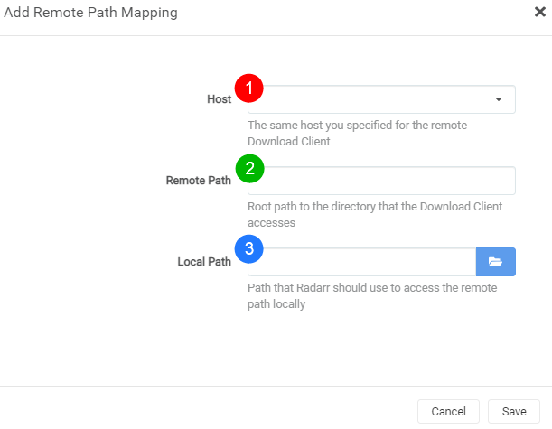

# Mappages de chemins distants

Il semble que beaucoup de gens ne comprennent pas comment fonctionne la cartographie des chemins à distance pour Radarr. Je vais essayer de l'expliquer avec quelques captures d'écran et une brève description.

Le mappage de chemin à distance agit comme une recherche stupide de « Chemin à distance » et le remplace par « Chemin local »

## Quand ai-je besoin de mappages de chemins distants

- Si Radarr et votre client de téléchargement ne sont pas sur le même serveur/système.
- Si vous utilisez des configurations locales/à distance fusionnées à l'aide demergefs ou similaire.
- Vous exécutez des dockers et **N'AVEZ PAS** de chemins cohérents et bien planifiés.

!!! note
    Si vous exécutez Dockers, il serait plus intelligent de résoudre le problème à la source du problème réel.

    - [Radarr Wiki Servarr - Guide Docker](https://wiki.servarr.com/docker-guide#consistent-and-well-planned-paths){:target="_blank" rel="noopener noreferrer"}

    - [Guides TRaSH](/Hardlinks/Hardlinks-and-Instant-Moves/){:target="_blank" rel="noopener noreferrer"}

------

## Comment puis-je reconnaître que j'ai besoin de mappages de chemins distants

Votre téléchargement reste dans votre client de téléchargement et Radarr ne souhaite pas l'importer.

Allez dans `Activité` => `File d'attente`

Vous verrez une icône de téléchargement orange, survolez-la avec votre souris et vous obtiendrez une erreur qui ressemble un peu à ceci :

Allez dans `Système` => `Événements`

Vous verrez une erreur qui ressemble un peu à ceci :

L'erreur suivante peut également signifier que vous avez besoin de mappages de chemins distants :

Donc, en regardant ces captures d'écran, il semble que vous deviez utiliser des mappages de chemins distants.

------

## Comment configurer les mappages de chemins distants

Allez dans `Paramètres` => `Télécharger les clients`

Faites défiler jusqu'en bas jusqu'à l'endroit où vous voyez « Mappages de chemins distants » et cliquez sur le signe plus dans le coin inférieur droit.

Un écran apparaîtra avec les options suivantes :

1. `Hôte` => Il s'agit du nom d'hôte ou de l'adresse IP que vous avez défini dans les paramètres de votre client de téléchargement.
1. `Remote Path` => Le chemin de téléchargement que vous avez défini dans votre client de téléchargement.
1. `Local Path` => Le chemin dont Radarr a besoin pour accéder au même chemin.

### Hôte

Pour trouver ce que vous devez mettre dans votre hébergeur

Allez dans `Paramètres` => `Télécharger les clients`

Ouvrez le client de téléchargement. Pour cet exemple, j'utiliserai SABnzbd.

C'est ce que vous mettez dans votre hôte dans le mappage de chemin à distance.
Il peut s'agir d'un « nom d'hôte », d'un « nom de conteneur » ou d'une « adresse IP ».

??? exemple "exemple de ce qu'il faut ajouter dans Ajouter un mappage de chemin distant - [Cliquez pour afficher/masquer]"

    

### Chemin distant

Pour savoir ce que vous devez mettre dans votre chemin distant, vous devez ouvrir votre client de téléchargement et regarder ce que vous avez utilisé comme emplacement de téléchargement.

Dans SABnzbd, allez dans `paramètres` => `Dossiers`

??? exemple "exemple de ce qu'il faut ajouter dans Ajouter un mappage de chemin distant - [Cliquez pour afficher/masquer]"

    

### Chemin local

Pour savoir ce que vous devez insérer dans votre chemin local, vous devez savoir comment Radarr peut accéder aux fichiers téléchargés par votre client de téléchargement. Cela peut se faire de différentes façons. Montage/partages réseau, peu importe, mais Radarr doit y avoir un accès local, vous devez donc trouver le meilleur moyen pour Radarr d'accéder vous-même aux fichiers téléchargés du client de téléchargement.

Cliquez sur le bouton Parcourir et accédez à l'emplacement où les fichiers sont accessibles pour Radarr.

??? exemple "exemple de ce qu'il faut ajouter dans Ajouter un mappage de chemin distant - [Cliquez pour afficher/masquer]"

    

Le résultat final ressemblera à ceci :

Après ces modifications, le fichier devrait pouvoir être importé par Radarr.

