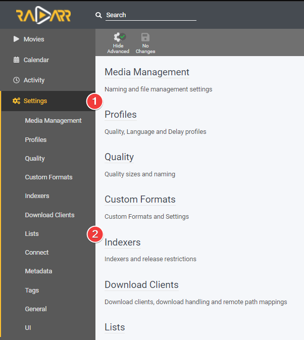
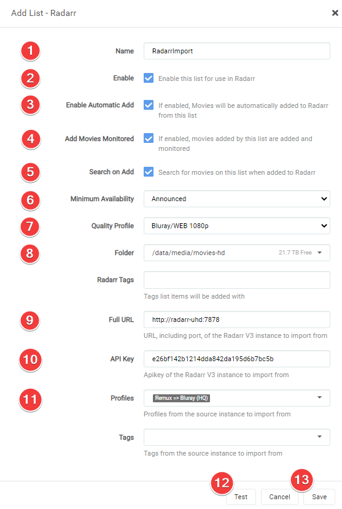
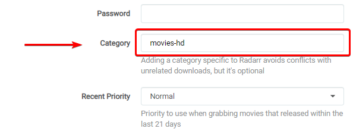
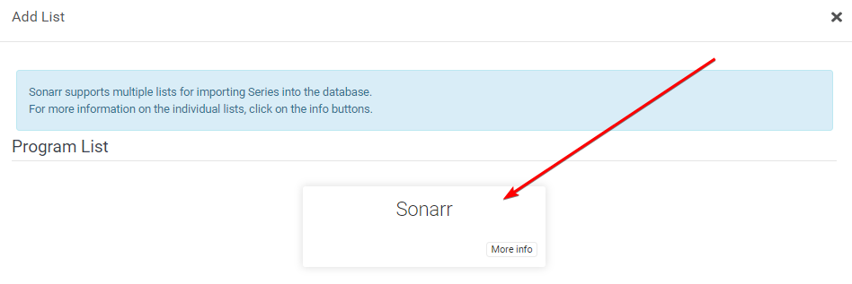

# Comment synchroniser 2 Radarr ou Sonarr entre eux

Dans ce guide, je vais essayer d'expliquer comment synchroniser deux (ou plusieurs) instances Radarr/Sonarr entre elles.

Je vais montrer deux options différentes sur la façon dont vous pouvez configurer votre synchronisation avec deux instances Radarr/Sonarr.

- Option 1 : Cette option est mieux utilisée si vous souhaitez une copie 1:1 de vos instances Radarr/Sonarr car elle synchronisera tout.
- Option 2 : Cette option est mieux utilisée si vous souhaitez uniquement sélectionner les films/émissions de télévision que vous souhaitez en 4K/2160p (UHD).

!!! bogue ""
    Je ne vais pas expliquer comment configurer deux instances Radarr/Sonarr pour votre système, car cela dépend de la façon dont vous l'avez installé/exécuté. [Informations sur les instances multiples Radarr](https://wiki.servarr.com/radarr/installation#multiple-instances) et [Informations sur les instances multiples Sonarr](https://wiki.servarr.com/sonarr/installation#multiple-instances )

## Préparation

Pour cela, vous devez avoir préparé ce qui suit :

- Deux instances Radarr/Sonarr entièrement configurées (indexeurs, formats personnalisés, téléchargeurs, etc.).
- Un client de téléchargement (*Deux si vous préférez Usenet et Torrents*).
- Votre client de téléchargement comporte deux catégories distinctes (films-hd, films-uhd, tv-hd, tv-uhd, etc.)

!!! avertissement

    :bangbang:Vous ne pouvez pas utiliser le même dossier racine (bibliothèque multimédia) pour les deux Radarr/Sonarr :bangbang:

    Assurez-vous d'utiliser deux dossiers racine distincts dans Radarr/Sonarr (movies-hd, movies-uhd, tv-hd, tv-uhd, etc.)

------

### Option 1

!!! Info ""
    Dans cet exemple, je vais utiliser deux instances Radarr (les bases sont les mêmes pour Sonarr).

    - `Radarr 1` = Mon radarr principal 4K/2160p (UHD).
    - `Radarr 2` = Mon Radarr 1080p que j'ai configuré pour un profil de qualité optimisé pour le streaming.[^1]

    Cette option est mieux utilisée si vous souhaitez une copie 1:1 de vos instances Radarr/Sonarr

#### Ajout de la liste Radarr Sync

Dans `Radarr 2` allez dans `Paramètres` => `Listes`

Cliquez sur le + pour ajouter une liste et sélectionnez « Radarr »

Ensuite, vous obtenez un écran avec les options suivantes :

1. Le nom que vous souhaitez appeler votre liste de synchronisation.
1. Activez pour activer la liste.
1. Activez pour que les films soient automatiquement ajoutés.
1. Activez pour que les films soient ajoutés et surveillés (si désactivé, aucune recherche de films ne sera effectuée).
1. Activez pour que Radarr effectue une recherche lorsqu'un film est ajouté.
1. Lorsque Radarr considère un film comme disponible.[^2]
1. Le profil de qualité que vous souhaitez utiliser sur « Radarr 2 ».
1. Votre emplacement racine pour votre bibliothèque multimédia.
1. L'URL complète de « Radarr 1 » (utilisez l'URL locale s'ils fonctionnent sur le même système).
1. Votre clé API de « Radarr 1 ».
1. Quel profil de « Radarr 1 » vous souhaitez synchroniser avec « Radarr 2 ».
1. Testez la connexion à « Radarr 1 ».
1. Enregistrez vos paramètres.

#### Radarr Télécharger la configuration du client

 Vous n'avez pas besoin d'un client de téléchargement distinct pour vos deux instances Radarr, tout cela peut être fait avec un seul client de téléchargement (*Deux si vous préférez Usenet et Torrents*).

`Paramètres` => `Télécharger les clients`

Sélectionnez votre client de téléchargement préféré.

La seule chose que vous devez modifier/créer est une « Catégorie » distincte que vous allez utiliser pour « Radarr 2 ».

!!! avertissement

    Cela ne peut pas et ne doit pas être la même catégorie que celle que vous utilisez pour « Radarr 1 », mais une « Catégorie » distincte.

### Comment fonctionne cette synchronisation Radarr

Il ne vous reste plus qu'à utiliser `Radarr 1`. Tous les films que vous ajoutez à « Radarr 1 » seront synchronisés avec « Radarr 2 » à une heure programmée.

------

### Option 2

!!! Info ""
    Dans cet exemple, je vais utiliser deux instances Sonarr (les bases sont les mêmes pour Radarr).

    - `Sonarr 1` = Mon Sonarr WEB-DL 1080p principal.
    - `Sonarr 2` = Sonarr WEB-DL 4K/2160p (UHD).

    Cette option est mieux utilisée si vous souhaitez uniquement avoir quelques émissions de télévision (ou films si vous utilisez cette option avec Radarr) en 4K/2160p (UHD).

#### Préparation supplémentaire

Dans `Sonarr 1` allez dans `Paramètres` => `Profils`

Clonez votre profil utilisé et renommez votre profil de « Nom de profil - Copier » en « Nom de profil ! »

#### Ajout de la liste Sonarr Sync

Dans `Sonarr 2` allez dans `Paramètres` => `Importer des listes`

Cliquez sur le + pour ajouter une liste et sélectionnez `Sonarr`

Ensuite, vous obtenez un écran avec les options suivantes :

1. Le nom que vous souhaitez appeler votre liste de synchronisation.
1. Activez pour que les émissions soient automatiquement ajoutées.
1. Choisissez vos options de surveillance.[^3]
1. Votre emplacement racine pour votre bibliothèque multimédia.
1. Le profil de qualité que vous souhaitez utiliser sur `Sonarr 2`.
1. Type de série.[^4]
1. Si vous souhaitez utiliser les dossiers saisonniers.
1. L'URL complète de « Sonarr 1 » (utilisez l'URL locale s'ils fonctionnent sur le même système).
1. Votre clé API de « Sonarr 1 ».
1. Le profil cloné de « Sonarr 1 » que nous allons utiliser pour synchroniser avec « Sonarr 2 ».
1. Testez la connexion à `Sonarr 1`.
1. Enregistrez vos paramètres.

#### Sonarr Télécharger la configuration du client

 Vous n'avez pas besoin d'un client de téléchargement séparé pour vos deux instances Sonarr/Radarr, tout cela peut être fait avec un seul client de téléchargement (*Deux si vous préférez Usenet et Torrents*).

`Paramètres` => `Télécharger les clients`

Sélectionnez votre client de téléchargement préféré.

La seule chose que vous devez modifier/créer est une « Catégorie » distincte que vous allez utiliser pour « Sonarr 2 ».

!!! conseil

    Cela ne peut pas et ne doit pas être la même catégorie que celle que vous utilisez pour « Sonarr 1 », mais une « Catégorie » distincte.

### Comment fonctionne cette synchronisation Sonarr

Il ne vous reste plus qu'à utiliser `Sonarr 1`. Lorsque vous obtenez une émission de télévision (ou un film si vous utilisez cette option avec Radarr) que vous souhaitez également en 4K/2160p (UHD), assurez-vous d'utiliser le profil de qualité cloné. Et il se synchronisera à une heure programmée.

------

[^1] :

    Si vous êtes intéressé par le profil de qualité optimisée pour le streaming 1080p, vous pouvez rejoindre mon [discord](https://trash-guides.info/discord) et accéder à la chaîne Special Quality Profiles (access-to-sqp) en acceptant les règles.

    Il s'agit d'un profil de qualité spécial que j'ai créé pour les personnes qui s'y intéressent vraiment.

    Ce profil de version est adapté lorsque vous souhaitez exécuter un deuxième Radarr pour 1080p et que vous souhaitez un transcodage minimum ou nul et des tailles plus petites pour les deuxièmes copies.

    Pourquoi choisir ce profil de qualité ?

    - Streaming optimisé (optimisé pour PLEX, emby, Jellyfin et autres plateformes de streaming)
    - Petites tailles
    - Bonne qualité
    - Uniquement AC3 Audio (piste audio sous-mixée sans perte en Dolby Digital 5.1 pour une compatibilité optimale)
    - Vous souhaitez une compatibilité maximale entre tous les appareils et disposez toujours d'une version HQ.
    - Vous exécutez deux instances de Radarr et souhaitez les deux versions ou uniquement celles en 1080p.
    - Vous souhaitez avoir un transcodage minimum, voire aucun, pour les appareils à faible consommation ou le streaming à distance.

[^2] :

    - **Annoncé** : Radarr considérera les films disponibles dès qu'ils seront ajoutés à Radarr. Ce paramètre est recommandé si vous disposez de bons trackers privés qui n’ont pas de contrefaçons.
    - **Dans les cinémas** : Radarr considérera les films disponibles dès qu'ils sortiront en salles. Cette option n'est pas recommandée.
    - **Sortie** : Radarr considérera les films disponibles dès la sortie du Blu-ray. Cette option est recommandée si vos indexeurs contiennent souvent des contrefaçons.

[^3] :

    - **Tous les épisodes** : surveillez tous les épisodes sauf les spéciaux
    - **Futurs épisodes** : surveillez les épisodes qui n'ont pas encore été diffusés
    - **Épisodes manquants** : surveillez les épisodes qui n'ont pas de fichiers ou qui n'ont pas encore été diffusés
    - **Épisodes existants** : surveillez les épisodes contenant des fichiers ou qui n'ont pas encore été diffusés
    - **Première saison** : surveillez tous les épisodes de la première saison. Toutes les autres saisons seront ignorées
    - **Dernière saison** : surveillez tous les épisodes de la dernière saison et des saisons à venir
    - **Aucun** : aucun épisode ne sera surveillé

[^4] :

    - **Anime** : épisodes publiés en utilisant un numéro d'épisode absolu
    - **Quotidien** : épisodes diffusés quotidiennement ou moins fréquemment qui utilisent l'année-mois-jour (2017-05-25)
    - **Standard** : épisodes publiés avec le modèle SxxEyy

--8<-- "includes/support.md"