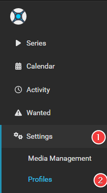
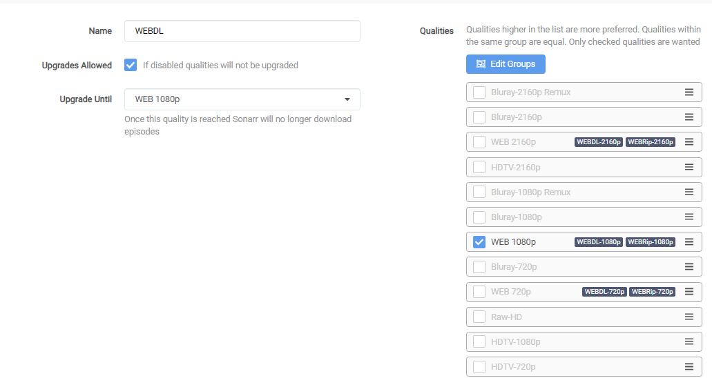
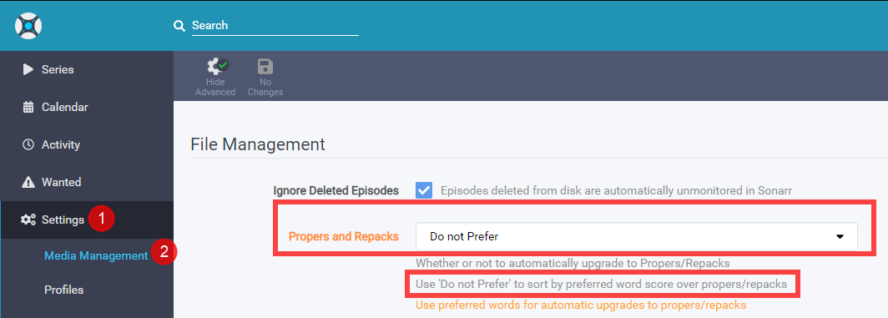
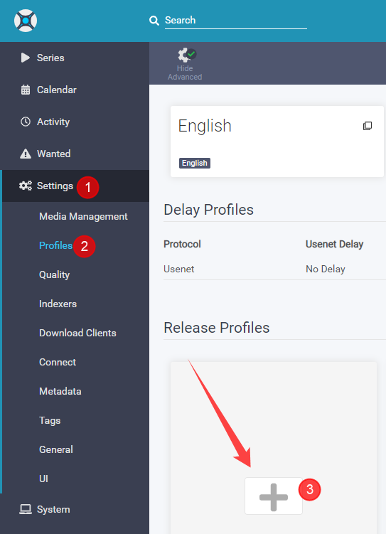
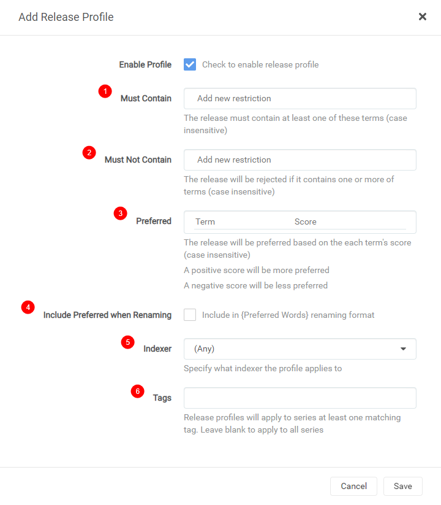
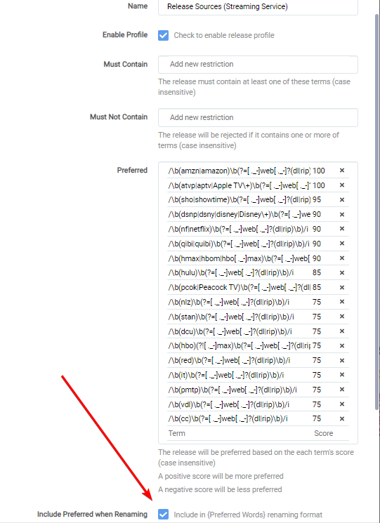
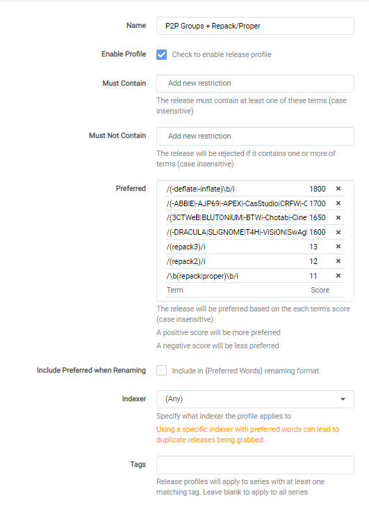
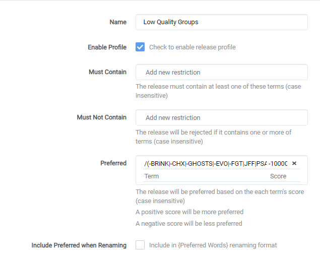

{! include-markdown "../../includes/sonarrv3-eol.md" !}

# Libérer le profil RegEx (WEB-DL)

Sonarr V3 possède une fonctionnalité intéressante appelée Release Profile.
Avec cette option, vous pouvez affiner vos préférences.

Le profil Release que nous allons utiliser pour cet exemple consiste principalement à préférer les versions P2P aux versions Scene. (Les versions Scene sont toujours en cours de téléchargement, mais remplacées une fois qu'une mise à niveau est trouvée.)

!!! danger ""
    **Si vous ne vous souciez pas de la qualité, arrêtez de lire et voyez si les autres tutoriels vous sont utiles.**

??? question "FAQ - [Cliquez pour afficher/masquer]"

    ## FAQ

    **Q : Pourquoi disposez-vous uniquement d'un profil de version pour WEB-DL ?**

    R : Je fais moi-même du WEB-DL uniquement pour les émissions de télévision car, à mon avis, le WEB-DL est le juste milieu entre la qualité et la taille et de toute façon, on ne voit souvent pas de grandes différences pour les émissions de télévision. (Sauf pour les émissions comme GOT, Vikings, etc.)

    **Q : Pourquoi préférez-vous les groupes P2P aux groupes de scènes ?**

    R : Les groupes de scènes sortent toujours à la va-vite pour les sortir le plus vite possible.

    J'ai donc souvent remarqué que je recevais des versions Repacks/Proper d'eux ou de différents groupes et qualités.
    Les versions P2P sont un peu plus intelligentes et fonctionnent en quelque sorte ensemble en ne faisant pas la même version.
    De plus, j'ai remarqué qu'avec certaines versions de scène, l'audio 5.1 était supprimé ou converti en audio AAC.

    À mon avis, les versions P2P sont de meilleure qualité.
    Il y a un groupe de scène qui sort des versions de qualité `-deflate/-inflate`.

    **Q : Pourquoi vois-je autant de repacks/propriétés d'Amazon WEB-DL ces derniers temps ?**

    R : Une grande partie des WEB-DL d'Amazon au cours de la semaine dernière n'avaient que 192 Kbps DD+5.1, car c'est tout ce qu'Amazon avait initialement mis à disposition.
    L'audio DD+5.1 à 640 Kbps approprié peut apparaître quelques heures plus tard ou quelques mois, mais lorsqu'ils seront mis à jour, les épisodes seront RÉEMBALLÉS.

    **Q : Pourquoi avez-vous supprimé tous les groupes de scènes ?**

    R : J'ai décidé de refaire le profil de version pour permettre à moi et à l'utilisateur final de mettre à jour/gérer plus facilement le profil de version. J'ai décidé de ne plus ajouter les groupes de scènes (et également de supprimer ceux actuels). Pourquoi? Dernièrement, j'ai remarqué de nombreuses versions de scènes contextuelles, ce qui signifie que nous devons les mettre à jour souvent.

    Cela signifie également que toutes les scènes et les groupes (encore) inconnus obtiendront un score de « 0 » et non de « -50 ».

    Je garderai toujours un œil sur eux et ajouterai les groupes de faible qualité au score « -100 ». Lorsque je trouverai un nouveau groupe P2P, je les ajouterai, ce qui entraînera moins de mises à jour et une mise à niveau plus précise.

------

## Bases

Ce guide est basé sur WEBDL (Lire la [FAQ](#faq) pourquoi) c'est pourquoi nous allons créer un profil de qualité basé sur WEBDL.

`Paramètres` => `Profils`



Sélectionnez le profil que vous souhaitez utiliser/préférer.




!!! conseil
    À partir de 2010, vous pourrez trouver presque tout comme WEBDL,

    2000-2010, vous ne trouverez que quelques émissions au format WEBDL, dans ce cas, vous souhaiterez peut-être activer « HDTV » et/ou « 720p ».

    Si vous voulez du WEBDL 2160p alors choisissez 2160p WEBDL et ajoutez le regex HDR et/ou DV, le 2160p sans HDR/DV n'a aucun réel avantage !!!

------

{! include-markdown "../../includes/merge-quality/sonarr-current-logic.md" !}

------

## Propriétés et reconditionnements

Nous devons d’abord nous assurer qu’une version P2P n’est pas remplacée par une version Scene Repack/Proper !



Allez dans `Paramètres` => `Gestion des médias`
Nous allons le définir sur « Ne pas préférer ».

Ensuite, nous naviguons vers « Paramètres » => « Profils » et cliquons sur le signe plus.



Vous obtiendrez un écran contextuel qui ressemblera à ceci :



1. `Must Contain` => ajoutez les mots que le nom de la version **DOIT AVOIR !**

1. `Ne doit pas contenir` => ajoutez des mots que le nom de la version ** NE DOIT PAS AVOIR OU IL SERA REJETÉ ! **

1. `Préféré` => ajoutez les mots que vous préférez avec un certain score. La version sera préférée en fonction du score de chaque trimestre.

1. `Inclure les préférences lors du renommage` => Lorsque vous ajoutez `{Mots préférés}` à votre schéma de renommage, cette information sera ajoutée.

1. `Indexers` => Spécifiez à quel indexeur le profil s'applique.

1. `Tags` => créez une balise afin qu'elle ne soit utilisée que par les émissions auxquelles vous donnez cette balise, sinon elle est globale.

------

!!! Info

    Les nombres entre les **[**crochets**]** dans les profils de version suivants correspondent aux scores que le nom de la version obtiendra lors d'une recherche automatique et manuelle. Avec l'utilisation des scores, certaines versions seront préférées à d'autres et même mis à niveau.

    Le nombre entre **(**crochets**)** dans les profils de version suivants fait référence à l'emplacement où vous devez ajouter cette expression régulière dans le profil de version correspondant à la capture d'écran ci-dessus.

!!! avertissement "Nous allons utiliser quatre profils de version distincts."

------

## Profil 1

<!-- [trash_id : a0e7774a471e041d4f1111e0690244d0] -->

### Sources de version (service de streaming)

!!! note

    Cochez « Inclure les préférences lors du renommage » et ajoutez « {Mots préférés} » à votre schéma de renommage, sinon vous pourriez avoir des problèmes de boucle de téléchargement !!!

    Ce qu'il fait:

    Lorsqu'il est activé, le bloc contenant [Release Source (Streaming Service)] (#release-source-streaming-service) est ensuite ajouté au nom du fichier qui corrige toutes les boucles dues au fait que Sonarr voit une nouvelle extraction NF lorsqu'une extraction AMZN est trouvé.
    Cela ne se produit probablement pas si le seuil est respecté, mais pour tout ce qui n'est pas respecté ou pour toute recherche forcée, cela entraîne une boucle car NF n'est pas dans la copie de Sonarr, donc il est mis à niveau et boucle.

    L'activation de l'inclusion dans les mots préférés pour AMZN et l'ajout de cela au nom du fichier corrigent ce problème.

    Exemple de schéma de dénomination pour les séries :

    Peut être trouvé [ICI](/Sonarr/Sonarr-recommended-naming-scheme/){:target="_blank" rel="noopener noreferrer"}

Ajoutez-le à votre « Préféré (3) » avec un score de [100]

```bash
/\b(atvp|aptv|Apple TV\+)\b(?=[ ._-]web[ ._-]?(dl|rip)\b)/i
```

```bash
/\b(dsnp|dsny|disney|Disney\+)\b(?=[ ._-]web[ ._-]?(dl|rip)\b)/i
```

Ajoutez-le à votre « Préféré (3) » avec un score de [90]

```bash
/\b((?<!hbo[ ​​._-])max)\b(?=[ ._-]web[ ._-]?(dl|rip)\b)/i
```

Ajoutez-le à votre « Préféré (3) » avec un score de [80]

```bash
/\b(hmax|hbom|hbo[ ._-]max)\b(?=[ ._-]web[ ._-]?(dl|rip)\b)/i
```

```bash
/\b(qibi|quibi)\b(?=[ ._-]web[ ._-]?(dl|rip)\b)/i
```

Ajoutez-le à votre « Préféré (3) » avec un score de [70]

```bash
/\b(amzn|amazon)\b(?=[ ._-]web[ ._-]?(dl|rip)\b)/i
```

Ajoutez-le à votre « Préféré (3) » avec un score de [60]

```bash
/\b(nf|netflix)\b(?=[ ._-]web[ ._-]?(dl|rip)\b)/i
```

```bash
/\b(pcok|Peacock TV)\b(?=[ ._-]web[ ._-]?(dl|rip)\b)/i
```

```bash
/\b(pmtp)\b(?=[ ._-]web[ ._-]?(dl|rip)\b)/i
```

```bash
/\b(stan)\b(?=[ ._-]web[ ._-]?(dl|rip)\b)/i
```

Ajoutez-le à votre « Préféré (3) » avec un score de [50]

```bash
/\b(cc)\b(?=[ ._-]web[ ._-]?(dl|rip)\b)/i
```

```bash
/\b(crav(e)?)\b[ ._-]web[ ._-]?(dl|rip)?\b/i
```

```bash
/\b(dcu)\b(?=[ ._-]web[ ._-]?(dl|rip)\b)/i
```

```bash
/\b(hbo)(?![ ._-]max)\b(?=[ ._-]web[ ._-]?(dl|rip)\b)/i
```

```bash
/\b(hulu)\b(?=[ ._-]web[ ._-]?(dl|rip)\b)/i
```

```bash
/\b(it)\b(?=[ ._-]web[ ._-]?(dl|rip)\b)/i
```

```bash
/\b(nlz)\b(?=[ ._-]web[ ._-]?(dl|rip)\b)/i
```

```bash
/\b(rouge)\b(?=[ ._-]web[ ._-]?(dl|rip)\b)/i
```

```bash
/\b(sho|showtime)\b(?=[ ._-]web[ ._-]?(dl|rip)\b)/i
```

```bash
/\b(vdl)\b(?=[ ._-]web[ ._-]?(dl|rip)\b)/i
```

```bash
/\b(ovid)\b(?=[ ._-]web[ ._-]?(dl|rip)\b)/i
```

```bash
/\b(fod)\b(?=[ ._-]web[ ._-]?(dl|rip)\b)/i
```

```bash
/\b(tver)\b(?=[ ._-]web[ ._-]?(dl|rip)\b)/i
```

```bash
/\b(u-suivant)\b(?=[ ._-]web[ ._-]?(dl|rip)\b)/i
```

```bash
/\b(ALL4)\b(?=[ ._-]web[ ._-]?(dl|rip)\b)/i
```

```bash
/\b(4OD)\b(?=[ ._-]web[ ._-]?(dl|rip)\b)/i
```

!!! danger "Attention"
    N'oubliez pas de cliquer sur `SAVE` après avoir ajouté tout ce que vous voulez au profil de version :bangbang:

??? réussite "exemple - [Cliquez pour afficher/masquer]"

    !!! avertissement
        Ces captures d'écran ne sont que des exemples pour vous montrer à quoi cela devrait ressembler et où vous devez placer les données que vous devez ajouter. Elles ne reflètent pas à 100 % les données réelles et ne sont pas toujours à jour à 100 % avec les données réelles. vous devez ajouter.

        - Suivez toujours les données décrites dans le guide (avec l'option copier-coller/option à la fin).
        - Si vous avez des questions ou n'êtes pas sûr, cliquez simplement sur le badge de discussion pour rejoindre la chaîne Discord où vous pourrez poser vos questions directement.

        [](https://trash-guides.info/discord){:target ="_blank" rel="noopener noreferrer"}

    

------

## Profil 2

<!-- [trash_id : 37cf8cdd57c8fb4a8b68f36e00e40de2] -->

### Groupes P2P + Repack/Proper

!!! avertissement "NE PAS cocher `Inclure les préférences lors du changement de nom` :bangbang:"

Ajoutez ceci à votre « Préféré (3) » avec un score de [1700]

```bash
/(-ABBIE|-AJP69|-APEX|-CasStudio|CRFW|-CtrlHD|-FLUX|\bHONE|-KiNGS|-monkee|NOSiViD|-NTb|-NTG|-PAXA|-PEXA|-QOQ|-RTN |-SiC|T6D|-TOMMY|-ViSUM|-XEPA)\b/i
```

Ajoutez ceci à votre « Préféré (3) » avec un score de [1650]

```bash
/(3CTWeB|BLUTONiUM|-BTW|-Chotab|-Cinefeel|-CiT|-CMRG|Coo7|-dB|-DEEP|-END|-ETHiCS|-FC|-Flights|-GNOME|-iJP|-iKA| -iT00NZ|-JETIX|-KHN|-KiMCHI|-LAZY|-MZABI|-NPMS|-NYH|-orbitron|playWEB|PSiG|-ROCCaT|RTFM|-SA89|-SDCC|-SIGMA|-SMURF|-SPiRiT |-TEPES|-TVSmash|-WELP)\b/i
```

Ajoutez ceci à votre « Préféré (3) » avec un score de [1600]

```bash
/(-DRACULA|SLiGNOME|T4H|-ViSiON|SwAgLaNdEr|-NINJACENTRAL)\b/i
```

Ajoutez ceci à votre « Préféré (3) » avec un score de [1600] [^1]

```bash
/(-dégonfler|-gonfler)\b/i
```

Ajoutez-le à votre « Préféré (3) » avec un score de [7]

```bash
/(repack3)/je
```

Ajoutez-le à votre « Préféré (3) » avec un score de [6]

```bash
/(repack2)/je
```

Ajoutez-le à votre « Préféré (3) » avec un score de [5]

```bash
/\b(reconditionner|correct)\b/i
```

!!! danger "Attention"
    N'oubliez pas de cliquer sur `SAVE` après avoir ajouté tout ce que vous voulez au profil de version :bangbang:

??? réussite "exemple - [Cliquez pour afficher/masquer]"

    !!! avertissement
        Ces captures d'écran ne sont que des exemples pour vous montrer à quoi cela devrait ressembler et où vous devez placer les données que vous devez ajouter. Elles ne reflètent pas à 100 % les données réelles et ne sont pas toujours à jour à 100 % avec les données réelles. vous devez ajouter.

        - Suivez toujours les données décrites dans le guide (avec l'option copier-coller/option à la fin).
        - Si vous avez des questions ou n'êtes pas sûr, cliquez simplement sur le badge de discussion pour rejoindre la chaîne Discord où vous pourrez poser vos questions directement.

        [](https://trash-guides.info/discord){:target ="_blank" rel="noopener noreferrer"}

    

------

## Profil 3

<!-- [trash_id : EBC725268D687D588A20CBC5F97E538B] -->

### Groupes de faible qualité

!!! avertissement "NE PAS cocher `Inclure les préférences lors du changement de nom` :bangbang:"

Ajoutez ceci à votre « Préféré (3) » avec un score de [-10000]

```bash
/(-BRiNK|-CHX|-CTFOH|-d3g|-EVO|-FGT|-GHOSTS|-HiQVE|-iNTENSO|JFF|MeGusta|-NERO|nhanc3|Pahe\.ph|Pahe\.in|Pahe|PSA|TBS|-TG|-VIDEOHOLE|-worldmkv|-XLF|-Zero00)\b/i
```

!!! danger "Attention"
    N'oubliez pas de cliquer sur `SAVE` après avoir ajouté tout ce que vous voulez au profil de version :bangbang:

??? réussite "exemple - [Cliquez pour afficher/masquer]"

    !!! avertissement
        Ces captures d'écran ne sont que des exemples pour vous montrer à quoi cela devrait ressembler et où vous devez placer les données que vous devez ajouter. Elles ne reflètent pas à 100 % les données réelles et ne sont pas toujours à jour à 100 % avec les données réelles. vous devez ajouter.

        - Suivez toujours les données décrites dans le guide (avec l'option copier-coller/option à la fin).
        - Si vous avez des questions ou n'êtes pas sûr, cliquez simplement sur le badge de discussion pour rejoindre la chaîne Discord où vous pourrez poser vos questions directement.

        [](https://trash-guides.info/discord){:target ="_blank" rel="noopener noreferrer"}

    

------

## Profil 4

###Options

!!! avertissement "NE PAS cocher `Inclure les préférences lors du changement de nom` :bangbang:"

!!! danger "Attention"
    Ces options sont facultatives car elles ne doivent être ajoutées/utilisées que si vous avez un certain cas d'utilisation, si vous ne comprenez pas à quoi sert l'option, alors vous n'en avez probablement pas besoin :bangbang:

    :bangbang: **À l'exception de la `Règle d'or`, celle-ci est en fait un incontournable même si elle est ajoutée dans la section facultative** :bangbang:

    Si vous voyez certaines options avec un score positif et que vous ne les voulez pas, ajoutez-les simplement avec un score négatif !!!

#### Règle d'or

!!! avertissement ""
    :bangbang: Celui-ci est en fait un incontournable même s'il est ajouté dans la section facultative :bangbang:

??? question "Pourquoi l'entrée Ne doit pas contenir - [Cliquez pour afficher/masquer]"

    Celui-ci bloque/ignore les versions 720/1080p qui sont (ré)codées en x265.

    Alors pourquoi ai-je mis `/^(?=.*(1080|720))(?=.*((x|h)( ._-]?265|hevc)).*/i` comme `Ne doit pas Contenir et à quoi ça sert ?

    Pourquoi ?

    !!! citation
        x265 convient aux contenus 4K ou 1080p s'ils utilisent les remux comme source.
        Si le média n'est pas de qualité source/remux, il y aura une perte de qualité à chaque fois.
        De plus, une fois que vous passez à x265, ce fichier est généralement terminé.
        Il ne peut pas être remplacé par autre chose sans une énorme perte de qualité.

        Quelque chose comme 95 % des fichiers vidéo sont au format x264 et offrent une bien meilleure prise en charge de la lecture directe.
        Si vous avez plusieurs utilisateurs,
        vous remarquerez beaucoup plus de transcodage.
        Cela dépend simplement de vos priorités.

        Donc, fondamentalement, si vous manquez de stockage et que vous avez juste besoin d’économiser de l’espace, utilisez x265.
        Le problème est que si vous voulez la meilleure qualité x265, vous avez besoin de fichiers de qualité source, vous avez donc toujours des tailles de fichiers énormes.
        Si vous souhaitez une compatibilité maximale et la possibilité de remplacer vos fichiers par autre chose plus tard,
        puis x264.
        Tout dépend vraiment de situations spécifiques pour différentes personnes

    Il est dommage que la plupart des groupes x265 microdimensionnent les versions ou utilisent le x264 comme source, ce qui entraîne des versions de mauvaise qualité. Et les quelques groupes qui utilisent la bonne source en souffrent.

    C'est pourquoi j'ai créé ma propre règle d'or.

    - 720/1080p => x264
    - 2160p/4k => x265

Ajoutez ceci à votre « Ne doit pas contenir (2) »

```bash
/^(?=.*(1080|720))(?=.*((x|h)[ ._-]?265|hevc)).*/i
```

??? réussite "exemple - [Cliquez pour afficher/masquer]"

    

------

#### Facultatif – Préférer le HDR

Ajoutez-le à votre « Préféré (3) » avec un score de [500]

```bash
/\bHDR(\b|\d)/i
```

------

#### Facultatif - Préférez Dolby Vision

Ajoutez-le à votre « Préféré (3) » avec un score de [1 500]

```bash
/\b(dv|dovi|dolby[ .]?v(ison)?)\b/i
```

------

#### Facultatif – Je n'aime pas les retags

??? question "Explication - [Cliquez pour afficher/masquer]"
    Utilisez-le uniquement si vous n'aimez pas les versions renommées et réétiquetées, certains indexeurs/trackers sont connus pour renommer ou ajouter leurs propres balises au nom de la version, ce qui pourrait gâcher vos résultats ou votre dénomination.

Ajoutez ceci à votre « Préféré (3) » avec un score de [-10000]

```bash
/(\[rartv\]|\[rarbg\]|\[eztv([ ._-]re)?\]|\[TGx\])/i
```

#### Facultatif – Je n'aime pas les éléments obscurcis

??? question "Explication - [Cliquez pour afficher/masquer]"
    Utilisez-le uniquement si vous n'aimez pas les versions obscurcies, certains indexeurs sont connus pour renommer ou ajouter leurs propres balises/noms obscurcis au nom de la version, ce qui pourrait gâcher vos résultats ou votre dénomination.

Ajoutez ceci à votre « Préféré (3) » avec un score de [-10000]

```bash
/(-4P|-4Planet|-AsRequested|-BUYMORE|-CAPTCHA|-Chamele0n|-GEROV|-iNC0GNiTO|-NZBGeek|-Obfuscated|-postbot|-Rakuv|-Scrambled|-WhiteRev|-WRTEAM|-xpost) \bi
```

------

#### Facultatif - Je n'aime pas la fin de la version : fr

Ajoutez ceci à votre « Préféré (3) » avec un score de [-10000]

??? question "Explication - [Cliquez pour afficher/masquer]"
    Certains indexeurs sont connus pour ajouter des informations supplémentaires inutiles au nom de la version, ce qui pourrait gâcher vos résultats ou votre dénomination.

```bash
/\s?\ben\b$/i
```

------

#### Facultatif - Je n'aime pas la version contenant : 1-

??? question "Explication - [Cliquez pour afficher/masquer]"
    Certains indexeurs sont connus pour ajouter des informations supplémentaires inutiles au nom de la version, ce qui pourrait gâcher vos résultats ou votre dénomination.

    Correspond à toute version contenant « 1- » comme préfixe pour les groupes de versions

Ajoutez ceci à votre « Préféré (3) » avec un score de [-10000]

```bash
/(?<!\d\.)(1-.+)$/i
```

------

#### Facultatif – Je n'aime pas les extras

Ajoutez ceci à votre « Préféré (3) » avec un score de [-10000]

```bash
/(?<=\bS\d+\b).*\b(Extras|Bonus)\b/i
```

------

#### Facultatif - Préférer les packs de saison

??? question "Explication - [Cliquez pour afficher/masquer]"
    Utilisez-le si vous préférez les packs saisonniers

!!! avertissement ""

    - Cela mettra également à niveau vos épisodes uniques déjà téléchargés
    - Les packs de saison `/\bS\d+\b(?!E\d+\b)/i` sont préférés : cependant, étant donné que le nom du dossier est ignoré, l'erreur/avertissement/problème se produit car les noms de fichiers ne seraient pas une saison pack bien sûr.
    - gardez à l'esprit que c'est la seule façon de préférer les packs de saison si vous avez des mots préférés en raison d'un bug de longue date => Les mots préférés annulent la préférence du pack de saison [Sonarr/Sonarr#3562](https://github.com/Sonarr/ Sonarr/issues/3562){:target="_blank" rel="noopener noreferrer"}

Ajoutez-le à votre « Préféré (3) » avec un score de [15]

```bash
/\bS\d+\b(?!E\d+\b)/i
```

------

##### Problème de pack de saison .su

??? bug "Problème du pack de saison .su - [Cliquez pour afficher/masquer]"

    Lorsque vous voyez une erreur dans Sonarr qui ressemble en quelque sorte à la capture d'écran suivante

    

    Ensuite, il n’existe qu’une seule solution réelle qui résout toujours ce problème.
    créez un nouveau profil de version spécifique pour .su qui utilise la [regex de saison] (#optional-matches-season-packs-use-this-if-you-prefer-season-packs) comme « Ne doit pas contenir (2) »

    

    !!! note
        Il existe un [script](/NZBGet/scripts/#wtfnzb-renamer){:target="_blank" rel="noopener noreferrer"} pour NZBGet qui pourrait parfois aider, mais il semble qu'il ne fonctionne pas toujours. Il semble également qu'il existe une solution pour SABnzbd, mais je ne peux pas confirmer que je n'utilise pas Sab.

------

#### Facultatif - Ignorer Dolby Vision sans repli HDR10

??? question "Explication - [Cliquez pour afficher/masquer]"

    Il s'agit d'un RegEx qui ignore les DV qui n'ont pas de solution de repli vers HDR10, ce qui peut entraîner des problèmes de lecture comme des couleurs étranges si vous souhaitez le lire sur une configuration non compatible Dolby Vision.

Ajoutez ceci à votre « Ne doit pas contenir (2) »

```bash
/^(?!.*(HDR|HULU|REMUX))(?=.*\b(DV|Dovi|Dolby[- .]?V(ision)?)\b).*/i
```

------

#### Facultatif - Ignorer le groupe -SCÈNE

??? question "Explication - [Cliquez pour afficher/masquer]"

    Il semble que plex ignore « -scene » parce qu'il pense que ce sont des extras. [SOURCE](https://github.com/squaresmile/Plex-Plug-Ins/blob/61eda8a775e198971dcf5088c4daf264a844736f/Scanners.bundle/Contents/Resources/Common/VideoFiles.py#L11){:target="_blank" rel=" pas d'ouverture ni de référence"}

Ajoutez ceci à votre « Ne doit pas contenir (2) »

```bash
/\b(-scène)\b/i
```

------

#### Facultatif - Ignorer les versions de scène

??? question "POURQUOI ? - [Cliquez pour afficher/masquer]"

    Si vous ne souhaitez pas télécharger ce qu'on appelle les versions de scène.

Ajoutez ceci à votre « Ne doit pas contenir (2) »

```bash
/^(?!.*(web[ ]dl|-deflate|-inflate))(?=.*(\b\d{3,4}p\b).*([_. ]WEB[_. ])(?!DL)\b)|\b(-CAKES|-GGEZ|-GGWP|-GLHF|-GOSSIP|-NAISU|-KOGI|-PECULATE|-SLOT|-EDITH|-ETHEL|-ELEANOR| -B2B|-SPAMnEGGS|-FTP|-DiRT|-SYNCOPY|-BAE|-SuccessfulCrab|-NHTFS|-SURCODE|-B0MBARDIERS).*/i

```

#### Facultatif - Ignorer les mauvais groupes audio doubles

??? question "POURQUOI ? - [Cliquez pour afficher/masquer]"

    Ces groupes prennent la version originale, puis ajoutent leur propre langue préférée (par exemple le portugais) comme piste audio principale (AAC 2.0). Ce qui résulte après le changement de nom et FFprobe que le fichier multimédia sera reconnu comme audio AAC portugais. Il est courant d'ajouter le meilleur son en premier.
    De plus, ils renomment souvent le nom de la version en portugais.

Ajoutez ceci à votre « Ne doit pas contenir (2) »

```bash
/\b(-alfaHD|-BAT|-BNd|-C\.A\.A|-Cory|-EXTREME|-FF|-FOXX|-G4RiS|-GUEIRA|-N3G4N|-PD|-PTHome|-RiPER|-RK|-SiGLA|-Tars|-WTV|-Yatogam1|-YusukeFLA|-ZigZag)\b/i
```

#### Facultatif – Ignorer AV1

??? question "POURQUOI ? - [Cliquez pour afficher/masquer]"

    - Il s'agit d'un nouveau codec et vous avez besoin d'appareils modernes qui le prennent en charge.
    - Nous avons également eu des rapports faisant état de problèmes de lecture/transcodage.
    - Aucun groupe principal ne l'utilise (encore).
    - Il est préférable d'ignorer ce nouveau codec pour éviter des problèmes de compatibilité.

Ajoutez ceci à votre « Ne doit pas contenir (2) »

```bash
/\bAV1\b/i
```

------

### Une petite explication des scores et pourquoi

- Scores [75]-[100] Source de sortie.
- Scores [1600]-[1800] groupes P2P.
- Scores [10-12] Donnez à un repack/bon un score plus élevé, mais ne l'emportez pas sur les groupes P2P pour un correctif de scène.
- Scores [-10000] Versions réétiquetées/renommées/obscurcies.

    !!! danger ""
        Si vous recevez souvent un message d'erreur du type « A la même taille de fichier que le fichier existant », vous devrez peut-être envisager de supprimer le [-10000]

- Scores [-10000] Groupes qui modifient l'audio ou ajoutent une autre langue préférée.

Facultatif => Nous l'avons testé et cela a fonctionné pour ce sur quoi nous l'avons testé, si cela fonctionnera dans votre situation, nous ne le savons pas.

Si vous remarquez quelque chose qui ne va pas, contactez-moi et nous essaierons de le réparer ou de le supprimer.

## Résultats finaux

Lorsque vous l'aurez fait correctement, cela ressemblera à ceci.

??? réussite "exemple - [Cliquez pour afficher/masquer]"

    !!! avertissement
        Ces captures d'écran ne sont que des exemples pour vous montrer à quoi cela devrait ressembler et où vous devez placer les données que vous devez ajouter. Elles ne reflètent pas à 100 % les données réelles et ne sont pas toujours à jour à 100 % avec les données réelles. vous devez ajouter.

        - Suivez toujours les données décrites dans le guide (avec l'option copier-coller/option à la fin).
        - Si vous avez des questions ou n'êtes pas sûr, cliquez simplement sur le badge de discussion pour rejoindre la chaîne Discord où vous pourrez poser vos questions directement.

        [](https://trash-guides.info/discord){:target ="_blank" rel="noopener noreferrer"}

    

------

Cette liste est établie en collectant des informations auprès de Sonarr Discord Channel, ainsi que des tests personnels et quelques autres qui ont aidé.

Je tiens donc à remercier tous ceux qui ont contribué à rendre cette liste possible, pour des raisons de confidentialité, j'ai décidé de ne pas ajouter les noms/pseudo des personnes.

Si vous souhaitez être mentionné, veuillez m'envoyer un message sur Discord, en incluant un lien pour prouver la partie que vous souhaitez être crédité.

!!! Info

    Gardez à l’esprit que cette liste sera un travail constant en cours car je la mettrai à jour lorsque cela sera nécessaire.

    Il est donc préférable de définir une notification pour les mises à jour de cette page.

    Vous pouvez également utiliser l'une des options de synchronisation tierce que vous pouvez trouver [ICI](/Misc/trash-sync){:target="_blank" rel="noopener noreferrer"}.

------

{! include-markdown "../../includes/support.md" !}
<!-- --8<-- "includes/support.md" -->

[^1]:

    La raison pour laquelle celui-ci obtient un score positif est que c'est le seul groupe de scène de qualité qui existe (jusqu'à présent). Les groupes de scènes n'ajoutent pas de service de streaming aux noms de leurs versions, le score est donc ajusté pour en tenir compte.