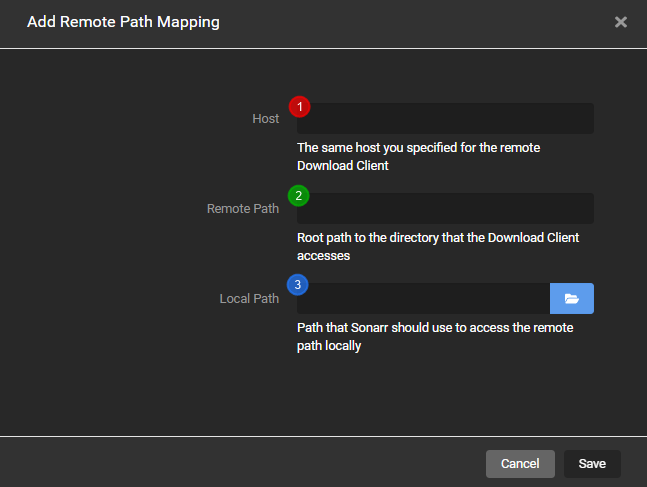
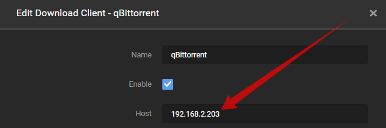
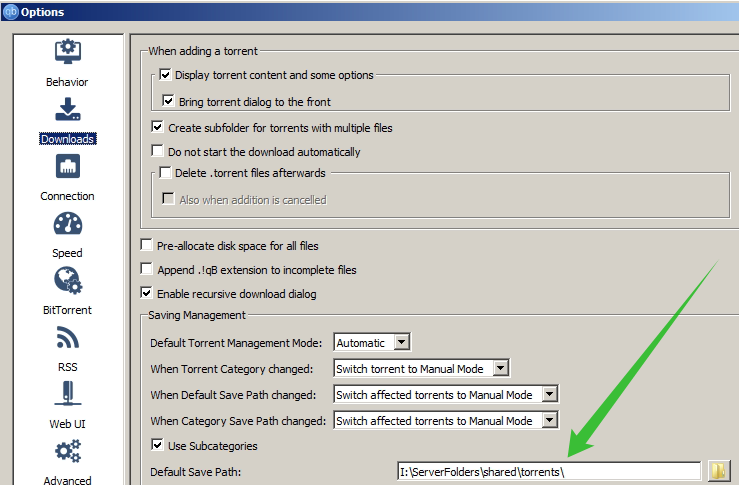
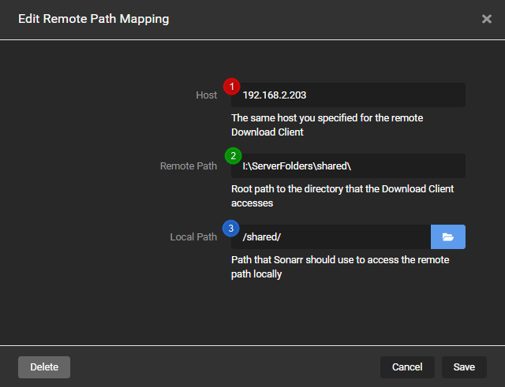

# Mappages de chemins distants

Il semble que beaucoup de gens ne comprennent pas comment fonctionne le mappage de chemin à distance pour Sonarr. Je vais essayer de l'expliquer avec quelques captures d'écran et une brève description.

Le mappage de chemin à distance agit comme une recherche stupide de « Chemin à distance » et le remplace par « Chemin local »

## Quand ai-je besoin de mappages de chemins distants

- Si Sonarr et votre client de téléchargement ne sont pas sur le même serveur/système.
- Si vous utilisez des configurations locales/à distance fusionnées à l'aide demergefs ou similaire.
- Vous exécutez des dockers et **N'AVEZ PAS** de chemins cohérents et bien planifiés.

!!! note
    Si vous exécutez Dockers, il serait plus intelligent de résoudre le problème à la source, à l'origine du problème réel.

    - [Sonarr Wiki Servarr - Guide Docker](https://wiki.servarr.com/docker-guide#consistent-and-well-planned-paths){:target="_blank" rel="noopener noreferrer"}

    - [Guides TRaSH](/Hardlinks/Hardlinks-and-Instant-Moves/){:target="_blank" rel="noopener noreferrer"}

------

## Comment puis-je reconnaître que j'ai besoin de mappages de chemins distants

Si votre client de téléchargement se trouve sur un autre système que Sonarr, vous devrez probablement utiliser les mappages de chemins distants.

Vous obtiendrez une erreur qui ressemble un peu à la capture d’écran suivante.

En regardant cette capture d'écran, il semble que nous devions utiliser les mappages de chemins distants.

------

## Comment

Tout d'abord, nous naviguons dans Sonarr vers l'onglet `Paramètres` => `Télécharger les clients`.

En bas, vous choisissez « Ajouter un nouveau mappage »

Un écran apparaîtra avec les options suivantes :

1. `Hôte` => Il s'agit du nom d'hôte ou de l'adresse IP que vous avez défini dans les paramètres de votre client de téléchargement.
1. `Remote Path` => Le chemin de téléchargement que vous avez défini dans votre client de téléchargement.
1. `Local Path` => Le chemin dont Sonarr a besoin pour accéder au même chemin.

------

??? exemple "Exemples"

    === "QBittorrent"

        ## Hôte

        Pour trouver ce que vous devez mettre dans votre hôte, accédez dans Sonarr à l'onglet Paramètres => Télécharger les clients.
        Là, vous ouvrez le client de téléchargement pour cet exemple, j'utiliserai QBittorrent

        

        C'est ce que vous mettez dans votre hôte dans le mappage de chemin à distance.

        ## Chemin distant

        Pour trouver ce que vous devez mettre dans votre chemin distant, vous devez ouvrir votre client de téléchargement et regarder ce que vous avez utilisé comme emplacement de téléchargement.

        Dans QBittorrent, accédez à Outils => Options (ou ALT+O) et accédez aux paramètres de téléchargement.

        

        C'est ce que vous ajoutez à votre chemin distant dans le mappage de chemin distant.

        ## Chemin local

        Pour savoir ce que vous devez insérer dans votre chemin local, vous devez savoir comment Sonarr peut accéder aux fichiers téléchargés par votre client de téléchargement. Cela peut se faire de différentes façons. Montage/partages réseau, peu importe, mais Sonarr doit y avoir un accès local, vous devez donc trouver le meilleur moyen pour Sonarr d'accéder vous-même aux fichiers téléchargés du client de téléchargement.

        Le résultat final ressemblera à ceci.

        

{! include-markdown "../../includes/support.md" !}
<!-- --8<-- "includes/support.md" -->