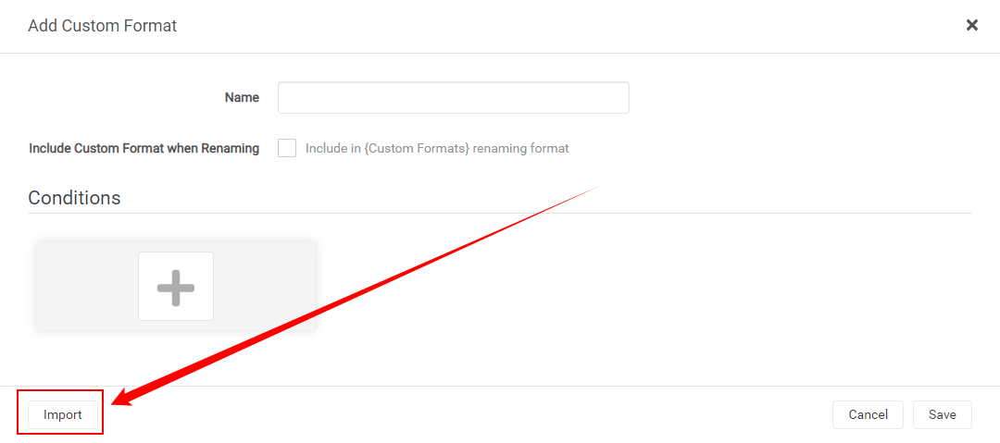
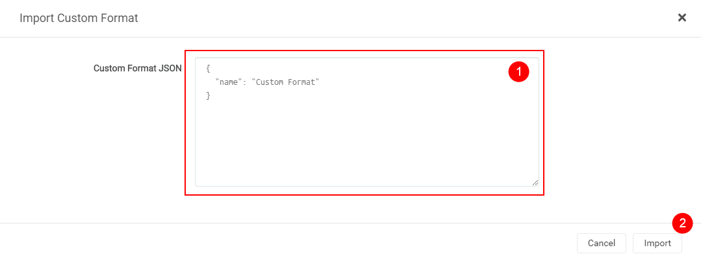

# Comment importer des formats personnalisés

Ici, je vais essayer d'expliquer comment vous pouvez importer manuellement des formats personnalisés pour Sonarr v4+.

!!! info "Gardez à l'esprit que les formats personnalisés sont conçus pour affiner votre profil de qualité. En général, la qualité l'emporte sur tout"

## Comment copier/coller le JSON depuis le site

Dans cet exemple, j'utiliserai le [{{ sonarr['cf']['br-disk']['name'] }}](/Sonarr/sonarr-collection-of-custom-formats/#br-disk){:target="_blank" rel="noopener noreferrer"} Format personnalisé, celui que la plupart des gens ne veulent pas télécharger de toute façon. Et si vous le faites, vous n’utilisez probablement aucune des applications Starr ou Plex, car les deux ne les prennent pas en charge.

Accédez à la [Collection of Custom Formats](/Sonarr/sonarr-collection-of-custom-formats/){:target="_blank" rel="noopener noreferrer"} and select [{{ sonarr['cf']['br-disk']['name'] }}](/Sonarr/sonarr-collection-of-custom-formats/#br-disk){:target="_blank" rel="noopener noreferrer"} du tableau.

### Développez le JSON pour BR-DISK

Cliquez ensuite sur l'icône de copie dans le coin supérieur droit

## Comment importer un format personnalisé JSON

### À Sonarr

`Paramètres` => `Formats personnalisés`

### Ajouter un nouveau format personnalisé

Cliquez ensuite sur  pour ajouter un nouveau format personnalisé.

### Importer le format personnalisé

Suivi de « Importer » en bas à gauche.

### Collez le format personnalisé

Collez le fichier "JSON" dans la zone vide "Format personnalisé JSON" (1) que vous avez obtenu de la [Collection de formats personnalisés](/Sonarr/sonarr-collection-of-custom-formats/){:target="_blank" rel ="noopener noreferrer"} suivi du bouton `Importer` (2).

### Enregistrez le format personnalisé

Après avoir sélectionné le bouton « Importer », vous obtiendrez un écran contenant toutes les variables de formats personnalisés correctement renseignées,
tout ce que vous avez à faire maintenant est de cliquer sur le bouton « Enregistrer » et vous avez terminé.

### Configurez les scores dans votre profil de qualité

Après avoir ajouté les formats personnalisés, vous devrez le configurer dans le profil de qualité que vous souhaitez utiliser/préférez utiliser les formats personnalisés.
La manière de procéder est expliquée [ICI](/Sonarr/sonarr-setup-custom-formats/#basics){:target="_blank" rel="noopener noreferrer"}

------

## Commencez à ajouter judicieusement d'autres formats personnalisés

!!! Info ""

    Commencez à ajouter judicieusement plus de formats personnalisés, **N'ajoutez pas tous les formats personnalisés disponibles !!!**

    Consultez le [Comment configurer les formats personnalisés](/Sonarr/sonarr-setup-custom-formats/) où j'expliquerai comment tirer le meilleur parti des formats personnalisés et montrerai quelques exemples personnels que j'utilise. Vous pouvez utiliser ces exemples pour avoir une idée sur la façon de configurer le vôtre.

### Synchronisation TRaSH

Cela peut également être fait automatiquement avec l'une des applications TRaSH Sync,

plus d'informations peuvent être trouvées [Ici](/Guide-Sync/){:target="_blank" rel="noopener noreferrer"}

