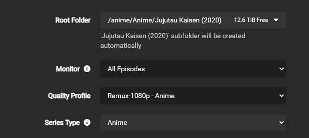
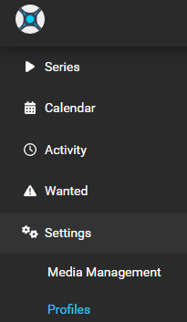
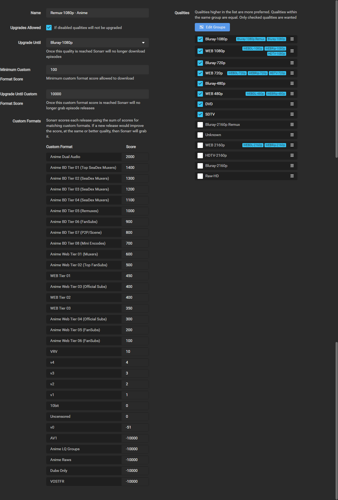
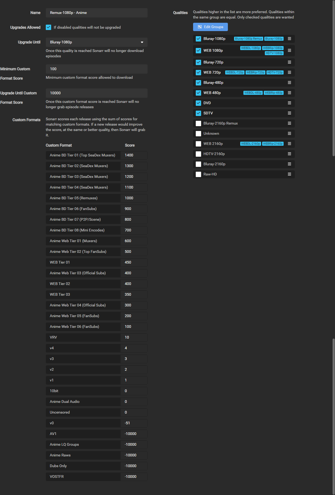

# Comment configurer les profils de qualité Anime

*alias Comment configurer les formats personnalisés (Anime)*<br><br>

!!! avertissement
    Vous devez exécuter Sonarr V4 pour pouvoir utiliser cette configuration.

    { .off-glb }

!!! note
    Ce guide est créé et maintenu par [FonduemangVI](https://github.com/FonduemangVI) et [rg9400](https://github.com/rg9400)

Il est recommandé d'exécuter deux instances Sonarr. Un pour les anime et un pour les émissions de télévision normales, ou vous pouvez utiliser des profils de qualité et créer différents formats personnalisés (CF) selon vos besoins.

L'objectif de ce guide est de sélectionner la meilleure version globale (selon [SeaDex](https://releases.moe/){:target="_blank" rel="noopener noreferrer"}) et pas nécessairement seulement le double audio.
La grande majorité des sorties peuvent être trouvées sur [Nyaa](https://nyaa.si/){:target="_blank" rel="noopener noreferrer"} ou [AB](https://animebytes.tv/). {:target="_blank" rel="noopener noreferrer"}

!!! Info ""
    Nyaa est un tracker public tandis qu'AB est un tracker sur invitation uniquement.

---

## Gestion des médias

### Type de série

Lorsque vous ajoutez une nouvelle série, assurez-vous de définir le type de série sur Anime.

??? réussite "exemple - [Cliquez pour afficher/masquer]"
    

### Schéma de dénomination recommandé

```bash
{{ sonarr['naming']['sonarr-naming']['episodes']['anime']['default:4'] }}
```

??? résumé "Résultats : - [Cliquez pour afficher/masquer]"

    Épisode unique :

    `Le titre de la série ! (2010) - S01E01 - 001 - Titre de l'épisode 1 [Son Surround x264 HDTV-720p v2] [10 bits] [AVC] [DTS 5.1] [JA]-RlsGrp`

    Épisode multiple :

    `Le titre de la série ! (2010) - S01E01-E03 - 001-003 - Titre de l'épisode [Surround Sound x264 HDTV-720p v2] [10 bits] [AVC] [DTS 5.1] [JA]-RlsGrp`

Format de dossier de la série ####

```bash
{{ sonarr['naming']['sonarr-naming']['series']['default'] }}
```

Résultat:

`Le titre de la série ! (2010)

#### Format du dossier de saison

```bash
Saison {saison:00}
```

Résultat:

'Saison 01'

#### Style multi-épisodes

```bash
Plage préfixée
```

Résultat:


---

## Paramètres de qualité

Pour les paramètres de qualité, veuillez consulter [Sonarr Quality Definitions - Anime](/Sonarr/Sonarr-Quality-Settings-File-Size/#sonarr-quality-definitions-anime){:target="_blank" rel="noopener noreferrer"}

Si vous n'exécutez qu'une seule instance de Sonarr, vous pouvez utiliser à la place [Sonarr Quality Definitions](/Sonarr/Sonarr-Quality-Settings-File-Size/#sonarr-quality-definitions){:target="_blank" rel=" pas d'ouverture ni de référence"}

---

## Profil de qualité

Nous devons créer un nouveau profil appelé « Remux-1080p - Anime » en raison de la façon dont l'anime peut être nommé, nous devrons fusionner quelques qualités, voir [ici](/Sonarr/Tips/Merge-quality/){:target ="_blank" rel="noopener noreferrer"} pour un exemple.

Nous devons ajouter `Bluray-1080p Remux` et `Bluray-1080p` dans un groupe ensemble, `HDTV-1080p` dans le même groupe que `WEBDL-1080p` et `WEBRip-1080p`, et enfin `HDTV-720p` dans le même groupe que `WEBDL-720p` et `WEBRip-720p` afin que la notation fonctionne correctement.

Allez dans `Paramètres` => `Profils`




Nous devons ensuite sélectionner et organiser les qualités comme ci-dessous.


---

## Anime CF/Score

!!! note
    Nous allons utiliser les formats personnalisés ci-dessous. Consultez [Comment importer des formats personnalisés](/Sonarr/sonarr-import-custom-formats/){:target="_blank" rel="noopener noreferrer"} pour savoir comment les importer.

### Notation par défaut

{! include-markdown "../../includes/cf/sonarr-anime.md" !}
<!-- --8<-- "includes/cf/sonarr-anime.md" -->

{! include-markdown "../../includes/cf/sonarr-streaming-services-anime.md" !}
<!-- --8<-- "includes/cf/sonarr-streaming-services-anime.md" -->

La notation qui a été définie est la notation recommandée, cependant certains CF sont facultatifs selon ce que vous préférez.
« Anime Dual Audio », « Non censuré » et « 10 bits » peuvent recevoir des scores positifs si vous souhaitez préférer le contenu avec ces attributs.

« Anime Raws » et « Dubs Only » ont un score négatif, mais si vous préférez ces attributs, vous pouvez leur donner un score positif.

Une fois les formats personnalisés importés, vous pouvez définir les scores comme ci-dessus. Pour ce faire, allez dans `Paramètres` => `Profils` et sélectionnez le profil `Remux-1080p - Anime` qui a été configuré auparavant.


Dans le profil, entrez les scores selon le tableau ci-dessus dans cette section.


Une fois que vous avez terminé, cela devrait ressembler à l’image ci-dessus.

### Double notation audio

Si vous préférez les versions « Dual Audio », vous disposez de quelques options en fonction de vos préférences.

Si vous souhaitez préférer « Dual Audio » au sein du même niveau, donnez au « CF » un score de « 10 », si vous souhaitez qu'il soit préféré à un niveau supérieur, donnez au « CF » un score de « 101 », et si vous Si vous voulez le préférer à n'importe quel niveau, donnez au « CF » un score de « 2000 ».

Si vous devez disposer de versions « Dual Audio », définissez le « Score de format personnalisé minimum » sur 2000 dans le profil « Remux-1080p - Anime » que vous avez configuré précédemment.

En utilisant cette notation, vous bénéficierez toujours des niveaux si un meilleur groupe de versions réalise une version « Dual Audio ».

Vous trouverez ci-dessous un exemple de notation définie pour préférer « Dual Audio » à n'importe quel niveau.



### Notation non censurée

!!! note
    La plupart des BD ne sont pas censurées par défaut, donc la plupart des groupes ne l'incluent pas dans le nom.

Si vous préférez les versions « non censurées », vous disposez de quelques options en fonction de vos préférences.

Si vous souhaitez préférer « Non censuré » au sein du même niveau, donnez au « CF » un score de « 10 », si vous souhaitez qu'il soit préféré à un niveau supérieur, donnez au « CF » un score de « 101 ».

En utilisant cette notation, vous bénéficierez toujours des niveaux si un meilleur groupe de versions réalise une version « non censurée ».

Vous trouverez ci-dessous un exemple de notation définie pour préférer « Non censuré » à un niveau supérieur.


### Finir

Une fois que vous avez défini votre score préféré, vous devrez apporter une modification supplémentaire à votre profil « Remux-1080p - Anime ».

Assurez-vous que « Mises à niveau autorisées » est cochée, puis définissez la section « Mise à niveau jusqu'à » sur « Bluray-1080p » et la « Mise à niveau jusqu'au score de format personnalisé » sur « 10 000 ».

Une fois cela fait, votre profil devrait ressembler à celui ci-dessous. Ceci est un exemple de configuration de la notation par défaut.



### Remerciements

La plupart de mes informations et connaissances proviennent de :

- rg9400 (Création des formats personnalisés, conseils sur les groupes d'anime et partage de connaissances générales.)

- V01 de SeaDex (Conseils sur les groupes d'anime et partage de connaissances générales.)

- Drazzilb (Conseils sur les groupes d'anime, tests et partage de connaissances générales.)

- [TRaSH](https://trash-guides.info/) (Pour m'avoir permis d'utiliser son site Web pour notre guide et notre partage de connaissances générales.)

